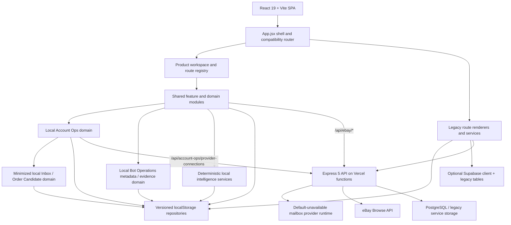
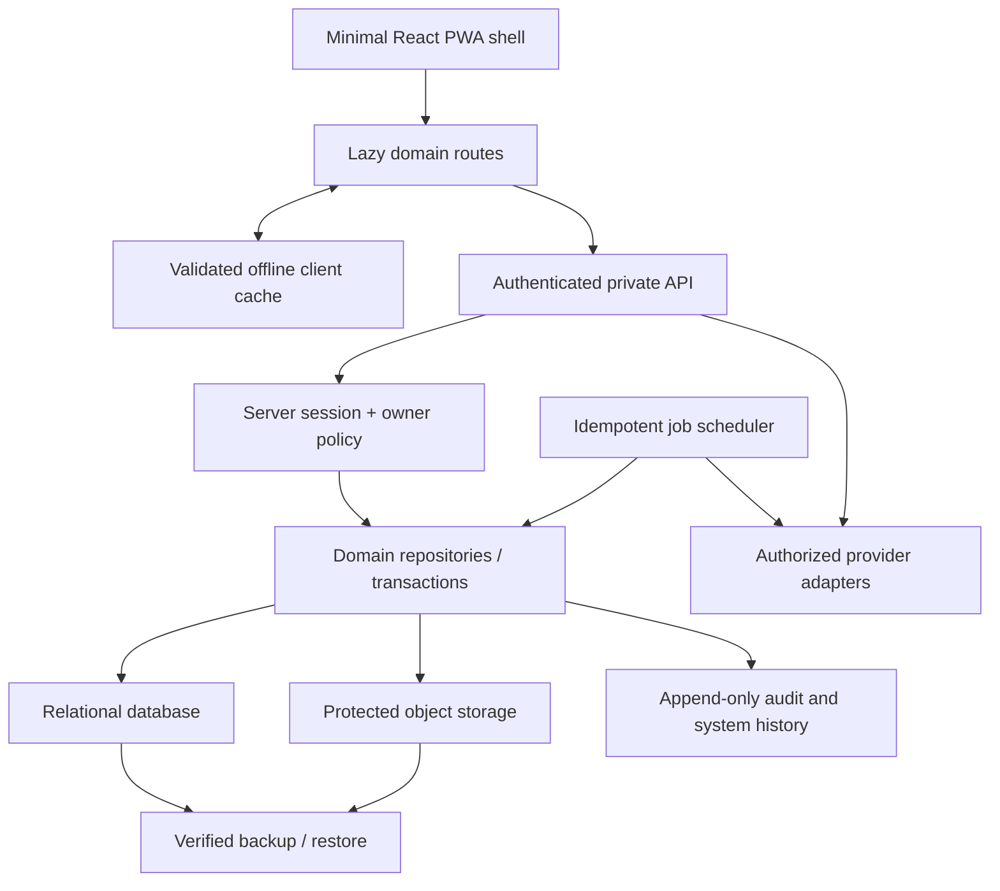

# Code 3 Architecture

Phase 1B starting baseline: `26d30b9a0b1379d53778c0bc5c92887cc0ae744f`.

Phase 1A is published on the feature branch. Hosted owner access still depends on correct environment configuration and has not been accepted for Production.

Phase 1B status: validated checkpoint source published on the feature branch. The canonical database artifact is `SCHEMA_ONLY`; repository/API contracts are present but hosted use is gate-disabled; Migration Preview is `DRY_RUN_ONLY`; `REMOTE_ACTIVE` is `NOT_ACTIVE`. No production migration or owner-data migration has run.

Phase 1C is published through commit `af21199f610cc91e31d9dee59af6f0a2f748ab79`. It does not apply the Phase 1B schema, enable `REMOTE_ACTIVE`, move owner data, start sync, or add an automated marketplace action.

Phase 2A Account Ops is published at `c76e3e4bc668c08d9a0908c9bb2cd96444610297`. It adds browser-local profiles, email-alias metadata, retailer-account metadata, assisted setup state, account health, and account tasks. `LOCAL_ONLY` remains authoritative; no schema was applied, no canonical domain was added, and no provider-backed email, Inbox, Orders, sync, or retailer automation is active.

Phase 2A.5 is published at `4c6c7891a123777acec8f326793f30aee61f3de6`. It adds presentation-level product workspace ownership, compatibility-first homes, a switcher, bounded recent-workspace preference, and route/deep-link metadata without changing data authority or provider access.

Phase 2B1 is published at `2f49a5ed97cec827184c6080e4ada0f4c8194451`. It adds a default-unavailable owner-protected mailbox-provider runtime, a separate versioned `LOCAL_ONLY` inbox/order evidence source, protected-message minimization, deterministic idempotency/reconciliation, and owner-reviewed Order Candidates. No mailbox is connected, no provider token store is enabled, no Purchase is created, and hosted API reachability remains unverified.

Phase 2B2-B is published at `b4848cb851b2be83093fbdc4ed4b976857f9d3ff`. Its separate Phase 2B2-B.1 operational verification is paused. A Free Upstash resource exists and three managed-store values are configured as branch-scoped Preview secrets, but Supabase owner/auth values and the remaining Preview CORS/activation/runtime values are not configured, no follow-up Preview was deployed, and `hostedRuntimeVerified=false`. Production and Development remain untouched.

Phase 2D-A is published at `cdde7df506c94bc55b2ec7995596843ae1c2261a`, Phase 2D-B1 at `e832ab67a153c5e672f8a77dda5474aedb1395af`, and Phase 2D-B2 at `0b45c3584f7f15b4d951c5e4cddd1e42dcbeb5a3`. Phase 2D-B2 adds an owner-selected, offline Stellar task-export JSON preview with recursive security screening and strict allowlisted normalization, but no import, repository write, provider adapter, credential, provider network, task control, checkout, Purchase, receiving, Inventory mutation, remote persistence, or deployment. Hayha and Stellar remain `NOT_CONFIGURED`, every live capability remains false, and the evidence review continues to recommend no live pilot.

Phase 2C-A is a parallel local-only workstream from published baseline `0b45c3584f7f15b4d951c5e4cddd1e42dcbeb5a3`. It adds a separate owner-gated Purchase Draft, exact-money Purchase, append-only Receiving, and derived Inventory Handoff Preview domain. It does not connect Inbox/Order or Bot evidence, create a Purchase automatically, create Inventory, resume Phase 2B2-B.1, activate remote persistence, or deploy Production.

## Executive summary

Code 3 is a hybrid React/Vite single-page application. Its approved everyday shell and private sourcing foundation are implemented, but authoritative data is split across three persistence styles:

1. versioned browser-local repositories for canonical Deal Finder and Owner Center records;
2. older browser storage and optional Supabase persistence used by legacy application modules;
3. an Express/PostgreSQL backend used by legacy APIs and the secure eBay Browse connector.

The published architecture is suitable for a private preview, not for centralized durability or reliable background work. Phase 1A supplies a Supabase-backed server identity boundary for the auth/eBay route families and a deterministic browser-backup/restore-preview contract. Phase 1B selects and scaffolds the owner-authorized Express API → repository/service layer → PostgreSQL/Supabase Postgres target, but deliberately leaves current browser repositories authoritative. Phase 1C adds presentation-independent deterministic intelligence modules and append-only local card-analysis history on top of that unchanged authority boundary. Published Phase 2A adds one versioned Account Ops source behind the existing local persistence gateway and exposes a session-gated route family. Published Phase 2A.5 adds a shared product-workspace registry and shell around existing routes without duplicating shared business records. Published Phase 2B1 adds minimized synthetic message/order processing and a fail-closed provider-runtime boundary without connecting a provider. Phase 2D-A turns the empty Bot shell into a cohesive, versioned `LOCAL_ONLY` metadata and evidence foundation, while real-provider registry entries remain disconnected and normal runtime remains empty. Auction results can be saved without a generic linked revision series, and restock intelligence is recomputed from retained observations. Those changes reduce migration, recommendation, account-operations, navigation, future mailbox-ingestion, and future Bot-adapter risk; they do not migrate records, activate remote persistence, protect every legacy route, provision email aliases, store credentials, connect a mailbox/order/Bot provider, implement billing, configure an AI/computer-vision provider, or make a backup complete when server data or referenced file bytes are omitted. The safest target remains an incremental strangler migration.

## Published Phase 1A boundary

The published Phase 1A implementation adds these boundaries without a database migration:

- `backend/src/auth/*`: normalized principals, Supabase token verification, immutable-subject owner policy, and environment gating;
- `backend/src/security/*`: exact-origin CORS and structured redaction helpers;
- `backend/src/routes/auth.routes.ts`: safe `GET /api/auth/session` inspection;
- `backend/src/routes/ebay.routes.ts`: OWNER middleware around health and search;
- `src/services/ownerSession.js`: browser session inspection and authenticated request headers;
- `src/features/backup/*`: source registry, bounded/canonical JSON, prohibited-data filtering, SHA-256 backup envelope, and no-write restore preview;
- Owner Center session states and a minimal Data & Backup surface;
- centralized Code 3 runtime/PWA/offline identity.

See [OWNER_AUTH_DECISION.md](./OWNER_AUTH_DECISION.md), [BACKUP_FORMAT_V1.md](./BACKUP_FORMAT_V1.md), and [RESTORE_PREVIEW_CONTRACT.md](./RESTORE_PREVIEW_CONTRACT.md).

## Phase 1B checkpoint delta

Phase 1B adds a no-cutover persistence foundation:

- canonical relational schema/migration source for the bounded private-business domains;
- server-side domain definitions, strict validation, owner-scoped repository contracts, optimistic versions, bounded pagination, and owner-authorized API routing;
- test/dry-run repositories that can prove ownership, constraints, pagination, and conflict behavior without production credentials;
- client persistence modes `LOCAL_ONLY`, `MIGRATION_PREVIEW`, and `REMOTE_ACTIVE`, with local remaining the active default and existing feature repositories not yet rewired; the local adapter mirrors canonical status/`includeArchived` behavior, `ARCHIVED` state, and stable `(createdAt, id)` ordering while retaining a private legacy-ID-compatible cursor distinct from the UUID-strict server cursor;
- migration-source classification, client canonical wire validation aligned to the server contract, money-to-minor-unit diagnostics, deterministic no-delete plan generation, conflict/reference detection, and zero-write proof;
- a minimal Migration Readiness surface under Owner Center Data & Backup;
- server-export adapter contracts that keep backup coverage `PARTIAL` whenever remote data is unavailable;
- schema-only file-asset metadata, with no object upload or byte migration.

The exact implementation paths are cited in [CANONICAL_PERSISTENCE_DECISION.md](./CANONICAL_PERSISTENCE_DECISION.md) and [MIGRATION_PREVIEW_CONTRACT.md](./MIGRATION_PREVIEW_CONTRACT.md). A migration file in source is not evidence that it was executed.

`backend/src/routes/code3.routes.ts` is mounted at `/api/code3` through the same protected CORS and owner boundary as auth/eBay. It provides bounded canonical resource contracts plus read-only export and migration dry-run endpoints, but `CODE3_CANONICAL_PERSISTENCE_ENABLED` and `DATABASE_URL` must both be configured before the hosted route family leaves its safe `503` state. `supabase/migrations/20260820120000_code3_canonical_owner_records.sql` defines the unexecuted target tables/RLS/constraints. `FILE_ASSET` uses the generic record envelope plus a typed `code3_file_assets` metadata row and owner-scoped related-record validation; no file byte is uploaded. `src/features/persistence` supplies the client local/remote abstraction and deterministic local mapping, with all 80 backup-registry record paths explicitly classified. `src/services/code3OwnerApi.js` supplies owner-session headers to the bounded remote-export adapter; Data & Backup and `src/features/backup/MigrationReadinessPanel.jsx` consume that read result when available and otherwise retain honest `PARTIAL`/unavailable states. A `COMPLETE` remote export must use the repository consistent-read boundary, carry every uppercase canonical domain key, and have no truncation; source-read warnings flow into readiness and its deterministic hashes.

## Phase 1C local intelligence delta

Phase 1C introduces a reusable browser-side domain layer under `src/features/intelligence`:

- validated card identity, image-reference, defect-observation, provenance, condition, and confidence contracts;
- deterministic apparent-condition rules for `NM`, `LP`, `MP`, `HP`, and `DMG`, including structural-damage floors, cumulative wear, image limitations, and owner-confirmed values kept separate from the system proposal;
- safe integer-minor-unit money, basis-point fee, `code3.valuation.v2` condition-aware valuation, deal recommendation with explicit risk severity, lot scenario, auction maximum-bid, and coarse restock-pattern services;
- one shared `HIGH` / `MEDIUM` / `LOW` / `INSUFFICIENT` confidence vocabulary that discounts repeated underlying sources and considers freshness, completeness, identity/condition certainty, and contradictions;
- an analysis pipeline that separates normalization, identity resolution, evidence extraction, condition, valuation, recommendation, and optional persistence;
- valuation basis selection that prefers matched-condition verified sales without another adjustment, falls back only to an explicit `NM` baseline adjustment, and excludes unknown or incompatible comparable conditions with warnings;
- tagged append-only `code3-intelligence-analysis-v1` card revisions in the existing local `appraisals` collection through a hard-wired Phase 1B `LOCAL_ONLY` gateway;
- explicit owner-correction events with prior/new values and `OWNER_ENTERED` provenance; reanalysis creates a linked revision and never rewrites the prior system result;
- official eBay active-listing evidence normalization that retains provider identity/observations separately and refuses to fabricate money when currency is missing, plus a provider-neutral scanner boundary that preserves provenance without claiming OCR or computer vision;
- restock freshness based on the latest positive observation, with contradictory evidence preserved and shared confidence unable to bypass source independence.

The Phase 1C layer is decision support only. It has no server-side intelligence route, background job, provider/model secret, hosted write, automatic purchase, offer, bid, message, or migration path. See [INTELLIGENCE_CONTRACT.md](./INTELLIGENCE_CONTRACT.md).

## Published Phase 2A Account Ops delta

Phase 2A introduces `src/features/accountOps` as a cohesive local domain rather than another collection of fields inside `App.jsx`:

- one schema-versioned `code3.account-ops.v1` source with eight arrays: `profileGroups`, `profiles`, `emailDomains`, `emailAliases`, `retailers`, `storeAccounts`, `tasks`, and `activity`;
- validation-backed profile/group, alias, retailer, store-account, setup, health, task, credential-reference, and future-message/order contracts;
- a persistence service that uses the Phase 1B gateway fixed to `LOCAL_ONLY`; the caller cannot select `REMOTE_ACTIVE`, supply authoritative owner identity, or activate sync;
- recursive rejection of owner/session/token/authorization authority fields and prohibited secret fields before a record reaches persistence;
- first-class `/account-ops` routes for Overview, Profiles, Emails, Store Accounts, and Tasks, loaded only after the verified application session authorizes Owner access;
- locally generated alias metadata that remains explicitly different from a provider-provisioned, mail-receiving alias;
- ephemeral password generation for immediate copy only, with no plaintext-password persistence, logging, analytics, or backup path;
- owner-driven account setup/checklist and verification state; retailer signup may be opened, but Code 3 does not submit bulk signups, bypass CAPTCHA/OTP/verification, or mark verification complete without owner action;
- Account Ops metadata in Backup Format v1 and zero-write Restore Preview, while all eight new record paths remain `REQUIRES_MAPPING` for migration because no canonical Account Ops domain or schema exists;
- provider-neutral future Inbox and Orders contracts only at the Phase 2A checkpoint. Published Phase 2B1 implements the separate synthetic/minimized evidence foundation described below, still without provider fetch, raw-body storage, or Purchase creation.

See [ACCOUNT_OPS_CONTRACT.md](./ACCOUNT_OPS_CONTRACT.md). This architecture is published at the Phase 2A checkpoint.

## Phase 2C-A Purchase, Receiving, and Inventory Handoff delta

Phase 2C-A introduces `src/features/purchaseReceiving` as a separate, versioned browser-local domain behind the verified OWNER boundary on the Business Purchases route:

- non-authoritative Purchase Drafts that reference, rather than copy, future Order Candidate or Checkout Evidence sources;
- explicit OWNER correction, rejection, and exactly-once confirmation into one canonical local Purchase;
- multi-line exact-minor-unit money with deterministic BigInt proportional allocation and stable remainder distribution;
- append-only Purchase events and Receiving Events, including partial receipts and discrepancy history;
- stable idempotency for source proposals, Purchase confirmation, and Receiving submissions;
- conservative product matching with `MATCHED`, `AMBIGUOUS`, and `UNRESOLVED` states; and
- a pure Inventory Handoff Preview that has no persistence or Inventory writer.

The source remains fixed to `LOCAL_ONLY`, and every migration path is `REQUIRES_MAPPING`. Existing legacy Flip Scout purchases/lots remain compatibility data and are not reinterpreted as the new confirmed Purchase model. Neither shipment nor delivery evidence creates a Receiving Event. No Receiving Event creates an Owned Item, Inventory record, quantity adjustment, or cost-basis mutation. See [PURCHASE_RECEIVING_CONTRACT.md](./PURCHASE_RECEIVING_CONTRACT.md).

## Published Phase 2A.5 workspace delta

Phase 2A.5 adds one presentation architecture around existing records and feature modules:

- a central `src/config/workspaceRegistry.js` registry for `COLLECT`, `FIND`, `SELL`, `BOT`, `BUSINESS`, `OWNER`, `GLOBAL`, and `LEGACY_REDIRECT` route ownership;
- compatibility-first homes at `/collect`, `/find/home`, `/sell/home`, `/bot`, and `/business`;
- `src/features/workspaces/WorkspaceSwitcher.jsx` and `WorkspaceHomePage.jsx` with shared styling in `workspace-shell.css`;
- a dedicated `code3.workspace-preference.v1` preference contract under `src/features/workspaces`, limited to public product-workspace identity and kept separate from historical persisted `Workspace` records and `activeWorkspaceId`;
- route-derived workspace selection that takes precedence over remembered state;
- workspace-local navigation on mobile and desktop without exposing every route globally;
- Business association for Account Ops without changing its `VERIFIED_OWNER` gate;
- an OWNER-only Bot shell with no provider, checkout, task-control, or automation capability;
- explicit nonauthoritative entitlement hints for future product packaging, distinct from OWNER authorization.

The registry and switcher are not security boundaries. Verified application-session and backend authorization remain definitive. Owner Center remains outside the product-workspace switcher. See [WORKSPACE_ARCHITECTURE_CONTRACT.md](./WORKSPACE_ARCHITECTURE_CONTRACT.md).

## Phase 2D-A Bot Integration Foundation delta

Phase 2D-A introduces `src/features/botOps` as a provider-neutral local domain behind the existing OWNER-only `/bot` route:

- `code3.bot-ops.v1`, a versioned ten-collection document accessed through the Phase 1B gateway fixed to `LOCAL_ONLY`;
- safe contracts and validators for installations, Account Ops retailer-account/profile references, proxy metadata, product targets, task groups, tasks, attempts, Checkout Evidence, and bounded activity;
- a static registry in which Hayha and Stellar are `NOT_CONFIGURED`, supported retailers are unverified/empty, and every live capability is false;
- a test-only `MOCK` adapter that must be injected explicitly and cannot appear as a normal-runtime provider connection;
- recursive rejection of browser authority, credentials, proxy authentication material, raw provider payloads/logs, credential-bearing URLs, and unsafe inputs before hashing or persistence;
- append-only attempts/activity plus scoped provider/installation/event idempotency, deterministic interrupted-write repair, reordered-event preservation, and contradiction warnings;
- owner-reviewable Checkout Evidence whose correction state can change without changing the underlying attempt history, while Purchase/receiving/Inventory flags remain false;
- a sanitized Backup Format v1 section and zero-write Restore Preview treatment, with all ten migration paths `REQUIRES_MAPPING`; and
- responsive Overview, Bots, Task Groups, Tasks, Accounts, Profiles, Proxies, Product Targets, and Activity views whose normal state contains no synthetic live data.

This layer has no backend Bot route, server secret store, provider SDK/network client, local companion process, webhook receiver, export watcher, task command, retailer automation, Purchase writer, or Inventory dependency. It does not reuse the paused Phase 2B2-B.1 Upstash resource. See [BOT_INTEGRATION_CONTRACT.md](./BOT_INTEGRATION_CONTRACT.md).

## Phase 2D-B1 provider discovery delta

Phase 2D-B1 keeps the Phase 2D-A runtime and persistence model unchanged. A separate immutable research layer records short official-source references, evidence freshness, integration-mode status, independent observation/read/control/sensitive capability assessments, and fail-closed pilot readiness. Research metadata is bundled source, not owner data, provider health, or a backup source.

- Hayha public evidence confirms a human-operated desktop GUI/CLI and limited Discord notification behavior, but no supported machine-readable read/status API, SDK, local companion protocol, or safe task/history export was verified. Public docs are stale and say restricted Discord material is newer; current provider confirmation is required.
- Stellar public guides confirm manual task-group export/import controls, Discord notification configuration, and an external-monitor-to-Stellar WebSocket input. The current public Tasks overview does not establish the export's exact serialized format or version-compatibility rules. The WebSocket sends product pings into Stellar and is not a status egress; it may affect running tasks and is therefore not a read-only pilot path.
- Secret-bearing session/profile/account/proxy/config exports are classified `DO_NOT_USE`. Private/internal APIs, traffic inspection, CLI/UI scraping, process attachment, reverse engineering, and undocumented automation are also `DO_NOT_USE`.
- Every operational provider capability remains false. Evidence that a human UI can perform an action or that an export exists does not activate a Code 3 adapter capability.
- The decision is `NO_LIVE_BOT_PILOT_YET`. Phase 2D-B2 implements only the least-risk offline preview boundary with synthetic fixtures. It does not claim a supported Stellar schema/version and cannot import or persist data.

## Phase 2D-B2 Stellar export preview delta

Phase 2D-B2 adds a dedicated Bot Operations import-preview boundary without expanding the Bot provider adapter or the `code3.bot-ops.v1` repository. The only entry is an OWNER-initiated browser file picker under `/bot/tasks`; Code 3 does not discover directories, watch Stellar files, inspect an installation, or contact a provider.

The flow is deliberately one-way and ephemeral:

```text
Owner-selected JSON file
  -> 1 MiB / 500-record bounds
  -> JSON parse and root-shape check
  -> recursive credential/payment/session/proxy/dangerous-key scan
  -> strict safe-field allowlist
  -> conservative identifiers, integer-minor-unit money and quantity normalization
  -> in-memory preview and warnings
  -> discard on close, replacement, navigation or refresh
```

Official Stellar documentation establishes owner task-group import/export as JSON and requires the same Stellar version for transfer, but it does not publish a stable JSON root, field list, or version marker. Format recognition therefore supports the vocabulary `SUPPORTED`, `PARTIALLY_RECOGNIZED`, `UNKNOWN_FORMAT`, `UNSAFE`, and `REJECTED`, while `SUPPORTED` is reserved and never emitted until a provider schema/version is independently verified.

The scanner traverses nested objects and arrays before normalization. Any prohibited field/value or prototype-pollution key blocks the whole file without echoing the value. Harmless unknown fields are counted and discarded with warnings. Only bounded task/group labels and references, retailer/site labels, product identifiers, titles, quantities, exact price/currency data, safe mode/enabled/status values, and safe timestamps can appear in the preview. Retailer text in a file does not establish Stellar retailer coverage.

The preview model has no persistence adapter and no repository/service dependency. It retains no raw JSON, full path, source hash, or data across refresh. It is absent from Backup Format v1 and Migration Preview. It cannot create Bot Tasks, Product Targets, Attempts, Activity, Checkout Evidence, Order Candidates, Purchases, Receiving, or Inventory. `Stellar Export Preview != Bot Task Import` and `Previewed Task != Task`.

See [BOT_PROVIDER_CAPABILITY_REVIEW.md](./BOT_PROVIDER_CAPABILITY_REVIEW.md). Phase 2B2-B.1 remains paused and no Bot secret store is authorized.

## Current system map



## Frontend

| Concern | Current implementation | Evidence | Consequence |
|---|---|---|---|
| Framework | React 19.2.3, Vite 8.0.10 | `package.json`, `src/main.jsx`, `vite.config.js` | Modern SPA toolchain |
| Entry | `src/main.jsx` lazy-imports the application and installs an error boundary/service worker | `src/main.jsx` | Shell bootstrap is already isolated |
| Shell | A very large `src/App.jsx` owns authentication, hydration, route selection, navigation, dialogs, and legacy renderers | `src/App.jsx`, `docs/APP_SHELL_EXTRACTION_PLAN.md` | High coupling and a large initial chunk |
| Product workspace shell | Five focused product contexts over shared feature modules; Owner Center remains separate | `src/config/workspaceRegistry.js`, `src/features/workspaces`, `src/App.jsx`, `src/utils/appRouteState.js` | Phase 2A.5 published; route metadata and remembered UI context do not authorize access or duplicate records |
| Canonical pages | Collect, Find, Sell, Business, and Owner Center delegate to focused modules | `src/pages/OperationsHome.jsx`, `src/pages/EverydayWorkspaces.jsx`, `src/features/flipScout`, `src/features/ownerCenter`, `src/features/workspaces` | Current plain-language experience is reorganized rather than rewritten |
| Account Ops | Business-associated lazy route with local domain service, mobile-first Overview/Profiles/Emails/Accounts/Tasks plus Phase 2B1 Connections/Inbox/Orders foundation, and verified-session gate | `src/features/accountOps`, `src/services/accountOpsProviderApi.js`, `src/App.jsx`, `src/utils/appRouteState.js` | Phase 2A metadata remains local; Phase 2B1 adds capability truth and synthetic evidence only, not live email, provider secrets, Purchase import, secure-vault integration, or server durability |
| Inbox / Order Candidate domain | Provider-neutral normalization, protected-message minimization, exact money, alias/retailer proposals, connection-scoped idempotency, reconciliation, and owner review | `src/features/inboxOrder` | Separate `LOCAL_ONLY` source; no mailbox read, raw-body mirror, provider token, Purchase writer, or remote adapter |
| Bot Operations | OWNER-gated provider-neutral registry, local metadata/evidence services, test-only mock adapter, responsive operations sections, honest disconnected state, and an ephemeral Stellar JSON preview | `src/features/botOps`, `src/features/workspaces/WorkspaceHomePage.jsx`, `src/App.jsx`, `src/utils/appRouteState.js` | Separate `LOCAL_ONLY` source plus a zero-write in-memory preview; Hayha/Stellar not configured, no credentials/provider network/task control/import/checkout/Purchase/Inventory writer |
| Purchase and Receiving | OWNER-gated Purchase Draft review, exact-money confirmed Purchases, append-only Receiving Events, and derived Inventory Handoff Preview | `src/features/purchaseReceiving`, `src/pages/EverydayWorkspaces.jsx` | Separate `LOCAL_ONLY` source; no upstream auto-import, receipt inference, Inventory writer, remote adapter, or canonical-schema use |
| Shared UI | Semantic operations components and CSS | `src/components/operations`, `src/styles/app/01-tokens-theme.css` | Reusable accessible foundation |
| Routing | Custom path parsing and render dispatch, not React Router | `src/utils/appRouteState.js`, `src/App.jsx` | Back/redirect compatibility depends on bespoke code |
| State | Large in-memory React state plus domain repository snapshots and legacy hooks | `src/App.jsx`, feature repositories | No single authoritative state boundary |
| Canonical read bridge | Owner-authorized Code 3 request helper and bounded server-export adapter | `src/services/code3OwnerApi.js`, `src/features/persistence/remoteBackupAdapter.js` | Backup/preview may compare remote records when configured; no remote writes or cutover |
| Intelligence | Presentation-independent condition, valuation, deal, auction/lot, restock, card-history, and provider-evidence modules | `src/features/intelligence` | Deterministic local decision support is reusable; auction has no generic revision series, restock recomputes from observations, and no AI/CV provider or autonomous action exists |
| PWA | Manifest/service worker and installable SPA behavior | `public/manifest.webmanifest`, `public/sw.js`, `src/main.jsx` | Offline shell support exists; conflict-safe sync does not |

## Routing and compatibility

Phase 2A.5 centralizes product-workspace ownership in `src/config/workspaceRegistry.js`, while `src/utils/appRouteState.js` retains the custom route parsing/compatibility boundary. Compatibility-first homes are:

- `/collect` for Collect;
- `/find/home` for Find;
- `/sell/home` for Sell;
- `/bot` for the OWNER-only Bot foundation;
- `/business` for Business.

Current primary feature paths continue to include:

- `/`, `/find/*`, `/collection/*`, `/business/*`, `/account-ops/*`, `/owner-center/*`, and `/settings/*`;
- direct business shortcuts `/purchases`, `/inventory`, `/sell`, and `/sales`;
- secondary `/kids-community`, `/assistant`, and `/integrations` routes.

Legacy aliases remain for older sourcing, collection, sales, exchange, community, administration, reporting, and settings URLs. `src/App.jsx` resolves these aliases or renders compatibility modules. Registry classification distinguishes canonical workspace ownership from `GLOBAL`, `OWNER`, and `LEGACY_REDIRECT`; it does not reinterpret historical stored records. The definitive migration inventory remains in `docs/LEGACY_ROUTE_MIGRATION.md`.

Risks:

- path state, active tab, modal history, and scroll restoration are custom and tightly coupled;
- some aliases still render a separate legacy workflow rather than delegate to a canonical screen;
- localStorage hydration can influence the first route render;
- careless route extraction can break direct refreshes and Android/browser Back.

Phase 2A.5 implements the presentation registry and switcher portion of that target. Route extraction, complete canonical delegation, domain-level error/loading boundaries, and retirement of legacy renderers remain future work.

## Current persistence

### Canonical browser repositories

- `src/features/flipScout/storageRepository.js` stores schema-versioned feature data under `ember-and-tide.flip-scout.v1`. The old namespace is intentionally retained for compatibility.
- Phase 1C card-analysis history adds only tagged records to that repository's existing `appraisals` collection. Legacy appraisal rows remain untouched and are not silently reinterpreted. The history factory fixes its Phase 1B gateway to `LOCAL_ONLY` and exposes no delete/archive or remote-mode selector. Auction saves do not create this linked revision series, and restock results are recomputed from observations.
- `src/features/ownerCenter/ownerCenterRepository.js` stores owner intelligence and controls under `private-business-hub.owner-center.v1`.
- Phase 2C-A stores validated Purchase Drafts, confirmed Purchases, Purchase events, Receiving Events, and bounded activity under `code3.purchase-receiving.v1`. Inventory Handoff Preview is derived in memory and is not a stored collection. The source is distinct from legacy Flip Scout purchase/lot records and has no Inventory writer.
- Phase 2A stores Account Ops schema version 1 under `code3.account-ops.v1`. Its eight arrays are read and written through the existing Phase 1B local persistence gateway; no direct remote adapter, sync mode, or canonical write path is exposed.
- Phase 2B1 stores minimized Inbox/Order Intelligence schema version 1 under `code3.inbox-order.v1`. Its four arrays (`messageEvents`, `orderCandidates`, `candidateEvents`, and `activity`) use the same gateway fixed to `LOCAL_ONLY`; provider secrets and raw/protected content are prohibited, evidence/review history is append-only where claimed, and no Purchase repository is reachable.
- Phase 2D-A stores Bot Operations schema version 1 under `code3.bot-ops.v1`. Its ten arrays (`installations`, `retailerAccountLinks`, `botProfiles`, `proxyGroups`, `productTargets`, `taskGroups`, `tasks`, `attempts`, `checkoutEvidence`, and `activity`) use the gateway fixed to `LOCAL_ONLY`; attempts/activity are append-only, evidence corrections preserve history, all prohibited credentials/raw provider data are rejected, and no Purchase/receiving/Inventory repository is reachable.
- Phase 2D-B2 preview state is not an eleventh Bot Operations path. It exists only in component memory, is never handed to the persistence gateway, and disappears on discard/navigation/refresh. Backup and migration registries remain unchanged.
- guided forms use namespaced session/draft keys through `src/components/operations/RecordExperience.jsx` and feature screens.

These repositories provide safe parsing, defaults, validation, import/export, and update notifications. They are browser-local, single-device, and not protected by server authorization.

### Legacy local and Supabase persistence

`src/utils/betaDataCleanup.js` enumerates older local keys. `src/services/phase2Persistence.js` falls back to `et-tcg-phase2-data` and optionally persists selected legacy records to Supabase. `src/supabaseClient.js` uses public URL/anonymous-key configuration and relies on database policies.

Existing Supabase migrations cover legacy profiles, workspaces, catalog, receipts, notification, and public-beta features. They do not provide a canonical backend repository for the current Deal Finder, Owner Center, owned-item, or business records.

### Backend persistence

`backend/src/db.ts` provides a PostgreSQL pool from `DATABASE_URL`. Legacy backend routes still combine database services, in-memory services, and upstream adapters. Phase 1B adds a coherent canonical service/repository layer for `/api/code3`, but its schema is unexecuted, its hosted gate is off, and existing feature repositories have not cut over.

## Backend and API

The backend is Express 5 with TypeScript in `backend/`. Vercel entry points `api/[...path].ts` and `api/health.ts` import the Express application. Phase 2B2-A adds exact filesystem entry points at `api/auth/session.ts` and `api/account-ops/provider-connections.ts`; both only export that same Express app, so the owner-session and provider-proof paths no longer depend on catch-all resolution. Current route families include catalog, inventory, collection compatibility, sales/expenses compatibility, stores/reports, alerts, community, market, scanning, Best Buy legacy monitoring, and eBay.

The eBay implementation is the strongest current server boundary:

- `backend/src/routes/ebay.routes.ts`
- `backend/src/services/ebayBrowse.service.ts`
- `backend/src/server.ts`

It keeps credentials server-side, caches application tokens, retries authentication once, maps upstream failures, and normalizes active listings. Browser discovery and Import Review live in `src/features/flipScout/ebayDiscovery.js` and `src/features/flipScout/screens/EbayDiscoveryScreen.jsx`. Phase 1C's `providerAdapters/ebayEvidence.js` keeps the official eBay external identity, observations, image references, and supplied active asking/current-bid/shipping evidence separately attributable. It emits exact `ACTIVE_LISTING` money only when the provider supplies a usable amount and currency; missing currency produces a warning and no fabricated money. It always leaves completed-sale evidence empty unless a separately approved source is introduced.

Current backend limitations after the Phase 1B checkpoint:

- the new owner policy protects `/api/ebay/*`, but it is not yet an application-wide policy;
- canonical owner API/repository contracts exist locally, but remote persistence and owner-data cutover are not active;
- legacy route families remain behind their previous permissive `cors()` policy until separately migrated;
- mixed durable and process-memory services;
- no canonical background-job subsystem or durable audit writer; mutation idempotency beyond the Phase 1B contract remains future work;
- no protected object/file storage for evidence and receipts.
- no configured model-backed image/OCR/AI analysis provider; image references remain references and the scanner adapter reports that no image analysis ran.
- mailbox provider status/capability/disconnect routing is OWNER-protected and fail-closed. Phase 2B2-A can attest exact Preview server execution separately from provider readiness. Phase 2B2-B implements Preview-only durable connection/secret/state adapters; an approved Free Upstash resource and three branch-scoped Preview secrets exist, but owner/CORS/runtime configuration and deployed proof remain paused, and no connect/callback route or live Gmail/Microsoft adapter exists.

## Authentication and permissions

The selected identity provider is the existing Supabase Auth integration. The browser supplies its current access token; the server verifies it with Supabase, normalizes an `AuthPrincipal`, and separately checks an exact provider-qualified immutable subject in `CODE3_OWNER_SUBJECTS`. Email, browser role, localStorage, hidden navigation, and Vercel Preview Authentication do not authorize a request.

`GET /api/auth/session` returns only safe, masked session facts with `Cache-Control: no-store`. The browser uses that verified result for Owner Center visibility and compact Sign In Required / Owner Access Required states. Backend policy remains definitive for protected operations.

The Phase 2A Account Ops route reuses that verified session boundary and does not construct or read its private local repository before authorization. Phase 2A.5 associates Account Ops with Business for route context only; Business availability does not grant Account Ops access. Account Ops profiles are operational contact/account metadata only; they can never replace the authenticated principal or grant OWNER access.

Bot and Owner Center also require verified OWNER authorization. A saved workspace preference, client feature/entitlement metadata, query parameter, or hidden route cannot make either surface accessible. Owner Center remains outside the ordinary product-workspace switcher.

The local adapter requires an explicit server setting, a development runtime, loopback host and socket, and an explicit header. The test adapter is injectable only in the automated-test runtime. Both fail closed in Preview, Production, and hosted-unknown environments.

Current roles (`OWNER`, `ADMIN`, `MODERATOR`, `BETA_USER`, `USER`) still exist in the legacy beta model, but they cannot grant access to the protected eBay routes. Future collaborator, inventory-helper, bookkeeper, and read-only policies remain dormant. Session/device management and private-record permissions are still missing.

## Brand and feature controls

The approved application identity is Code 3. The published Phase 1A source applies display, short, PWA, PWA short, browser-title, accessible-logo, logo, favicon, and offline identity through `src/config/brand.js` and the Vite metadata replacement. The legal/public business name and tagline remain separate and blank. Historical route, storage, cache, module, and imported-source identifiers remain unchanged.

The runtime configuration still needs the definitive default social handle, currency, and time zone. Some compatibility/public-beta copy outside the primary shell still contains historical wording and requires a separately bounded migration. `src/features/ownerCenter/ownerCenterRepository.js` stores feature controls and scoring defaults locally; these controls influence UI visibility but are not server entitlements. Phase 2A.5 may describe future `FREE`, `PLUS`, `PRO`, `BUSINESS`, and `OWNER` packaging in registry metadata, but supplies no billing or authoritative entitlement system; `OWNER` remains authority rather than a paid package.

## Phase 2B1 provider and order-intelligence boundary

Phase 2B1 adds two deliberately separate layers:

1. a server-only provider runtime under `backend/src/providerRuntime` and the owner-protected `/api/account-ops/provider-connections` route; and
2. a browser-local minimized message/Order Candidate domain under `src/features/inboxOrder`, fixed to `LOCAL_ONLY` through the existing persistence gateway.

The server layer contains capability definitions, safe connection projections, a secret-store interface, an OAuth-state interface, sanitized audit summaries, and default-unavailable lifecycle behavior. Its production/default adapters cannot store a secret or issue state. The only memory implementations are dependency-injected automated-test fakes and reject non-test runtimes. No Gmail or Microsoft SDK/network adapter is present.

The browser receives only opaque connection metadata and capability truth. `src/services/accountOpsProviderApi.js` accepts only the protected provider-connections route, reuses the verified owner-session header mechanism, rejects caller headers/bodies/alternate methods, rejects SPA/non-JSON fallbacks, bounds the response, and discards unsafe credential-shaped data. The lazy Account Ops Connections/Inbox/Orders foundation is mounted only after the existing verified-owner gate; it does not initialize a provider or inbox store for an unauthorized session.

The local inbox/order source is separate from `code3.account-ops.v1` so the strict eight-collection Account Ops schema is not silently changed. It retains minimized message events, current candidate projections, append-only candidate/review events, and sanitized activity only. Provider tokens, OAuth state, raw bodies, protected content, and authority fields are prohibited. Message identity is connection-scoped, order reconciliation is evidence-aware, owner corrections are preserved separately, and no repository path writes a Purchase.

Phase 2B1 was published at `2f49a5ed97cec827184c6080e4ada0f4c8194451`. Its provider readiness remains unavailable and live OAuth remains blocked. Published Phase 2B2-A adds a bounded server-owned proof that is true only for exact `VERCEL=1` plus `VERCEL_ENV=preview` execution. Published Phase 2B2-B implements managed adapters. The approved Free Upstash resource and three branch-scoped Preview secrets exist, but Phase 2B2-B.1 is paused pending Supabase sign-in and the remaining owner/CORS/runtime configuration; no follow-up Preview was deployed and `hostedRuntimeVerified=false`. The browser is never used as a fallback secret store.

See [INBOX_ORDER_PROVIDER_CONTRACT.md](./INBOX_ORDER_PROVIDER_CONTRACT.md).

## Phase 2B2-A trusted Preview runtime

The narrow Preview mapping is:

```text
Browser
→ api/auth/session.ts or api/account-ops/provider-connections.ts
→ backend/src/server.ts
→ protected Express route
→ server-owned Preview proof and provider capability truth
```

The exact files preserve the existing filesystem-before-SPA routing order and do not duplicate authentication, authorization, CORS, rate limiting, redaction, or provider logic. `backend/src/providerRuntime/trustedRuntime.ts` projects only bounded execution facts. Request headers, query/body fields, client roles, local storage, and entitlement metadata cannot supply the environment or owner scope.

A verified trusted Preview runtime still returns provider `configurationState=NOT_CONFIGURED`: Gmail and Outlook remain unavailable, all live capabilities are false, no provider network adapter exists, and `LOCAL_ONLY` remains authoritative. The Phase 2B2-B source can select managed stores only in an exact Preview runtime with an explicit enable flag and complete configuration; the current hosted environment does not satisfy that gate. See [PREVIEW_TRUSTED_RUNTIME_CONTRACT.md](./PREVIEW_TRUSTED_RUNTIME_CONTRACT.md).

## Phase 2B2-B managed provider-state foundation

Phase 2B2-B adds a server-only adapter set around the official Upstash Redis REST client without changing the canonical business-data authority:

- safe provider connection metadata is owner-hash scoped and stored separately from secret envelopes;
- provider secret material is encrypted by Code 3 with AES-256-GCM before transport, using a 32-byte server environment key, a key-version label, a fresh 96-bit IV, an authentication tag, and owner/provider/connection/reference associated data;
- OAuth state is generated from at least 32 random bytes, stored only by SHA-256 digest, bounded per owner, expires after a short TTL, and is validated and consumed atomically with a Redis Lua script; a temporary used-state marker makes replay distinguishable without retaining raw state;
- metadata upsert/capacity, disconnect state, readiness probes, state issue, and state consume operations are atomic where cross-instance correctness requires it;
- transport failures are projected as a bounded `503` and never cause a hosted in-memory fallback; automated-test memory stores remain explicitly test-only.

The selector activates only for real hosted execution with exact `VERCEL=1`, `VERCEL_ENV=preview`, `CODE3_PROVIDER_MANAGED_STORE_ENABLED=true`, exact matches between `CODE3_PROVIDER_PREVIEW_PROJECT_ID`/`CODE3_PROVIDER_PREVIEW_GIT_BRANCH` and Vercel's server-owned project/commit-ref markers, an HTTPS REST endpoint, a server token, the exact 32-byte encryption key, at least one exact HTTPS OAuth redirect, and a base namespace containing `preview`. It derives a deployment scope from the Vercel project ID and Git branch and appends the hash to the configured base namespace. Any missing/invalid value, wrong project/branch, Production, hosted-unknown, local development, or ordinary automated-test runtime receives unavailable stores; tests must explicitly inject the managed Redis fake. This does not activate an OAuth connect/callback route or provider adapter.

Hosted verification checks exact durable store kinds and performs bounded owner-scoped write/read/delete readiness operations for connection and encrypted-secret stores plus an atomic OAuth readiness operation. A successful Redis `PING`, a test-memory adapter, or configured environment names alone cannot set `hostedRuntimeVerified=true`.

Preview protected CORS reads only `CODE3_CORS_PREVIEW_ORIGINS`; it does not inherit general Production origins. Local/test may combine their explicit local and general lists, while Production reads only the general list. No wildcard deployment URL pattern is accepted.

The adapter source is published, but deployed-storage proof remains incomplete. A Free Upstash resource now exists and the REST endpoint, token, and Code 3 encryption key are configured as branch-scoped Preview secrets. Supabase server owner/auth values and the remaining exact Preview CORS/activation/runtime values are not configured, and no follow-up Preview has been deployed. No provider connection metadata, OAuth state, or provider secret has been created. Phase 2B2-B.1 remains paused pending the owner's explicit `Supabase signed in.` confirmation. Production and Development remain untouched, and `hostedRuntimeVerified=false` until a legitimate authenticated owner request in the isolated Preview passes all three bounded ephemeral write/read/delete readiness probes. The resource remains operational provider-security infrastructure only and is not available to Bot Operations or canonical business data.

## Deployment

| Layer | Current configuration |
|---|---|
| Frontend/API host | Vercel SPA + filesystem-first functions via `vercel.json`; published Phase 2B2-B exact session/provider entries reuse Express; Phase 2B2-B.1 follow-up Preview proof is paused and Phase 2D-A makes no deployment change |
| Build | root `npm run build`; backend has a separate TypeScript build command |
| Route fallback | filesystem first, then SPA fallback |
| CI | `.github/workflows/market-price-refresh.yml` is scheduled/manual only |
| Feature branch | Vercel Preview only at the verified baseline |
| Production | not deployed by this work |

There is no push/pull-request GitHub Actions workflow in the repository. Vercel's external Git integration supplies preview checks. The market-price workflow can modify generated data on its scheduled/manual path and is separate from the application build gate.

## Environment-variable inventory

Names only are documented; values were not read or copied into these documents.

| Scope | Current names found |
|---|---|
| Browser/build configuration | `VITE_SUPABASE_URL`, `VITE_SUPABASE_ANON_KEY`, `VITE_API_BASE_URL`, `VITE_PUBLIC_APP_URL`, `VITE_CODE3_LOCAL_AUTH_ENABLED`, `VITE_BETA_LOCAL_MODE`, `VITE_QA_UNLOCK_PAID_FEATURES`, `VITE_ADMIN_EMAILS`, `VITE_DEV_ADMIN_EMAIL`, `VITE_LOCAL_DEV_ADMIN`, `VITE_SEARCH_DEBUG` |
| Server/database | `DATABASE_URL`, `POSTGRES_URL`, `SUPABASE_URL`, `SUPABASE_ANON_KEY`, `SUPABASE_DB_URL`, `SUPABASE_DB_SSL_NO_VERIFY`, `SUPABASE_SERVICE_ROLE_KEY`, `CODE3_CANONICAL_PERSISTENCE_ENABLED`, `PORT`, `NODE_ENV` |
| Owner boundary and CORS | `CODE3_OWNER_SUBJECTS`, `CODE3_CORS_ALLOWED_ORIGINS`, `CODE3_CORS_PREVIEW_ORIGINS`, `CODE3_CORS_LOCAL_ORIGINS`, `CODE3_ENABLE_LOCAL_DEV_AUTH`, `VERCEL_ENV` |
| Preview provider managed storage | `CODE3_PROVIDER_MANAGED_STORE_ENABLED`, `CODE3_PROVIDER_PREVIEW_PROJECT_ID`, `CODE3_PROVIDER_PREVIEW_GIT_BRANCH`, `CODE3_PROVIDER_KV_REST_API_URL`, `CODE3_PROVIDER_KV_REST_API_TOKEN`, `CODE3_PROVIDER_SECRET_ENCRYPTION_KEY`, `CODE3_PROVIDER_SECRET_KEY_VERSION`, `CODE3_PROVIDER_OAUTH_REDIRECT_URIS`, `CODE3_PROVIDER_STORE_NAMESPACE`, plus server-owned `VERCEL_PROJECT_ID` and `VERCEL_GIT_COMMIT_REF` |
| eBay server | `EBAY_CLIENT_ID`, `EBAY_CLIENT_SECRET`, `EBAY_ENVIRONMENT`, `EBAY_MARKETPLACE_ID`, `EBAY_REQUEST_TIMEOUT_MS` |
| Legacy Best Buy/alerts server | `BESTBUY_API_KEY`, `BESTBUY_API_BASE_URL`, `BESTBUY_MONITOR_ENABLED`, `BESTBUY_MONITOR_QUERY`, `BESTBUY_MONITOR_ZIP`, `BESTBUY_MONITOR_SKUS`, `BESTBUY_ALERT_ONLY_ON_CHANGE`, `BESTBUY_DISCORD_WEBHOOK_URL`, `BESTBUY_MONITOR_SECRET`, `DISCORD_WEBHOOK_URL` |
| Vercel/build metadata | `VERCEL`, `VERCEL_DEPLOYMENT_ID`, `VERCEL_GIT_COMMIT_SHA`, `GITHUB_ACTIONS`, `MODE`, `DEV` |
| Test/import/sync scripts | `APP_URL`, `BETA_REGRESSION_SCENARIO_FROM`, `BETA_REGRESSION_SCENARIO_TO`, `BETA_REGRESSION_SCENARIOS`, `BETA_SMOKE_AREA`, `BETA_SMOKE_MODE`, `BETA_SMOKE_STEP_TIMEOUT_MS`, `DEMO_USER_IDS`, `MARKET_REFRESH_SCHEDULER`, `RLS_TEST_VERBOSE`, `SKIP_OVERPASS`, `SYNC_REQUEST_DELAY_MS`, `SYNC_STORES`, `SYNC_TIMESTAMP`, `TCGCSV_CATEGORY_ID`, `TCGCSV_GROUP_IDS`, `TCGCSV_GROUP_LIMIT`, `THEME_INSPECT` |

Some names occur only in maintenance/test scripts rather than deployed runtime. Browser-prefixed role or QA variables are configuration conveniences, never secrets or authorization. Server-secret classification and migration requirements are in [SECURITY_AND_PRIVACY.md](./SECURITY_AND_PRIVACY.md).

## Tests

The repository has focused Node/browser scripts rather than one consolidated test framework. Verified gates include:

- calculations, allocation, storage, eBay normalization and server behavior;
- deterministic condition, confidence, money, valuation, deal, auction/lot, restock, card-history, and evidence-boundary behavior;
- Owner Center models, authorization, restock metrics, and purpose history;
- browser workflows and Deal Inbox deletion;
- route loading, compatibility aliases, direct lazy-route loads;
- plain language, viewport light/dark, keyboard accessibility;
- focused beta smoke and a bounded 28-scenario regression.

The published Phase 1C checkpoint records 168 domain assertions, 27 card-history/provider cases, 61 integration assertions, and 15/15 deterministic fixtures with 175 assertions. Tests are listed in `package.json` and `backend/package.json`. Its complete local gate also passed the Phase 1A/1B suites and all 28 bounded regression scenarios in 323.446 seconds, with zero retries and no open handles after cleanup.

Published Phase 2A adds passing profile, alias/template/collision, password, retailer-account/setup/health/task, recursive authority rejection, backup/preview, route, mobile, and deterministic fixture tests. Published Phase 2A.5 adds registry, bounded-preference, switcher, deep-link, authority, legacy-route, mobile, shared-record projection, and inherited regression evidence. Published Phase 2B1 focused validation passes 16/16 provider-runtime cases, 52 domain assertions, 25/25 deterministic fixtures with 56 assertions, 102 history/idempotency assertions, and 55 security/protected-message assertions. Backup validation reports 19 included sections and 18 fixture records; Restore Preview and migration checks remain zero-write. The inherited gate also passes frontend/backend builds and the bounded 28/28 regression in 444.527 seconds with zero retries and no open handles. Phase 2D-A adds focused provider-registry, adapter, domain, fixture, security, idempotency/reconciliation, backup, Restore Preview, OWNER-gate, UI, and responsive-browser coverage. Phase 2C-A adds focused Purchase Draft, exact-money/allocation, Purchase confirmation, receiving/discrepancy, idempotency/history, security, backup/preview, UI, and responsive-browser coverage; its final local counts are recorded in `IMPLEMENTATION_STATUS.md`. None of this source/test evidence makes a mailbox or Bot provider hosted, connected, or controllable, and none creates Inventory.

## Bundle structure

`vite.config.js` separates React, Supabase, scanner, and catalog dependencies. The published Phase 2A main `App` chunk was approximately 2,337.78 kB minified and 586.01 kB gzip because many legacy renderers and state dependencies remain in `src/App.jsx`; Account Ops is already lazy-loaded. The published Phase 2A.5 candidate was 2,347.63 kB minified and 589.36 kB gzip for the main `App` chunk. Its lazy workspace home was 7.06 kB minified and 2.39 kB gzip, with 6.05 kB / 1.54 kB gzip of workspace-shell CSS. Phase 2B1 keeps its Account Ops provider/inbox/order surface behind the existing lazy boundary. The published Phase 2B1 main `App` chunk is 2,347.64 kB minified and 589.36 kB gzip; the lazy Inbox/Order foundation is 12.22 kB / 4.36 kB gzip and the Account Ops chunk is 88.84 kB / 22.25 kB gzip. Existing extraction analysis is in `docs/BUNDLE_AND_ROUTE_PERFORMANCE.md` and `docs/APP_SHELL_EXTRACTION_PLAN.md`.

## Target architecture



### Target boundaries

1. **Presentation:** domain-level route modules; no provider secrets or persistence implementation.
2. **Application services:** workflows, authorization decisions, validation, idempotency, and transaction orchestration.
3. **Repositories:** stable interfaces shared by local preview/migration tools and backend implementations.
4. **Provider adapters:** capability-declared official/authorized integrations only.
5. **Data:** relational canonical records using integer minor currency units and protected object references.
6. **Jobs:** rate-limit-aware, retryable, idempotent search/expiration/notification tasks with history.
7. **Audit:** corrections and administrative actions appended rather than silently overwritten.

## Migration strategy

The repository audit changes the safest order from “database first” to “security and recovery boundary first”:

1. freeze and document local schemas, produce a verified export with explicit complete/partial/failed coverage, and add no-write restore preview;
2. establish authenticated principals and OWNER authorization on sensitive endpoints;
3. define canonical schemas/repositories and rehearse migration without writes;
4. provision relational and object storage with versioned, reversible migrations;
5. migrate one domain behind repository interfaces, dual-read for validation, then cut over explicitly;
6. keep legacy keys and aliases until record counts, IDs, money totals, history, and attachments reconcile;
7. retire only after backup/restore and rollback have been exercised.

## Principal migration risks

- browser-local records can differ across devices and profiles;
- legacy and canonical records overlap but do not share one entity identity model;
- float-based local money and target minor-unit money require exact reconciliation;
- purpose inference for legacy inventory can be ambiguous and must remain `UNASSIGNED`;
- attachment references are not currently protected durable files;
- custom history/back behavior can regress during route extraction;
- server authorization must precede scheduled jobs or canonical-data APIs;
- old keys and route names are migration dependencies even though their visible wording is retired.

## Intentionally retained internal identifiers

The following are technical compatibility references, not user-facing product names:

- source paths under `src/features/flipScout` and legacy page module filenames;
- npm script names such as `test:flip-scout` and `test:scout`;
- route aliases including `/scout/*`, `/vault/*`, and `/forge/*`;
- storage keys beginning `ember-and-tide`, `et-tcg`, or other historical namespaces;
- legacy database tables/migrations and the existing repository/GitHub project name.

Renaming these without a separately tested migration could break saved data, scripts, deep links, and regression coverage. New visible copy and canonical navigation use the plain-language product contract.

See [IMPLEMENTATION_ROADMAP.md](./IMPLEMENTATION_ROADMAP.md) for acceptance and rollback gates.
