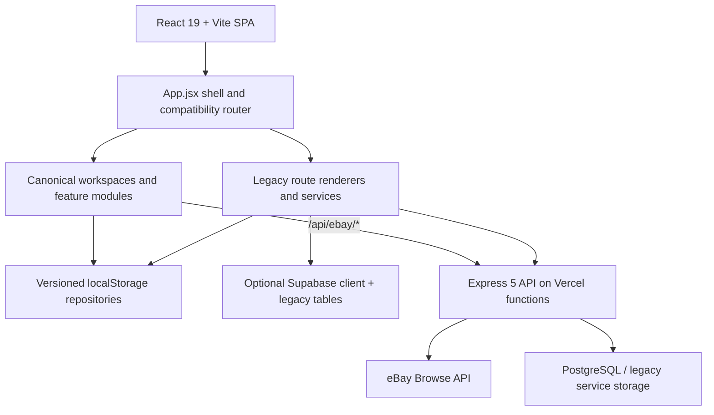
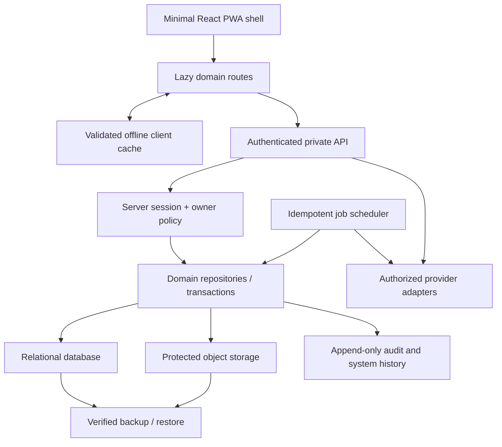

# Code 3 Architecture

Phase 1B starting baseline: `26d30b9a0b1379d53778c0bc5c92887cc0ae744f`.

Phase 1A is published on the feature branch. Hosted owner access still depends on correct environment configuration and has not been accepted for Production.

Phase 1B status: validated checkpoint source published on the feature branch. The canonical database artifact is `SCHEMA_ONLY`; repository/API contracts are present but hosted use is gate-disabled; Migration Preview is `DRY_RUN_ONLY`; `REMOTE_ACTIVE` is `NOT_ACTIVE`. No production migration or owner-data migration has run.

## Executive summary

Code 3 is a hybrid React/Vite single-page application. Its approved everyday shell and private sourcing foundation are implemented, but authoritative data is split across three persistence styles:

1. versioned browser-local repositories for canonical Deal Finder and Owner Center records;
2. older browser storage and optional Supabase persistence used by legacy application modules;
3. an Express/PostgreSQL backend used by legacy APIs and the secure eBay Browse connector.

The published architecture is suitable for a private preview, not for centralized durability or reliable background work. Phase 1A supplies a Supabase-backed server identity boundary for the auth/eBay route families and a deterministic browser-backup/restore-preview contract. Phase 1B selects and scaffolds the owner-authorized Express API → repository/service layer → PostgreSQL/Supabase Postgres target, but deliberately leaves current browser repositories authoritative. Those changes reduce migration risk; they do not migrate records, activate remote persistence, protect every legacy route, or make a backup complete when server data or referenced file bytes are omitted. The safest target remains an incremental strangler migration.

## Published Phase 1A boundary

The published Phase 1A implementation adds these boundaries without a database migration:

- `backend/src/auth/*`: normalized principals, Supabase token verification, immutable-subject owner policy, and environment gating;
- `backend/src/security/*`: exact-origin CORS and structured redaction helpers;
- `backend/src/routes/auth.routes.ts`: safe `GET /api/auth/session` inspection;
- `backend/src/routes/ebay.routes.ts`: OWNER middleware around health and search;
- `src/services/ownerSession.js`: browser session inspection and authenticated request headers;
- `src/features/backup/*`: source registry, bounded/canonical JSON, prohibited-data filtering, SHA-256 backup envelope, and no-write restore preview;
- Owner Center session states and a minimal Data & Backup surface;
- centralized Code 3 runtime/PWA/offline identity.

See [OWNER_AUTH_DECISION.md](./OWNER_AUTH_DECISION.md), [BACKUP_FORMAT_V1.md](./BACKUP_FORMAT_V1.md), and [RESTORE_PREVIEW_CONTRACT.md](./RESTORE_PREVIEW_CONTRACT.md).

## Phase 1B checkpoint delta

Phase 1B adds a no-cutover persistence foundation:

- canonical relational schema/migration source for the bounded private-business domains;
- server-side domain definitions, strict validation, owner-scoped repository contracts, optimistic versions, bounded pagination, and owner-authorized API routing;
- test/dry-run repositories that can prove ownership, constraints, pagination, and conflict behavior without production credentials;
- client persistence modes `LOCAL_ONLY`, `MIGRATION_PREVIEW`, and `REMOTE_ACTIVE`, with local remaining the active default and existing feature repositories not yet rewired; the local adapter mirrors canonical status/`includeArchived` behavior, `ARCHIVED` state, and stable `(createdAt, id)` ordering while retaining a private legacy-ID-compatible cursor distinct from the UUID-strict server cursor;
- migration-source classification, client canonical wire validation aligned to the server contract, money-to-minor-unit diagnostics, deterministic no-delete plan generation, conflict/reference detection, and zero-write proof;
- a minimal Migration Readiness surface under Owner Center Data & Backup;
- server-export adapter contracts that keep backup coverage `PARTIAL` whenever remote data is unavailable;
- schema-only file-asset metadata, with no object upload or byte migration.

The exact implementation paths are cited in [CANONICAL_PERSISTENCE_DECISION.md](./CANONICAL_PERSISTENCE_DECISION.md) and [MIGRATION_PREVIEW_CONTRACT.md](./MIGRATION_PREVIEW_CONTRACT.md). A migration file in source is not evidence that it was executed.

`backend/src/routes/code3.routes.ts` is mounted at `/api/code3` through the same protected CORS and owner boundary as auth/eBay. It provides bounded canonical resource contracts plus read-only export and migration dry-run endpoints, but `CODE3_CANONICAL_PERSISTENCE_ENABLED` and `DATABASE_URL` must both be configured before the hosted route family leaves its safe `503` state. `supabase/migrations/20260820120000_code3_canonical_owner_records.sql` defines the unexecuted target tables/RLS/constraints. `FILE_ASSET` uses the generic record envelope plus a typed `code3_file_assets` metadata row and owner-scoped related-record validation; no file byte is uploaded. `src/features/persistence` supplies the client local/remote abstraction and deterministic local mapping, with all 80 backup-registry record paths explicitly classified. `src/services/code3OwnerApi.js` supplies owner-session headers to the bounded remote-export adapter; Data & Backup and `src/features/backup/MigrationReadinessPanel.jsx` consume that read result when available and otherwise retain honest `PARTIAL`/unavailable states. A `COMPLETE` remote export must use the repository consistent-read boundary, carry every uppercase canonical domain key, and have no truncation; source-read warnings flow into readiness and its deterministic hashes.

## Current system map

## Frontend

| Concern | Current implementation | Evidence | Consequence |
|---|---|---|---|
| Framework | React 19.2.3, Vite 8.0.10 | `package.json`, `src/main.jsx`, `vite.config.js` | Modern SPA toolchain |
| Entry | `src/main.jsx` lazy-imports the application and installs an error boundary/service worker | `src/main.jsx` | Shell bootstrap is already isolated |
| Shell | A very large `src/App.jsx` owns authentication, hydration, route selection, navigation, dialogs, and legacy renderers | `src/App.jsx`, `docs/APP_SHELL_EXTRACTION_PLAN.md` | High coupling and a large initial chunk |
| Canonical pages | Home, Find, Collection, Business, and Owner Center delegate to focused modules | `src/pages/OperationsHome.jsx`, `src/pages/EverydayWorkspaces.jsx`, `src/features/flipScout`, `src/features/ownerCenter` | Current plain-language experience is real |
| Shared UI | Semantic operations components and CSS | `src/components/operations`, `src/styles/app/01-tokens-theme.css` | Reusable accessible foundation |
| Routing | Custom path parsing and render dispatch, not React Router | `src/utils/appRouteState.js`, `src/App.jsx` | Back/redirect compatibility depends on bespoke code |
| State | Large in-memory React state plus domain repository snapshots and legacy hooks | `src/App.jsx`, feature repositories | No single authoritative state boundary |
| Canonical read bridge | Owner-authorized Code 3 request helper and bounded server-export adapter | `src/services/code3OwnerApi.js`, `src/features/persistence/remoteBackupAdapter.js` | Backup/preview may compare remote records when configured; no remote writes or cutover |
| PWA | Manifest/service worker and installable SPA behavior | `public/manifest.webmanifest`, `public/sw.js`, `src/main.jsx` | Offline shell support exists; conflict-safe sync does not |

## Routing and compatibility

Canonical route ownership is encoded in `src/utils/appRouteState.js`. Current primary paths include:

- `/`, `/find/*`, `/collection/*`, `/business/*`, `/owner-center/*`, and `/settings/*`;
- direct business shortcuts `/purchases`, `/inventory`, `/sell`, and `/sales`;
- secondary `/kids-community`, `/assistant`, and `/integrations` routes.

Legacy aliases remain for older sourcing, collection, sales, exchange, community, administration, reporting, and settings URLs. `src/App.jsx` resolves these aliases or renders compatibility modules. The definitive migration inventory remains in `docs/LEGACY_ROUTE_MIGRATION.md`.

Risks:

- path state, active tab, modal history, and scroll restoration are custom and tightly coupled;
- some aliases still render a separate legacy workflow rather than delegate to a canonical screen;
- localStorage hydration can influence the first route render;
- careless route extraction can break direct refreshes and Android/browser Back.

The target is a route registry with one canonical owner per workflow, explicit redirects preserving query/hash data, domain-level error/loading boundaries, and focused compatibility tests.

## Current persistence

### Canonical browser repositories

- `src/features/flipScout/storageRepository.js` stores schema-versioned feature data under `ember-and-tide.flip-scout.v1`. The old namespace is intentionally retained for compatibility.
- `src/features/ownerCenter/ownerCenterRepository.js` stores owner intelligence and controls under `private-business-hub.owner-center.v1`.
- guided forms use namespaced session/draft keys through `src/components/operations/RecordExperience.jsx` and feature screens.

These repositories provide safe parsing, defaults, validation, import/export, and update notifications. They are browser-local, single-device, and not protected by server authorization.

### Legacy local and Supabase persistence

`src/utils/betaDataCleanup.js` enumerates older local keys. `src/services/phase2Persistence.js` falls back to `et-tcg-phase2-data` and optionally persists selected legacy records to Supabase. `src/supabaseClient.js` uses public URL/anonymous-key configuration and relies on database policies.

Existing Supabase migrations cover legacy profiles, workspaces, catalog, receipts, notification, and public-beta features. They do not provide a canonical backend repository for the current Deal Finder, Owner Center, owned-item, or business records.

### Backend persistence

`backend/src/db.ts` provides a PostgreSQL pool from `DATABASE_URL`. Legacy backend routes still combine database services, in-memory services, and upstream adapters. Phase 1B adds a coherent canonical service/repository layer for `/api/code3`, but its schema is unexecuted, its hosted gate is off, and existing feature repositories have not cut over.

## Backend and API

The backend is Express 5 with TypeScript in `backend/`. Vercel entry points `api/[...path].ts` and `api/health.ts` import the Express application. Current route families include catalog, inventory, collection compatibility, sales/expenses compatibility, stores/reports, alerts, community, market, scanning, Best Buy legacy monitoring, and eBay.

The eBay implementation is the strongest current server boundary:

- `backend/src/routes/ebay.routes.ts`
- `backend/src/services/ebayBrowse.service.ts`
- `backend/src/server.ts`

It keeps credentials server-side, caches application tokens, retries authentication once, maps upstream failures, and normalizes active listings. Browser discovery and Import Review live in `src/features/flipScout/ebayDiscovery.js` and `src/features/flipScout/screens/EbayDiscoveryScreen.jsx`.

Current backend limitations after the Phase 1B checkpoint:

- the new owner policy protects `/api/ebay/*`, but it is not yet an application-wide policy;
- canonical owner API/repository contracts exist locally, but remote persistence and owner-data cutover are not active;
- legacy route families remain behind their previous permissive `cors()` policy until separately migrated;
- mixed durable and process-memory services;
- no canonical background-job subsystem or durable audit writer; mutation idempotency beyond the Phase 1B contract remains future work;
- no protected object/file storage for evidence and receipts.

## Authentication and permissions

The selected identity provider is the existing Supabase Auth integration. The browser supplies its current access token; the server verifies it with Supabase, normalizes an `AuthPrincipal`, and separately checks an exact provider-qualified immutable subject in `CODE3_OWNER_SUBJECTS`. Email, browser role, localStorage, hidden navigation, and Vercel Preview Authentication do not authorize a request.

`GET /api/auth/session` returns only safe, masked session facts with `Cache-Control: no-store`. The browser uses that verified result for Owner Center visibility and compact Sign In Required / Owner Access Required states. Backend policy remains definitive for protected operations.

The local adapter requires an explicit server setting, a development runtime, loopback host and socket, and an explicit header. The test adapter is injectable only in the automated-test runtime. Both fail closed in Preview, Production, and hosted-unknown environments.

Current roles (`OWNER`, `ADMIN`, `MODERATOR`, `BETA_USER`, `USER`) still exist in the legacy beta model, but they cannot grant access to the protected eBay routes. Future collaborator, inventory-helper, bookkeeper, and read-only policies remain dormant. Session/device management and private-record permissions are still missing.

## Brand and feature controls

The approved application identity is Code 3. The published Phase 1A source applies display, short, PWA, PWA short, browser-title, accessible-logo, logo, favicon, and offline identity through `src/config/brand.js` and the Vite metadata replacement. The legal/public business name and tagline remain separate and blank. Historical route, storage, cache, module, and imported-source identifiers remain unchanged.

The runtime configuration still needs the definitive default social handle, currency, and time zone. Some compatibility/public-beta copy outside the primary shell still contains historical wording and requires a separately bounded migration. `src/features/ownerCenter/ownerCenterRepository.js` stores feature controls and scoring defaults locally; these controls influence UI visibility but are not server entitlements.

## Deployment

| Layer | Current configuration |
|---|---|
| Frontend/API host | Vercel SPA + functions via `vercel.json` |
| Build | root `npm run build`; backend has a separate TypeScript build command |
| Route fallback | filesystem first, then SPA fallback |
| CI | `.github/workflows/market-price-refresh.yml` is scheduled/manual only |
| Feature branch | Vercel Preview only at the verified baseline |
| Production | not deployed by this work |

There is no push/pull-request GitHub Actions workflow in the repository. Vercel's external Git integration supplies preview checks. The market-price workflow can modify generated data on its scheduled/manual path and is separate from the application build gate.

## Environment-variable inventory

Names only are documented; values were not read or copied into these documents.

| Scope | Current names found |
|---|---|
| Browser/build configuration | `VITE_SUPABASE_URL`, `VITE_SUPABASE_ANON_KEY`, `VITE_API_BASE_URL`, `VITE_PUBLIC_APP_URL`, `VITE_CODE3_LOCAL_AUTH_ENABLED`, `VITE_BETA_LOCAL_MODE`, `VITE_QA_UNLOCK_PAID_FEATURES`, `VITE_ADMIN_EMAILS`, `VITE_DEV_ADMIN_EMAIL`, `VITE_LOCAL_DEV_ADMIN`, `VITE_SEARCH_DEBUG` |
| Server/database | `DATABASE_URL`, `POSTGRES_URL`, `SUPABASE_URL`, `SUPABASE_ANON_KEY`, `SUPABASE_DB_URL`, `SUPABASE_DB_SSL_NO_VERIFY`, `SUPABASE_SERVICE_ROLE_KEY`, `CODE3_CANONICAL_PERSISTENCE_ENABLED`, `PORT`, `NODE_ENV` |
| Owner boundary and CORS | `CODE3_OWNER_SUBJECTS`, `CODE3_CORS_ALLOWED_ORIGINS`, `CODE3_CORS_PREVIEW_ORIGINS`, `CODE3_CORS_LOCAL_ORIGINS`, `CODE3_ENABLE_LOCAL_DEV_AUTH`, `VERCEL_ENV` |
| eBay server | `EBAY_CLIENT_ID`, `EBAY_CLIENT_SECRET`, `EBAY_ENVIRONMENT`, `EBAY_MARKETPLACE_ID`, `EBAY_REQUEST_TIMEOUT_MS` |
| Legacy Best Buy/alerts server | `BESTBUY_API_KEY`, `BESTBUY_API_BASE_URL`, `BESTBUY_MONITOR_ENABLED`, `BESTBUY_MONITOR_QUERY`, `BESTBUY_MONITOR_ZIP`, `BESTBUY_MONITOR_SKUS`, `BESTBUY_ALERT_ONLY_ON_CHANGE`, `BESTBUY_DISCORD_WEBHOOK_URL`, `BESTBUY_MONITOR_SECRET`, `DISCORD_WEBHOOK_URL` |
| Vercel/build metadata | `VERCEL`, `VERCEL_DEPLOYMENT_ID`, `VERCEL_GIT_COMMIT_SHA`, `GITHUB_ACTIONS`, `MODE`, `DEV` |
| Test/import/sync scripts | `APP_URL`, `BETA_REGRESSION_SCENARIO_FROM`, `BETA_REGRESSION_SCENARIO_TO`, `BETA_REGRESSION_SCENARIOS`, `BETA_SMOKE_AREA`, `BETA_SMOKE_MODE`, `BETA_SMOKE_STEP_TIMEOUT_MS`, `DEMO_USER_IDS`, `MARKET_REFRESH_SCHEDULER`, `RLS_TEST_VERBOSE`, `SKIP_OVERPASS`, `SYNC_REQUEST_DELAY_MS`, `SYNC_STORES`, `SYNC_TIMESTAMP`, `TCGCSV_CATEGORY_ID`, `TCGCSV_GROUP_IDS`, `TCGCSV_GROUP_LIMIT`, `THEME_INSPECT` |

Some names occur only in maintenance/test scripts rather than deployed runtime. Browser-prefixed role or QA variables are configuration conveniences, never secrets or authorization. Server-secret classification and migration requirements are in [SECURITY_AND_PRIVACY.md](./SECURITY_AND_PRIVACY.md).

## Tests

The repository has focused Node/browser scripts rather than one consolidated test framework. Verified gates include:

- calculations, allocation, storage, eBay normalization and server behavior;
- Owner Center models, authorization, restock metrics, and purpose history;
- browser workflows and Deal Inbox deletion;
- route loading, compatibility aliases, direct lazy-route loads;
- plain language, viewport light/dark, keyboard accessibility;
- focused beta smoke and a bounded 28-scenario regression.

Tests are listed in `package.json` and `backend/package.json`. The published UI and Phase 1A baseline passed the documented focused and full validation gates before publication review.

## Bundle structure

`vite.config.js` separates React, Supabase, scanner, and catalog dependencies. The main `App` chunk is still approximately 2,337 kB minified and 586 kB gzip because many legacy renderers and state dependencies remain in `src/App.jsx`. Existing extraction analysis is in `docs/BUNDLE_AND_ROUTE_PERFORMANCE.md` and `docs/APP_SHELL_EXTRACTION_PLAN.md`.

## Target architecture

### Target boundaries

1. **Presentation:** domain-level route modules; no provider secrets or persistence implementation.
2. **Application services:** workflows, authorization decisions, validation, idempotency, and transaction orchestration.
3. **Repositories:** stable interfaces shared by local preview/migration tools and backend implementations.
4. **Provider adapters:** capability-declared official/authorized integrations only.
5. **Data:** relational canonical records using integer minor currency units and protected object references.
6. **Jobs:** rate-limit-aware, retryable, idempotent search/expiration/notification tasks with history.
7. **Audit:** corrections and administrative actions appended rather than silently overwritten.

## Migration strategy

The repository audit changes the safest order from “database first” to “security and recovery boundary first”:

1. freeze and document local schemas, produce a verified export with explicit complete/partial/failed coverage, and add no-write restore preview;
2. establish authenticated principals and OWNER authorization on sensitive endpoints;
3. define canonical schemas/repositories and rehearse migration without writes;
4. provision relational and object storage with versioned, reversible migrations;
5. migrate one domain behind repository interfaces, dual-read for validation, then cut over explicitly;
6. keep legacy keys and aliases until record counts, IDs, money totals, history, and attachments reconcile;
7. retire only after backup/restore and rollback have been exercised.

## Principal migration risks

- browser-local records can differ across devices and profiles;
- legacy and canonical records overlap but do not share one entity identity model;
- float-based local money and target minor-unit money require exact reconciliation;
- purpose inference for legacy inventory can be ambiguous and must remain `UNASSIGNED`;
- attachment references are not currently protected durable files;
- custom history/back behavior can regress during route extraction;
- server authorization must precede scheduled jobs or canonical-data APIs;
- old keys and route names are migration dependencies even though their visible wording is retired.

## Intentionally retained internal identifiers

The following are technical compatibility references, not user-facing product names:

- source paths under `src/features/flipScout` and legacy page module filenames;
- npm script names such as `test:flip-scout` and `test:scout`;
- route aliases including `/scout/*`, `/vault/*`, and `/forge/*`;
- storage keys beginning `ember-and-tide`, `et-tcg`, or other historical namespaces;
- legacy database tables/migrations and the existing repository/GitHub project name.

Renaming these without a separately tested migration could break saved data, scripts, deep links, and regression coverage. New visible copy and canonical navigation use the plain-language product contract.

See [IMPLEMENTATION_ROADMAP.md](./IMPLEMENTATION_ROADMAP.md) for acceptance and rollback gates.
