# Code 3 Data Model

Phase 1B starting baseline: `26d30b9a0b1379d53778c0bc5c92887cc0ae744f`.

Phase 1A authentication and recovery structures and the validated Phase 1B schema/mapping contracts are published on the feature branch. No Phase 1B migration has been executed and no owner record has moved.

Phase 1C is published through `af21199f610cc91e31d9dee59af6f0a2f748ab79` and adds local intelligence contracts plus card-analysis revision history only. It does not change the repository schema version, apply the canonical schema, activate remote persistence, or canonicalize existing owner records.

Phase 2A Account Ops is published at `c76e3e4bc668c08d9a0908c9bb2cd96444610297`. It adds a separate versioned Account Ops browser document and migration classification only. It does not add a canonical Account Ops domain, apply a schema, provision email, activate remote persistence, or migrate owner records.

Phase 2A.5 is published at `4c6c7891a123777acec8f326793f30aee61f3de6`. It adds a bounded product-workspace preference and route metadata, not a domain entity or feature-data migration.

Phase 2B1 is published at `2f49a5ed97cec827184c6080e4ada0f4c8194451` and adds a separate versioned `code3.inbox-order.v1` browser source for minimized message evidence, Order Candidate projections, append-only candidate events, and sanitized activity. Phase 2B2-B is published at `b4848cb851b2be83093fbdc4ed4b976857f9d3ff`; its separate Preview operational verification remains paused and does not add canonical business data. A Free Upstash resource and three branch-scoped Preview secrets exist, but the remaining owner/CORS/activation configuration is absent, no follow-up Preview was deployed, and `hostedRuntimeVerified=false`.

Phase 2D-A adds the separate versioned `code3.bot-ops.v1` browser source for provider-neutral Bot installations, Account Ops references, proxy metadata, product targets, task groups/tasks, append-only attempts/activity, and reviewable Checkout Evidence. It changes neither the strict Account Ops/Inbox documents nor the Phase 1B canonical schema, and it cannot create a Purchase or Inventory mutation. `LOCAL_ONLY` remains authoritative.

Phase 2D-B2 adds no stored domain. `StellarTaskExportPreview` is an ephemeral inspection projection over one owner-selected JSON file; it is not a `BotTask`, `BotTaskGroup`, `ProductTarget`, import job, provider event, or migration source. Raw input and normalized preview data remain in memory only and are discarded on close, replacement, navigation, or refresh.

This document distinguishes current persisted shapes, Phase 1B schema-only representations, and the future active canonical model. A table, migration file, repository interface, or dry-run result is not evidence that remote persistence is active.

## Modeling rules

- One physical item has one stable `OwnedItem` identity.
- Product workspaces project shared opportunity, purchase, owned-item, inventory, and sale records; they never create Collect-, Sell-, or Business-specific clones merely for navigation.
- Imported source evidence, normalized data, user corrections, and final records remain separate.
- Historical financial and inventory facts are corrected, voided, returned, refunded, written off, or archived rather than destructively replaced.
- Major records include stable ID, created/updated timestamp, created/updated actor, schema/version, source, archive status, and notes where relevant.
- Target money uses integer minor units plus ISO currency. Current browser records use JavaScript numbers and require reconciliation during migration.
- Quantities use explicit units and validation; a draft sale does not reduce available quantity.
- Dates are stored as UTC instants when time is meaningful, plus source time zone where interpretation matters.
- Provider and external IDs are namespaced and never used as the sole internal primary key.
- Unknown legacy purpose remains `UNASSIGNED`; migration does not guess irreversibly.

## Current persisted models

### Deal Finder repository

`src/features/flipScout/storageRepository.js` stores one schema-versioned document under `ember-and-tide.flip-scout.v1` (retained internal compatibility key).

| Collection | Current purpose |
|---|---|
| `deals` | normalized listings and manually entered opportunities |
| `appraisals` | legacy saved deal assumptions/results plus explicitly tagged Phase 1C card-analysis revisions |
| `auctions` | manually entered auctions and maximum-bid inputs |
| `searchRules` | local rule definitions and templates |
| `purchases` | purchase headers and original projections |
| `lots` | purchase-lot grouping and allocations |
| `inventory` | owned/resale item records and quantity |
| `sales` | sale records and realized results |
| `expenses` | business expense records |
| `mileage` | business mileage records |
| `activity` | recent feature activity |
| `providerListings` | reviewed discovery snapshots used for deduplication/change detection |

The repository schema version is currently 2. It provides defaults, safe parsing, validation, import/export, and update events. It is client-local.

### Owner Center repository

`src/features/ownerCenter/ownerCenterRepository.js` stores schema version 1 under `private-business-hub.owner-center.v1` (an intentionally retained internal compatibility key, not visible branding).

| Collection/config | Current purpose |
|---|---|
| `restockStoreProfiles` | store pattern context |
| `restockEvents` | reports/confirmations |
| `restockPredictions` | prediction and outcome records |
| `storeVisits` | owner trip outcomes |
| `productObservations` | product/store observations |
| `imports` | owner import activity summaries |
| `jobs` | local job/status summaries, not a durable scheduler |
| `controls.scoring` | owner default deal thresholds/reserves |
| `controls.features` | client-visible feature toggles |

### Account Ops repository

Phase 2A stores schema version 1 under `code3.account-ops.v1` and accesses it through the Phase 1B persistence gateway fixed to `LOCAL_ONLY`.

| Collection | Current purpose |
|---|---|
| `profileGroups` | owner-created categories for reusable operational profiles |
| `profiles` | owner-managed contact, address, and business metadata; never an authentication principal |
| `emailDomains` | configured domain and provider-mode metadata; no provider secret |
| `emailAliases` | generated/provisioning-state metadata and profile/retailer relationships |
| `retailers` | owner-created retailer directory entries; static presets remain application metadata |
| `storeAccounts` | retailer-account metadata, setup/verification state, health inputs, and credential references |
| `tasks` | local Account Ops tasks and retained completion/dismissal state |
| `activity` | bounded, nonsecret local Account Ops activity summaries |

All eight record paths are registered for backup and are classified `REQUIRES_MAPPING` by Migration Preview because the Phase 1B canonical schema has no corresponding domain. Preview therefore proposes no insert, update, archive, or delete action for these records. The repository accepts no browser-supplied authoritative owner/session/token field, exposes no remote adapter, and does not activate sync.

#### Account Ops relationships and value objects

```text
ProfileGroup 1 -> many Profile
Profile 1 -> many EmailAlias
Retailer 1 -> many EmailAlias (optional relationship)
Profile 1 -> many StoreAccount
Retailer 1 -> many StoreAccount
EmailAlias 1 -> many StoreAccount (optional relationship)
Profile / Retailer / StoreAccount 1 -> many AccountOpsTask
```

Profiles, aliases, custom retailers, store accounts, tasks, and activity records use stable IDs, created/updated timestamps, record versions, and archive/retained-state semantics where applicable. A profile is operational owner data and can never act as `AuthPrincipal`, OWNER allowlist entry, or authorization input.

Alias lifecycle (`ACTIVE`, `PENDING`, `DISABLED`, `ERROR`) is independent from provisioning evidence. Generated local metadata is not a live alias. Catch-all coverage, provider provisioning, receiving confirmation, or provider error require explicit evidence. Provider types are `LOCAL_METADATA_ONLY`, `CATCH_ALL`, and `PROVIDER_MANAGED`; Phase 2A performs no provider network operation.

A store account references metadata only. Its status is `SETUP`, `NEEDS_VERIFICATION`, `READY`, `NEEDS_ATTENTION`, `LOCKED`, `DISABLED`, or `ARCHIVED`. Setup stages are `PREPARED`, `SIGNUP_OPENED`, `EMAIL_VERIFICATION`, `PHONE_VERIFICATION`, `OWNER_CONFIRMATION`, and `READY`; the owner completes security challenges and confirms state. Account health (`HEALTHY`, `NEEDS_ATTENTION`, `PROBLEM`, `UNKNOWN`) is a derived explanation, not retailer-supplied enforcement status.

`CredentialReference` contains provider, reference ID, label, and last-updated time only. Plaintext passwords, OTPs, sessions, tokens, payment-card data, and provider secrets are invalid record content. Password generation is ephemeral and is never persisted or backed up.

Account Ops task status is `OPEN`, `DONE`, or `DISMISSED`. Phase 2B1 keeps Inbox/order evidence in the separate source below rather than widening this strict eight-collection document. Any future Purchase import still requires a separately approved, explicit owner action.

### Inbox and Order Intelligence repository

Phase 2B1 stores schema version 1 under `code3.inbox-order.v1` through the existing persistence gateway fixed to `LOCAL_ONLY`.

| Collection | Current purpose |
|---|---|
| `messageEvents` | minimized, provider-connection-scoped message evidence; raw bodies and protected values are prohibited |
| `orderCandidates` | current owner-reviewable Order Candidate projections; never Business Purchases |
| `candidateEvents` | append-only source-revision and owner confirm/correct/reject history |
| `activity` | bounded, sanitized local processing summaries |

The source uses stable IDs, schema/record versions, bounded arrays and strings, recursive authority/secret rejection, and validation before writes. `messageEvents` and `candidateEvents` are immutable once written. Reprocessing the same `providerConnectionId + providerMessageId + sourceHash` is a no-op; changed evidence under the same scoped identity is retained as a revision/conflict. Order evidence reconciles only when the provider connection, normalized retailer, and external order ID are compatible. Missing or conflicting identity remains reviewable rather than being silently merged.

Message categories are `VERIFICATION`, `ORDER_CONFIRMATION`, `SHIPPED`, `DELIVERED`, `CANCELLED`, `REFUND`, `RETURN`, `PICKUP`, `PASSWORD_SECURITY`, `RETAILER_NOTICE`, `OTHER`, and `PROTECTED`. OTPs, reset/login links, security codes, raw protected content, and unrelated personal content are minimized before hashing or persistence. An `OTHER` or protected message cannot create an Order Candidate.

Candidate money uses safe integer minor units and one explicit currency. Decimal input is parsed without floating-point arithmetic; malformed, excess-precision, or mixed-currency evidence is rejected or warned without silent rounding. Order state, review state, per-field provenance, warnings, contradictions, source hash, processing version, and owner corrections remain separate. New or materially changed candidates require owner review; explicit owner confirmation or rejection may clear `ownerReviewRequired`, while later changing evidence sets it again. Every candidate fixes `automaticImportAllowed: false` and `purchaseCreated: false`.

All four paths are registered in Backup Format v1 and classified `REQUIRES_MAPPING`. No Phase 1B canonical domain, migration action, remote adapter, sync path, or Purchase writer is approved for them.

### Bot Operations repository

Phase 2D-A stores schema version 1 under `code3.bot-ops.v1` through the existing persistence gateway fixed to `LOCAL_ONLY`.

| Collection | Current purpose |
|---|---|
| `installations` | nonsecret logical Bot runtime metadata, provider, version, capabilities, connection/health state, and warnings |
| `retailerAccountLinks` | Bot-specific assignment metadata referencing canonical Account Ops store-account/profile IDs where available |
| `botProfiles` | nonsecret Bot checkout-profile configuration and Account Ops profile/shipping/billing/phone reference IDs |
| `proxyGroups` | proxy type/provider/region/assignment/health/count/latency metadata; never endpoints or credentials |
| `productTargets` | reusable provider-neutral retailer/product/SKU/TCIN/UPC/price/quantity/review/provenance targets |
| `taskGroups` | retailer/category/provider/installation/account/profile/proxy/schedule/limit/status metadata |
| `tasks` | product-target assignments, normalized runtime state, latest attempt/result, warnings, provider reference and provenance |
| `attempts` | append-only normalized provider-event history with bounded messages and evidence references |
| `checkoutEvidence` | owner-reviewable external checkout/order evidence; never a Purchase or confirmed order |
| `activity` | bounded append-only nonsecret Bot Operations activity summaries |

The normal document begins with empty arrays. Hayha and Stellar are static provider-registry metadata, both `NOT_CONFIGURED`, disconnected, with empty/unverified retailer coverage and all live capabilities false. `MOCK` exists only as an explicitly injected automated-test adapter and is not a normal-runtime live registry entry.

#### Bot Operations relationships

```text
AccountOps StoreAccount 1 -> many Bot RetailerAccountLink
AccountOps Profile 1 -> many Bot RetailerAccountLink / BotProfile
Bot Installation 1 -> many TaskGroup / ProxyGroup / Attempt
RetailerAccountLink 1 -> many TaskGroup
BotProfile 1 -> many TaskGroup
ProxyGroup 1 -> many TaskGroup
TaskGroup 1 -> many Task
ProductTarget 1 -> many Task
Task 1 -> many Attempt / CheckoutEvidence
Attempt many -> zero-or-one CheckoutEvidence identity per attempt
```

Each Attempt references at most one Checkout Evidence record. Changed provider-event revisions may reference the same stable evidence identity while each revision remains in append-only history; the evidence retains its primary attempt/source relationship and records conflicts for review. References preserve shared Account Ops identities; Phase 2D-A does not clone retailer credentials, authentication identity, addresses, or payment data. Internal Bot references are validated by service operations. Account Ops identifiers remain cross-source references; Restore Preview reports missing links when both sources are available, while lifecycle-state diagnostics remain future work. No link is repaired silently.

Attempts and activity are append-only. Checkout Evidence may receive version-checked owner review/correction state while retaining its underlying attempt/source history. Every evidence record forces automatic Purchase creation, Purchase-created state, receiving, and Inventory mutation false.

Provider events use the stable scoped identity `providerKey + installationId + providerEventId`. The same scoped identity and source hash is idempotent; the same provider event ID on another installation is distinct; a changed hash is retained as a revision/conflict. Reordered events preserve event and ingestion time. Contradictory states remain in history and produce review warnings rather than last-write-wins replacement.

All ten record paths are registered for Backup Format v1 and classified `REQUIRES_MAPPING`, because the Phase 1B schema has no Bot Operations domain. Preview proposes no canonical insert, update, archive, delete, Purchase, receiving, or Inventory action. Bot/provider, retailer, payment, and proxy credentials; raw provider payloads/logs; credential-bearing URLs; and browser authority fields are invalid before persistence and remain excluded from backup.

#### Stellar task-export preview projection

Phase 2D-B2 defines a non-persisted `StellarTaskExportPreview` with bounded summary fields only:

| Preview field | Meaning |
|---|---|
| `fileValidationState` | selected JSON file accepted or safely rejected by type/size/parse/root checks |
| `formatRecognitionState` | `SUPPORTED`, `PARTIALLY_RECOGNIZED`, `UNKNOWN_FORMAT`, `UNSAFE`, or `REJECTED`; `SUPPORTED` is reserved and not emitted while Stellar's stable schema/version marker is unverified |
| `recordCount` / `recognizedTaskCount` / `rejectedRecordCount` | bounded in-session counts, never durable metrics |
| `warningCount` / `blockingFindings` | category-level diagnostics with no secret values or raw JSON |
| `recognizedFields` / `ignoredFields` | bounded field-name summaries; arbitrary unknown values are not copied |
| `detectedRetailerLabels` | normalized labels observed in the file; not provider capability evidence |
| `tasks[]` | non-authoritative safe mapping proposals with validation/mapping warnings and duplicate state |

The preview accepts at most 1 MiB and 500 candidate records. Before a field can enter `tasks[]`, the entire parsed structure passes recursive screening for credentials, tokens/sessions/cookies, authorization, license material, OTP/recovery/security data, payment data, proxy authentication, credential-bearing URLs, raw provider artifacts, and dangerous prototype keys. Any such finding changes the file to `UNSAFE` and stops normalization.

The strict task allowlist can represent bounded task/group references and labels, retailer/site labels, product identifiers (`productId`, SKU, UPC/GTIN, or TCIN where recognizable), product title, integer quantity, exact money in integer minor units plus validated currency, safe mode/type, enabled/status state, and bounded timestamps. Missing, ambiguous, unsupported, or invalid values remain diagnostics; no default quantity, retailer support, currency, or price is invented.

Duplicate identities exist only within the current preview and use the narrowest available export-local reference or safe retailer/product/group tuple. They are warnings, not global IDs. No raw-file hash is retained. Only a basename may be shown, and it is discarded with the preview. No preview field enters `code3.bot-ops.v1`, Account Ops, backup, Restore Preview, Migration Preview, Upstash, Supabase, or any business repository.

See [BOT_INTEGRATION_CONTRACT.md](./BOT_INTEGRATION_CONTRACT.md) for the complete provider, security, idempotency, and handoff contract.

### Phase 2B2-B managed provider records

Phase 2B2-B introduces a server-only operational storage contract. It is intentionally separate from `code3.account-ops.v1`, `code3.inbox-order.v1`, the Phase 1B canonical schema, and ordinary backup/restore.

| Managed record | Persisted representation | Safety boundary |
|---|---|---|
| Provider connection metadata | owner-hash-scoped Redis hash containing a validated bounded `SafeProviderConnection` projection | no access/refresh token, OAuth code/state, PKCE verifier, password, OTP, raw mailbox content, or browser authority |
| Provider secret envelope | owner/connection-scoped Redis value with `code3.provider-managed-store.v1`, AES-256-GCM algorithm/key version, IV, authentication tag, ciphertext, and nonsecret reference metadata | plaintext exists only transiently inside trusted backend execution; encryption key is server environment state and never stored beside the envelope |
| OAuth state record | state-digest-keyed Redis value containing provider, hashed owner binding, hashed redirect binding, issue time, and expiry | raw state is returned once to the initiating trusted flow but never persisted; atomic consume deletes the live record and writes a short-lived used marker |
| OAuth state owner index | owner-hash-scoped sorted set of state digests and expiries | enforces a bounded active-state count and supports expiry cleanup without owner identifiers in keys |

All keys use a configured Preview base namespace plus a derived hash of the exact Vercel project ID and Git branch. Stable owner/provider/connection input is hashed before key construction. Connection and secret records occupy separate key families even when they use the same managed Redis resource. OAuth issue and consume use Lua scripts for capacity, expiry cleanup, exact binding checks, deletion, and single-use/replay behavior across serverless instances. Ephemeral readiness key families perform bounded write/read/delete checks and are removed inside the same operation; they are not provider connection records or backup data.

The current operational proof remains incomplete: a Free Upstash resource and three branch-scoped Preview secrets exist, but Supabase owner/auth values and the remaining Preview CORS/activation/runtime values are absent, no follow-up Preview has been deployed, and `hostedRuntimeVerified=false`. No managed provider connection, OAuth state, or live-provider secret has been created. Phase 2B2-B.1 remains paused. This operational store is unavailable to Bot Operations and must never be interpreted as canonical owner-business persistence or a reason to enable `REMOTE_ACTIVE`.

### Product workspace preference

Phase 2A.5 uses `code3.workspace-preference.v1` for reconstructible UI state. Its bounded version 1 shape is:

| Field | Meaning |
|---|---|
| `schemaVersion` | exact supported preference schema version |
| `lastProductWorkspace` | one available public product workspace (`COLLECT`, `FIND`, `SELL`, or `BUSINESS`) |
| `lastSelectedWorkspace` | optional product selection; may be `BOT` only as inert presentation history written for a currently verified owner and never as authority |
| `updatedAt` | canonical ISO update time |

The preference rejects extra, dangerous, and authority-bearing fields. It never stores Owner Center, owner ID/subject, role, entitlement, token, session, business records, or navigation payload. A stored Bot selection is ignored unless the current application session independently verifies OWNER authorization. Direct route ownership takes precedence over the saved value; invalid or unavailable values fall back safely.

This preference is intentionally distinct from the pre-existing persisted `Workspace` collaboration/data records and `activeWorkspaceId`. Phase 2A.5 does not rename, migrate, canonicalize, or reinterpret those historical entities. Code and documentation should use **product workspace** or **workspace shell** when the distinction matters.

Because the preference is reconstructible UI state and contains no owner business record or authority, Phase 2A.5 registers its key inside Backup Format v1's existing non-coverage `safe-ui-preferences` source. It does not add a source, affect coverage, or create a duplicated business record. Restore Preview remains zero-write and treats the value only as bounded display preference data.

### Owned-item compatibility

`src/features/ownedItems/ownedItemPurpose.js` formalizes:

- `PERSONAL_COLLECTION`
- `FOR_RESALE`
- `HOLD`
- `KIDS_COMMUNITY`
- `UNASSIGNED`

Purpose changes append history while preserving the original inventory record. Compatibility inference reads existing fields but ambiguous records stay unassigned.

### Legacy browser and Supabase data

Important retained browser keys include:

```text
et-tcg-beta-data
et-tcg-beta-scout
et-tcg-beta-tidepool
et-tcg-beta-feedback
et-tcg-beta-suggestions
et-tcg-beta-admin-review-log
et-tcg-market-price-cache
tide_tradr_what_did_i_see_reports
et-tcg-app-theme
et-tcg-daily-tide
et-tcg-route-state
et-tcg-beta-catalog-view
et-tcg-beta-catalog-page-size
et-tcg-beta-vault-showcase-view
et-tcg-forge-mode-settings
et-grade-assist-checklists
et-ember-assist-thread
et-tcg-beta-readiness
et-tcg-phase2-data
```

`src/services/phase2Persistence.js` may write selected legacy records to Supabase when configured, otherwise it uses `et-tcg-phase2-data`. Existing migrations in `supabase/migrations` define older profiles, workspaces, catalog, receipt, notification, and beta-feature tables. These are not yet the target canonical private-business schema.

Form drafts use historical internal session/local keys such as `private-business-hub.form-draft.*`. These are compatibility identifiers, not the approved application name, and MUST remain readable until migration is verified.

## Phase 1A security and recovery structures

Phase 1A introduces transport and recovery contracts, not canonical persisted business entities.

### AuthPrincipal

The backend-only normalized principal contains immutable `subject`, `provider`, optional provider-supplied `email` and `emailVerified`, plus `issuedAt` and `expiresAt`. Owner authorization compares `provider:subject` with a server-only allowlist. No principal, role, or owner identifier is accepted from browser storage or request bodies.

### Backup source registry

Each source descriptor contains `sourceId`, `displayName`, `storageType`, `schemaVersion`, supported versions, owner-data and security-state flags, Phase 1A inclusion, export/validation adapter identifiers, reference dependencies, record paths, coverage relevance, and an exclusion reason when omitted.

The Phase 2D-A registry contains 24 sources: 20 locally included sources and four excluded or conditional sources. Included local sources cover Deal Finder schema 2, Owner Center schema 1, Account Ops schema 1, Inbox/Order Intelligence schema 1, Bot Operations schema 1, allowlisted legacy business and fallback documents, legacy restock/community and review sources, safe preferences, and safe workflow drafts. Phase 1B may also include a valid owner-authorized canonical PostgreSQL export. Legacy Supabase, other PostgreSQL/process-memory records, and file bytes remain registered exclusions. Authentication/session persistence is a prohibited source and is never exportable. Account Ops, Inbox/Order Intelligence, and Bot Operations permit only their validated nonsecret metadata. Plaintext passwords, OTPs, tokens, sessions, OAuth state/codes/verifiers, provider/Bot/retailer/payment/proxy secrets, raw provider/protected content, credential-bearing URLs, security links, and owner-authority fields remain prohibited. The Phase 2A.5 product-workspace preference remains inside the existing `safe-ui-preferences` key group, which does not affect coverage or add a separate source.

### BackupEnvelope version 1

The JSON envelope contains format/version, creation and build provenance, coverage status/summary, manifest, data sections, and integrity metadata. Each section contains source ID, schema version, record count, exact sanitized data, warnings, and SHA-256. See [BACKUP_FORMAT_V1.md](./BACKUP_FORMAT_V1.md).

Coverage is `COMPLETE`, `PARTIAL`, or `FAILED`. Configured remote sources or referenced but unembedded file bytes make an otherwise valid artifact partial. Security/session exclusion does not make it partial because those values are prohibited recovery data.

### RestorePreviewResult

The no-write result is `READY_FOR_FUTURE_RESTORE`, `READY_WITH_WARNINGS`, `BLOCKED`, `UNSUPPORTED`, or `CORRUPTED`. It contains integrity/schema/source/count comparisons plus duplicate, collision, money, prohibited-field, and broken-reference findings. It is an in-memory diagnostic, not an import job or audit write. See [RESTORE_PREVIEW_CONTRACT.md](./RESTORE_PREVIEW_CONTRACT.md).

## Phase 1B schema-only rules

Phase 1B defines canonical records without activating them. `supabase/migrations/20260820120000_code3_canonical_owner_records.sql` uses a typed `code3_records` envelope plus `code3_record_links`, so each major owner record row includes:

```text
id UUID
owner_subject text
record_type text
status text
source/external_provider/external_id/source_url
amount_minor/currency/rate_basis_points
quantity/certification_number/occurred_at
created_at timestamptz
updated_at timestamptz
record_version integer
archived_at timestamptz or explicit archive state
source text
notes text when relevant
metadata jsonb when bounded evidence is safer than over-normalization
```

Relationships use explicit link rows and foreign keys where appropriate, while domain definitions validate the allowed relationship names and target types. Likely lookups are indexed by owner plus record type/status, source/provider/external ID, certification, and created/updated time. Parent purchase/lot, owned item, sale, store, and auction links remain owner-scoped. Supabase row-level policies complement—but never replace—owner scoping in the server repository.

Canonical list ordering is ascending `(created_at, id)` and its opaque server keyset cursor contains both values with a strictly validated timestamp and UUID ID. The private local cursor uses the same ordering but remains compatible with legacy non-UUID IDs during `LOCAL_ONLY`; it is not a canonical server cursor. Local and PostgreSQL adapters apply the same `status` and `includeArchived` filters. Canonical create/update reject `ARCHIVED`; only the version-checked archive operation sets status `ARCHIVED` and `archived_at`. It does not delete the record. An archived record cannot be updated in Phase 1B; restoration requires a future explicit, audited contract.

Canonical IDs are UUIDs generated once. The schema primary key is `(owner_subject, id)`: one owner's UUID is unique across all canonical record types, while a different owner may independently use the same UUID. A valid owner-wide unique local UUID may survive migration. Provider IDs, certification numbers, legacy IDs, and source URLs remain separate. A non-UUID legacy ID may produce a deterministic preview proposal from its source identity, but a record with no stable legacy or semantic identity receives no proposed UUID and requires an owner decision. Preview writes nothing, and every collision is reported before a future apply.

Canonical money is an integer `amount_minor` paired with an ISO `currency`. Existing local numeric values remain unchanged. Preview may propose exact conversion only when the source precision and currency make it unambiguous; it preserves the source value and blocks non-finite, ambiguous, or unsupported-precision values.

Mutable records use optimistic `record_version`. A future update supplies `expectedVersion`; a stale value produces `409` rather than overwriting the newer record. Archive/correction/return/refund/write-off semantics remain distinct from destructive deletion.

File bytes are not migrated in Phase 1B. The `FILE_ASSET` record type, client manifest validator, generic canonical record, and `code3_file_assets` metadata row can represent stable ID, owner-derived scope, provider/path, MIME type, size, SHA-256, creation time, and a validated owner-scoped related record. The metadata row has an owner-scoped foreign key to the generic `FILE_ASSET` envelope; service and dry-run validation also require its optional related record to resolve within the same owner, including a valid planned insert for dry-run only. Its storage-provider/path pair is owner-unique and remains reserved when the metadata record is archived. The normal browser backup does not synthesize this manifest, and a metadata row never proves the referenced byte exists, is protected, or is included in backup.

The schema source additionally defines `code3_file_assets` for reference metadata and `code3_audit_events` for future append-only safe summaries. Neither has an active production writer in Phase 1B. Direct browser roles are not granted table access; owner-scoped RLS policies are defense in depth for a separately reviewed future access mode.

See [CANONICAL_PERSISTENCE_DECISION.md](./CANONICAL_PERSISTENCE_DECISION.md), [MIGRATION_PREVIEW_CONTRACT.md](./MIGRATION_PREVIEW_CONTRACT.md), and [MIGRATION_ROLLBACK_CONTRACT.md](./MIGRATION_ROLLBACK_CONTRACT.md).

## Phase 1C local intelligence records

Phase 1C does not create a second storage namespace. `src/features/intelligence/analysisHistory.js` wraps the existing Deal Finder `appraisals` collection with `createLocalCollectionDataSource()` and a `createPersistenceGateway()` fixed to `LOCAL_ONLY`. A caller cannot select a persistence mode or supply a remote adapter. This linked revision model applies to card analyses; an auction may save its current analysis result without joining a generic revision series, and restock intelligence recomputes from its observation records. Legacy appraisal records remain present but are ignored by the Phase 1C card-history query unless both tags match:

```text
recordType = CODE3_INTELLIGENCE_ANALYSIS
format = code3-intelligence-analysis-v1
```

Each tagged revision contains:

```text
id
analysisType
analysisSeriesId
revision
previousAnalysisId
methodologyVersion
inputHash
analyzedAt
sourceInput
sourceReferences
evidence
immutable systemResult
warnings
ownerReview
recordVersion / createdAt / updatedAt from the local adapter
```

An initial card analysis creates revision 1. Card reanalysis appends the next revision and links it to the latest prior record; it never rewrites the prior revision. Owner review is a separate version-checked update containing the owner-confirmed condition, manual values, replacement dismissed-warning set, and correction events. The owner can explicitly clear a prior condition or manual value, and can undismiss a warning by replacing that set. Each correction event has its own ID, time, `OWNER_ENTERED` provenance, and explicit previous/new values. A carried owner confirmation remains visibly carried after reanalysis and does not replace the new system proposal.

Analysis source hashes use canonical JSON plus SHA-256. Analysis inputs recursively reject owner/role/session/token/authorization/credential/security authority fields. No authoritative owner subject is stored in the browser record. History exposes no delete/archive operation.

### Phase 1C intelligence value objects

- Money is `{ minorUnits, currency }` with a safe integer amount. New intelligence arithmetic rejects malformed major-unit strings, excess precision, unsafe integers, negative values where prohibited, and cross-currency operations.
- Rates are bounded integer basis points. Fractional minor-unit fee results retain the deterministic rounding method and remainder.
- Confidence is `HIGH`, `MEDIUM`, `LOW`, or `INSUFFICIENT` and records source independence, sample size, freshness, completeness, identity/condition certainty, and contradictions.
- Evidence provenance is `MACHINE_OBSERVED`, `PROVIDER_SUPPLIED`, `OWNER_ENTERED`, or `INFERRED`. A repeated underlying source is not counted as independent confirmation.
- Apparent card condition is `NM`, `LP`, `MP`, `HP`, or `DMG`. The system proposal, owner-confirmed value, and resolved display value remain separate.
- Valuation evidence types are `SOLD_COMPARABLE`, `ACTIVE_LISTING`, `REFERENCE_PRICE`, `OWNER_COST`, `OWNER_SALE`, and `PREDICTED_RESALE`. Only a verified completed sale may enter the completed-sale center.
- `code3.valuation.v2` records the subject condition, each comparable's validated condition/source quality, the selected condition-basis mode, included evidence IDs, and explicit exclusions. Matched-condition sold records are used without another condition adjustment. Only an explicitly `NM` baseline may be adjusted once when no match exists; unknown or incompatible conditions do not enter that center.
- Official eBay evidence retains external identity, provider observations, image references, and active-listing valuation evidence separately. A provider amount without a valid currency yields a warning and no money object; no default currency is fabricated.
- Recommendations are advisory. Deal results use `STRONG_BUY`, `BUY`, `WATCH`, `PASS`, or `INSUFFICIENT_DATA`, and every deal risk has explicit `LOW`, `MEDIUM`, `HIGH`, or `CRITICAL` severity. Auction results explicitly set automatic bidding false. Restock results use coarse bands, calculate freshness from the latest positive observation, respect independent-source limits, and never return a fabricated decimal probability.

Image entries are metadata/references only in Phase 1C. No file byte is uploaded, analyzed by a configured computer-vision model, or added to canonical file storage. Existing backup behavior includes tagged records through the already registered Deal Finder section, while referenced unembedded file bytes still make recovery coverage partial. See [INTELLIGENCE_CONTRACT.md](./INTELLIGENCE_CONTRACT.md).

## Target entity map

```mermaid
erDiagram
    USER ||--o{ USER_ROLE : has
    ROLE ||--o{ USER_ROLE : grants
    BUSINESS_PROFILE ||--|| BRAND_CONFIG : uses
    ACCOUNT_OPS_PROFILE ||--o{ EMAIL_ALIAS : owns
    RETAILER ||--o{ STORE_ACCOUNT : identifies
    ACCOUNT_OPS_PROFILE ||--o{ STORE_ACCOUNT : configures
    EMAIL_ALIAS ||--o{ STORE_ACCOUNT : may_use
    STORE_ACCOUNT ||--o{ ACCOUNT_OPS_TASK : requires
    BOT_PROVIDER ||--o{ BOT_INSTALLATION : identifies
    BOT_INSTALLATION ||--o{ BOT_TASK_GROUP : hosts
    BOT_INSTALLATION ||--o{ BOT_PROXY_GROUP : observes
    STORE_ACCOUNT ||--o{ BOT_RETAILER_ACCOUNT_LINK : referenced_by
    ACCOUNT_OPS_PROFILE ||--o{ BOT_PROFILE : referenced_by
    BOT_RETAILER_ACCOUNT_LINK ||--o{ BOT_TASK_GROUP : assigned_to
    BOT_PROFILE ||--o{ BOT_TASK_GROUP : assigned_to
    BOT_PROXY_GROUP ||--o{ BOT_TASK_GROUP : assigned_to
    BOT_TASK_GROUP ||--o{ BOT_TASK : contains
    PRODUCT_TARGET ||--o{ BOT_TASK : targets
    BOT_TASK ||--o{ BOT_ATTEMPT : records
    BOT_TASK ||--o{ BOT_CHECKOUT_EVIDENCE : may_support
    BOT_ATTEMPT }o--o| BOT_CHECKOUT_EVIDENCE : may_support
    PROVIDER ||--o{ PROVIDER_CONNECTION : configures
    PROVIDER_CONNECTION ||--o{ NORMALIZED_MESSAGE_EVENT : receives
    NORMALIZED_MESSAGE_EVENT }o--o{ ORDER_CANDIDATE : supports
    ORDER_CANDIDATE ||--o{ ORDER_CANDIDATE_EVENT : retains
    EMAIL_ALIAS }o--o{ NORMALIZED_MESSAGE_EVENT : may_match
    STORE_ACCOUNT }o--o{ ORDER_CANDIDATE : may_match
    PROVIDER ||--o{ SEARCH_RULE : searches
    SEARCH_RULE ||--o{ SEARCH_RUN : executes
    SEARCH_RUN ||--o{ LISTING : discovers
    LISTING ||--o{ LISTING_SNAPSHOT : snapshots
    LISTING ||--o{ DEAL_ANALYSIS : analyzes
    DEAL_ANALYSIS ||--o{ DEAL_SCENARIO : compares
    DEAL_ANALYSIS }o--o{ COMPARABLE_RECORD : uses
    LISTING }o--|| SELLER_PROFILE : attributed_to
    LISTING }o--|| SOURCE_PROFILE : sourced_from
    AUCTION_EVENT ||--o{ AUCTION_LOT : contains
    AUCTION_LOT ||--o{ BID_PLAN : evaluates
    AUCTION_EVENT ||--o{ PICKUP_PLAN : requires
    PURCHASE ||--o{ PURCHASE_LOT : contains
    PURCHASE_LOT ||--o{ OWNED_ITEM : creates
    PURCHASE ||--o{ COST_ALLOCATION : reconciles
    OWNED_ITEM ||--o{ INVENTORY_ADJUSTMENT : changes
    OWNED_ITEM }o--|| STORAGE_LOCATION : stored_at
    OWNED_ITEM ||--o{ SALES_LISTING : listed_as
    SALE ||--o{ SALE_LINE_ITEM : contains
    SALE_LINE_ITEM }o--|| OWNED_ITEM : sells
    SALE ||--o{ SHIPMENT : fulfilled_by
    SALE ||--o{ RETURN : may_have
    RESTOCK_STORE_PROFILE ||--o{ RESTOCK_EVENT : reports
    RESTOCK_STORE_PROFILE ||--o{ STORE_VISIT : visited
    RESTOCK_EVENT ||--o{ RESTOCK_PREDICTION : supports
    PRODUCT_OBSERVATION }o--|| RESTOCK_STORE_PROFILE : observed_at
```



## Identity, access, and configuration

| Entity | Required target content |
|---|---|
| `User` | identity, status, verified contact reference, session/security metadata |
| `AuthPrincipal` | verified provider subject and bounded claims used transiently for authorization; never restored as owner data |
| `Role` / `Permission` | OWNER plus dormant collaborator/helper/bookkeeper/read-only policies |
| `BusinessProfile` | owner business settings and default reporting context |
| `BrandConfig` | Code 3 application display/short/PWA names, title template and accessible logo text; independently configurable legal/public business name and unfinished tagline; marks/icons, accents, support/social, currency, time zone |
| `AppSetting` | versioned owner settings not belonging to a domain |
| `FeatureFlag` | availability, owner override, required dependency, reason unavailable |
| Product workspace registry | static presentation metadata for route ownership, navigation placement, availability, required authority, and future nonauthoritative entitlement hints; not a business entity or authorization source |
| Product workspace preference | bounded reconstructible client preference described above; not the historical persisted `Workspace` entity |

## Providers and discovery

| Entity | Required target content |
|---|---|
| `Provider` | provider ID/type, display name, capabilities, legal/terms review state |
| `ProviderConnection` | safe server projection of provider/configuration/auth status, opaque connection ID, scope summary and health; Phase 2B2-B implements a Preview-only durable metadata adapter, but no managed resource or connection is provisioned |
| `ProviderCapability` | declared operation and status |
| `ProviderSecretReference` | server-only managed/encrypted secret reference and rotation/revocation metadata; Phase 2B2-B encrypts material with AES-256-GCM before storage and supports deletion, but no live secret exists and no raw token is a browser or backup field |
| `OAuthStateRecord` | server-only SHA-256 digest bound to verified owner principal, provider, exact redirect, expiry and atomic one-time consumption; Phase 2B2-B implements the Preview-only Redis/Lua adapter but does not initiate OAuth |
| `SearchRule` | all keyword, classification, price/cost, geography, format, time-window, seller, score, schedule, quiet-hour, result-limit, queue, priority, and note fields |
| `SearchRun` | rule/provider, start/finish, counts, errors, rate-limit state, runtime, cursor/page metadata |
| `Listing` | provider/external identity, original URL, title/description, seller/location, format, current price/bid/shipping, dates, state, classification, confidence/risk, related rule/purchase |
| `ListingSnapshot` | immutable provider-normalized state at check time, payload hash, change set, availability |
| `ListingImage` | original URL or protected asset reference, position, source, content metadata |
| `DealAnalysis` | immutable input/methodology version and hash, evidence provenance, system proposal, separate owner correction, selected scenario, recommendation, maximum offer, confidence/risk/missing data, source set, prior-revision link |
| `DealScenario` | low/expected/high resale and complete cost/proceeds/profit/ROI/margin outputs |
| `ComparableRecord` | completed-sale vs active-ask evidence, match fields, inclusion/exclusion and reason, manual/provider provenance |
| `SellerProfile` | marketplace identity, location/rating history, purchase outcomes, packaging/condition/trust notes |
| `SourceProfile` | source type, capability, coverage, terms, prior outcomes, owner preference/block status |

Listings use the statuses in [DEFINITIVE_PRODUCT_SPEC.md](./DEFINITIVE_PRODUCT_SPEC.md). Import staging is an `ImportJob` plus row-level review results, not a final listing or owned item.

## Account Ops target extensions

| Entity | Required target content |
|---|---|
| `AccountOpsProfile` | reusable owner-managed operational identity metadata and group; explicitly separate from authentication identity |
| `EmailDomain` | owner-configured domain, provider type/capabilities and nonsecret configuration metadata |
| `EmailAlias` | address/local part/domain, profile/retailer/purpose, lifecycle, provisioning evidence, provenance and archive state |
| `Retailer` | stable retailer identity, official URLs, notes and verified capability metadata; custom retailers supported |
| `StoreAccount` | retailer/profile/alias links, username/display metadata, setup/verification/security status, credential reference and archive state |
| `CredentialReference` | external-vault or OS-secure-store provider/reference metadata only; never the secret |
| `AccountOpsTask` | account/profile/retailer-linked manual work with type, priority, due time and retained completion/dismissal state |
| `NormalizedMessageEvent` | Phase 2B1 minimized local provider-message evidence with scoped message identity, category proposal, safe sender/recipient facts, confidence/provenance, source hash, processing version and warnings; no raw or protected content by default |
| `RetailOrderCandidate` | Phase 2B1 local external order projection with exact-minor-unit money, source-event history, account/alias/retailer proposals, confidence/provenance and mandatory owner review; not a Purchase |
| `OrderCandidateEvent` | append-only source revision or owner confirm/correct/reject event that preserves previous evidence and `OWNER_ENTERED` correction provenance |

No Phase 1B canonical table or domain currently represents these entities. Account Ops and Phase 2B1 local evidence remain `REQUIRES_MAPPING` and require a separately reviewed schema/mapping, owner-authorized API, protected persistence, and migration rehearsal before any remote activation. Phase 2B1 does not implement Purchase mapping or import.

## Bot Operations target extensions

| Entity | Required target content |
|---|---|
| `BotProvider` | stable provider identity, display name, supported future integration modes, explicit configuration/connection state, independently declared capabilities, unverified/supported retailer metadata, optional version and bounded warnings; never credentials |
| `BotInstallation` | logical installation/runtime label, provider, connection mode, version, health/last seen, capability snapshot, warnings and lifecycle state; no hardware fingerprint |
| `BotRetailerAccountLink` | stable reference to Account Ops retailer account/profile plus Bot assignment labels/state/warnings; no duplicated credential or authority |
| `BotProfile` | nonsecret checkout-profile configuration, Account Ops/shipping/billing/phone reference IDs, retailer compatibility, Bot assignments and lifecycle state; no payment credential |
| `BotProxyGroup` | proxy type/provider/region/assignment/health/latency/count metadata; no host/IP/URL/username/password/authentication material |
| `ProductTarget` | shared retailer product identity, SKU/TCIN/UPC/GTIN, title/category, exact max/reference price, quantity limit, availability mode, notes, owner review and provenance |
| `BotTaskGroup` | retailer/category/provider/installation/account/profile/proxy/schedule/limit/enabled/status/warning metadata |
| `BotTask` | task-group/product target, retailer, quantity/max price/mode, assignments, normalized status, last attempt/result, provider reference and provenance |
| `BotAttempt` | append-only scoped provider/installation/event identity, task/provider/retailer/time/event/outcome/failure, bounded message, relationship references and provenance |
| `BotCheckoutEvidence` | reviewable provider/retailer/task/product/quantity/expected money/external reference/account/profile/time/confidence/warnings/provenance; explicitly not a Purchase or confirmed order |

The Phase 2D-A browser representations are not Phase 1B canonical tables. They remain local and `REQUIRES_MAPPING`. A future mapping must preserve scoped event identity, source hashes, contradictions, owner reviews/corrections, and the rule that no evidence becomes a Purchase without a separately approved owner-confirmed handoff.

## Auctions

| Entity | Required target content |
|---|---|
| `AuctionEvent` | source/URL/type, address/distance, start/end/preview/registration, deposits, payment/pickup terms, notes/status |
| `AuctionLot` | event/lot identity, description/photos, visible/unknown contents, bid/reserve data, premium/fees/tax, logistics/processing costs, resale scenarios, risk/confidence/status |
| `BidPlan` | fee/tax policy, desired profit/ROI, solved maximum bid, scenario version, no external action |
| `PickupPlan` | window, route inputs, vehicle/helper/equipment, documents/payment/weather/tolls/destinations/checklist |

Tax mode is one of `NONE`, `HAMMER_ONLY`, `HAMMER_PLUS_PREMIUM`, `MANUAL_TAXABLE_SUBTOTAL`, or `ACTUAL_TAX_AMOUNT`.

## Restocks

| Entity | Required target content |
|---|---|
| `RestockStoreProfile` | retailer/store/address/coordinates/distance, stocking method, confirmed pattern, products/quantity/sellout, notes |
| `RestockEvent` | store/product, report time, confirmation status/source/evidence, quantity, sellout, reliability, notes |
| `RestockPrediction` | store/product, predicted date/window, confidence, supporting events, actual outcome, timing error, correct/partial/incorrect |
| `StoreVisit` | store/date/arrival, success, products/quantity/spend, miles/time, purchase link, notes |
| `ProductObservation` | product/UPC/SKU, store/retailer, MSRP, date/quantity/limit/sellout, notes |
| `TripPlan` | selected stores, route inputs, distance/time, hours/windows, priorities, vehicle, notes; no unsupported optimization claim |

## Purchases and owned items

| Entity | Required target content |
|---|---|
| `Purchase` | source/seller/listing, dates/status, every acquisition cost, payment/receipt, shipment/pickup, projections, notes/history |
| `PurchaseLot` | purchase, photos, descriptions, expected/actual quantities, processing state |
| `CostAllocation` | purchase/lot/item, method, basis, amount, rounding adjustment, accepted unresolved difference and actor |
| `OwnedItem` | stable physical identity, purchase/lot, product/card fields, quantity, purpose, condition/grade/certification, images, allocated cost, storage, projection, notes/history |
| `InventoryAdjustment` | quantity/state/storage/purpose change, reason, before/after, related sale/return/correction, actor |
| `StorageLocation` | hierarchical building/room/shelf/cabinet/bin/box/binder/page/slot node |
| `Binder` / `BinderPage` / `BinderSlot` | binder metadata and explicit owned-item placement |
| `WishlistItem` | target product/variant/condition, maximum price, priority, preferred source, alert/matches |
| `GradingSubmission` | candidate, provider/cost/shipping/insurance, expected grade/value, break-even, dates/result/certification/actual cost |

Owned-item purpose is `PERSONAL_COLLECTION`, `FOR_RESALE`, `HOLD`, `KIDS_COMMUNITY`, or `UNASSIGNED`.

Inventory status supports `UNPROCESSED`, `NEEDS_IDENTIFICATION`, `NEEDS_REVIEW`, `NEEDS_CLEANING`, `NEEDS_PHOTOS`, `NEEDS_PRICING`, `READY_TO_LIST`, `LISTED`, `RESERVED`, `SOLD`, `SHIPPED`, `RETURNED`, `HOLD`, `GRADING_CANDIDATE`, `SUBMITTED_FOR_GRADING`, `DONATED`, `WRITTEN_OFF`, `MISSING`, and `ARCHIVED`.

Default aging buckets are 0–30, 31–60, 61–90, 91–180, 181–365, and over 365 days; report settings may define custom ranges.

## Sales and fulfillment

| Entity | Required target content |
|---|---|
| `SalesChannel` | channel type, default fees/shipping/payout/reserve/template |
| `SalesListing` | owned item, channel, generated/confirmed copy, category/condition/photos, quantity/pricing/shipping/returns, external URL/status |
| `Sale` | channel/buyer-minimized identity, dates, gross/shipping/discounts/fees/costs/refunds, COGS, proceeds/profit/ROI, payout status |
| `SaleLineItem` | owned item, quantity, unit/gross amounts, allocated COGS; prevents double sale |
| `Shipment` | weight/dimensions/packaging/carrier/service/insurance/tracking/label/checklist, estimated/actual cost |
| `Return` | original sale/lines, request/receipt/inspection, refund/costs, quantity restoration, condition outcome, recalculation |
| `BoothLocation` | venue/shelf/case and commercial terms |
| `BoothStatement` | period, inventory movement, sales, withheld fees, payout, missing/returned items, reconciliation |

## Money

| Entity | Required target content |
|---|---|
| `Expense` | date/category/merchant/description/amount/payment/business percentage, related records, receipt/recurring/notes |
| `MileageTrip` | date/start/destination/purpose/round trip/miles/odometer/parking/tolls, related record, notes |
| `Receipt` | protected image/PDF, merchant/date/amount/tax/category/transaction, duplicate/review state, original file |
| `CashCommitment` | type, related record, expected amount/date, paid/settled state, exposure |
| `ReconciliationIssue` | typed discrepancy, severity, records, evidence, status, resolution/correction |

Expense categories cover inventory, shipping, packaging, selling/payment fees, supplies/equipment, booth, advertising/software, travel/tolls/storage, repair/cleaning/disposal, grading/insurance, professional/licenses, donations, and other.

## Community, content, and work management

| Entity | Required target content |
|---|---|
| `KidsPack` | type/age range, card/special item count, packaging and allocated inventory cost, assembly/destination/distribution/event/notes |
| `Donation` | recipient-minimized identity, date/items/quantity/cost/event/notes |
| `Giveaway` | rules/date/items/winner-minimized identity/distribution/cost/notes |
| `CommunityEvent` | location/date, inventory/packs/expenses/attendance/notes |
| `ContentDraft` | platform/copy/assets/tags/action/schedule/approval/published URL |
| `ContentCalendarItem` | platform/date/campaign/type/status/related records/notes |
| `Campaign` | goal/dates/products/budget/content/giveaways/results |
| `CreativeAsset` | protected file, type, brand usage, rights/source |
| `SocialPerformanceRecord` | source/date-range and available engagement/traffic/attribution facts |
| `Task` | title/status/priority/due date, related record, assignment, completion |
| `CalendarEvent` | typed date/time/time zone, related record, reminders |
| `Notification` | priority/type/record/time/deep link, read/snooze/completed state and delivery evidence |

## Files, jobs, import/export, and audit

| Entity | Required target content |
|---|---|
| `FileAsset` | protected object key, original name, MIME/size/hash, source, owner, access policy, scan status |
| `ImportJob` | method/source, original file/data, schema/mapping, row validation/deduplication, preview, confirmation, counts/errors |
| `ExportJob` | future durable type/date range/schema version, generated asset, validation/hash, requested/completed timestamps; Phase 1A returns only an in-memory activity summary |
| `SyncJob` | provider/direction/cursor, idempotency key, counts/errors/retry state |
| `BackgroundJob` | type/schedule/attempt/lease, status, inputs/result, rate-limit metadata, heartbeat/history |
| `ActivityLog` | owner-facing domain activity |
| `AuditLog` | append-only actor/action/entity/before-after references, request/session, timestamp, administrative reason |

## Provenance layers

For every import or assisted analysis, retain:

1. original payload, file, URL, image, or screenshot;
2. provider-normalized payload and normalizer version;
3. optional raw machine/AI output and adapter/model version only when a real configured provider ran;
4. owner edits and corrections;
5. final confirmed record and confirmation actor/time;
6. later snapshots, change detection, corrections, and audit entries.

Owner-entered tax, costs, notes, condition, status, resale assumptions, and decision history cannot be overwritten by refresh. A new snapshot or card-analysis revision may propose changes for review. Phase 1C keeps the immutable card system proposal and versioned owner correction separately and never labels a catalog match or deterministic rule as machine vision. Auction result snapshots and recomputed restock conclusions remain provenance-aware but do not claim the card revision-series contract.

## Money precision and formulas

Target database columns store currency as integer minor units (`BIGINT` where aggregate size warrants it). Phase 1B constrains individual `amount_minor` values to JavaScript's safe-integer range and validates amount/currency as a pair. When an amount is supplied without currency, canonical create uses the current default `USD`; currency without an amount is rejected, and an update may not leave only one member of the pair. The generic canonical record also has an optional integer `rate_basis_points` field, exposed as `rateBasisPoints` and bounded from 0 through 100,000 by client/server/schema validation. Phase 1B does not semantically map legacy fee, tax, ROI, and similar domain-specific values into that field; they remain preserved in source metadata pending an explicit owner-reviewed mapping. Conversion, if ever introduced, preserves source amount/currency, rate, provider, and timestamp.

Canonical record metadata is a bounded JSON object. The client/server wire contract accepts at most 250,000 UTF-8 JSON bytes and also limits depth, node count, keys, array length, and string length. The schema's 262,144-byte JSON text constraint provides a safety margin for representation overhead; it does not expand the accepted API contract.

Current local floating-point values MUST be exported, validated to currency precision, totaled by record type, and reconciled before conversion. Allocation rounding uses an explicit adjustment assigned deterministically and recorded.

Phase 1B conversion is diagnostic only. The current validator explicitly supports `USD`, `CAD`, `EUR`, `GBP`, and `AUD` with two minor digits, plus `JPY` with zero; any other currency blocks until its precision rule is added and tested. For a two-decimal currency, `12.34`, `12.3`, and `12` may be proposed as `1234`, `1230`, and `1200` minor units. `12.345`, `NaN`, Infinity, ambiguous strings, missing currency, and incompatible linked currencies warn or block according to the field contract. No migration adapter silently rounds or mutates a local value.

## Migration approach

1. Inventory every current key/table and freeze schema validators.
2. Create a versioned JSON export and state `COMPLETE`, `PARTIAL`, or `FAILED` coverage honestly; verify hashes/counts and diagnose IDs, references, and money without mutation.
3. Produce a deterministic zero-write mapping plan with inserts, updates, skips, required decisions, errors, duplicates, ambiguous purposes, orphan references, and money-conversion differences; never propose delete.
4. Preserve old IDs as migration references while assigning stable canonical IDs.
5. Import originals/provenance before normalized final records.
6. Keep old keys read-only and support rollback until record-level reconciliation passes.
7. Require owner confirmation before cutover or destructive retirement.

Records that cannot map automatically remain in an explicit review queue; they are never dropped or guessed.
