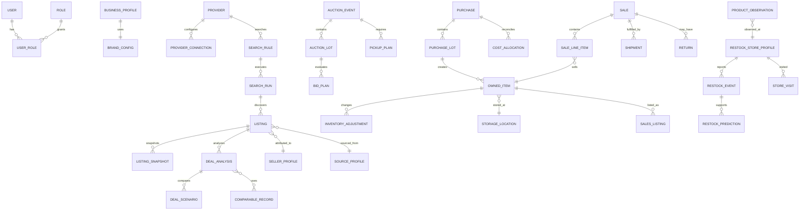

# Code 3 Data Model

Verified against commit `fa087331f3e81b5cf06a57ca7a89e8b37edba0fc`.

This document distinguishes current persisted shapes from the target canonical model. Proposed names are architectural contracts, not an instruction to perform a database migration now.

## Modeling rules

- One physical item has one stable `OwnedItem` identity.
- Imported source evidence, normalized data, user corrections, and final records remain separate.
- Historical financial and inventory facts are corrected, voided, returned, refunded, written off, or archived rather than destructively replaced.
- Major records include stable ID, created/updated timestamp, created/updated actor, schema/version, source, archive status, and notes where relevant.
- Target money uses integer minor units plus ISO currency. Current browser records use JavaScript numbers and require reconciliation during migration.
- Quantities use explicit units and validation; a draft sale does not reduce available quantity.
- Dates are stored as UTC instants when time is meaningful, plus source time zone where interpretation matters.
- Provider and external IDs are namespaced and never used as the sole internal primary key.
- Unknown legacy purpose remains `UNASSIGNED`; migration does not guess irreversibly.

## Current persisted models

### Deal Finder repository

`src/features/flipScout/storageRepository.js` stores one schema-versioned document under `ember-and-tide.flip-scout.v1` (retained internal compatibility key).

| Collection | Current purpose |
|---|---|
| `deals` | normalized listings and manually entered opportunities |
| `appraisals` | saved deal assumptions/results |
| `auctions` | manually entered auctions and maximum-bid inputs |
| `searchRules` | local rule definitions and templates |
| `purchases` | purchase headers and original projections |
| `lots` | purchase-lot grouping and allocations |
| `inventory` | owned/resale item records and quantity |
| `sales` | sale records and realized results |
| `expenses` | business expense records |
| `mileage` | business mileage records |
| `activity` | recent feature activity |
| `providerListings` | reviewed discovery snapshots used for deduplication/change detection |

The repository schema version is currently 2. It provides defaults, safe parsing, validation, import/export, and update events. It is client-local.

### Owner Center repository

`src/features/ownerCenter/ownerCenterRepository.js` stores schema version 1 under `private-business-hub.owner-center.v1`.

| Collection/config | Current purpose |
|---|---|
| `restockStoreProfiles` | store pattern context |
| `restockEvents` | reports/confirmations |
| `restockPredictions` | prediction and outcome records |
| `storeVisits` | owner trip outcomes |
| `productObservations` | product/store observations |
| `imports` | owner import activity summaries |
| `jobs` | local job/status summaries, not a durable scheduler |
| `controls.scoring` | owner default deal thresholds/reserves |
| `controls.features` | client-visible feature toggles |

### Owned-item compatibility

`src/features/ownedItems/ownedItemPurpose.js` formalizes:

- `PERSONAL_COLLECTION`
- `FOR_RESALE`
- `HOLD`
- `KIDS_COMMUNITY`
- `UNASSIGNED`

Purpose changes append history while preserving the original inventory record. Compatibility inference reads existing fields but ambiguous records stay unassigned.

### Legacy browser and Supabase data

Important retained browser keys include:

```text
et-tcg-beta-data
et-tcg-beta-scout
et-tcg-beta-tidepool
et-tcg-beta-feedback
et-tcg-beta-suggestions
et-tcg-beta-admin-review-log
et-tcg-market-price-cache
tide_tradr_what_did_i_see_reports
et-tcg-app-theme
et-tcg-daily-tide
et-tcg-route-state
et-tcg-beta-catalog-view
et-tcg-beta-catalog-page-size
et-tcg-beta-vault-showcase-view
et-tcg-forge-mode-settings
et-grade-assist-checklists
et-ember-assist-thread
et-tcg-beta-readiness
et-tcg-phase2-data
```

`src/services/phase2Persistence.js` may write selected legacy records to Supabase when configured, otherwise it uses `et-tcg-phase2-data`. Existing migrations in `supabase/migrations` define older profiles, workspaces, catalog, receipt, notification, and beta-feature tables. These are not yet the target canonical private-business schema.

Form drafts use session/local keys such as `private-business-hub.form-draft.*`. Existing keys MUST remain readable until migration is verified.

## Target entity map



## Identity, access, and configuration

| Entity | Required target content |
|---|---|
| `User` | identity, status, verified contact reference, session/security metadata |
| `Role` / `Permission` | OWNER plus dormant collaborator/helper/bookkeeper/read-only policies |
| `BusinessProfile` | owner business settings and default reporting context |
| `BrandConfig` | Code 3 application display/short/PWA names, title template and accessible logo text; independently configurable legal/public business name and unfinished tagline; marks/icons, accents, support/social, currency, time zone |
| `AppSetting` | versioned owner settings not belonging to a domain |
| `FeatureFlag` | availability, owner override, required dependency, reason unavailable |

## Providers and discovery

| Entity | Required target content |
|---|---|
| `Provider` | provider ID/type, display name, capabilities, legal/terms review state |
| `ProviderConnection` | configuration/auth status, encrypted secret references, scopes, health/last check; never browser secrets |
| `ProviderCapability` | declared operation and status |
| `SearchRule` | all keyword, classification, price/cost, geography, format, time-window, seller, score, schedule, quiet-hour, result-limit, queue, priority, and note fields |
| `SearchRun` | rule/provider, start/finish, counts, errors, rate-limit state, runtime, cursor/page metadata |
| `Listing` | provider/external identity, original URL, title/description, seller/location, format, current price/bid/shipping, dates, state, classification, confidence/risk, related rule/purchase |
| `ListingSnapshot` | immutable provider-normalized state at check time, payload hash, change set, availability |
| `ListingImage` | original URL or protected asset reference, position, source, content metadata |
| `DealAnalysis` | immutable input version, selected scenario, recommendation, maximum offer, confidence/risk/missing data, source set |
| `DealScenario` | low/expected/high resale and complete cost/proceeds/profit/ROI/margin outputs |
| `ComparableRecord` | completed-sale vs active-ask evidence, match fields, inclusion/exclusion and reason, manual/provider provenance |
| `SellerProfile` | marketplace identity, location/rating history, purchase outcomes, packaging/condition/trust notes |
| `SourceProfile` | source type, capability, coverage, terms, prior outcomes, owner preference/block status |

Listings use the statuses in [DEFINITIVE_PRODUCT_SPEC.md](./DEFINITIVE_PRODUCT_SPEC.md). Import staging is an `ImportJob` plus row-level review results, not a final listing or owned item.

## Auctions

| Entity | Required target content |
|---|---|
| `AuctionEvent` | source/URL/type, address/distance, start/end/preview/registration, deposits, payment/pickup terms, notes/status |
| `AuctionLot` | event/lot identity, description/photos, visible/unknown contents, bid/reserve data, premium/fees/tax, logistics/processing costs, resale scenarios, risk/confidence/status |
| `BidPlan` | fee/tax policy, desired profit/ROI, solved maximum bid, scenario version, no external action |
| `PickupPlan` | window, route inputs, vehicle/helper/equipment, documents/payment/weather/tolls/destinations/checklist |

Tax mode is one of `NONE`, `HAMMER_ONLY`, `HAMMER_PLUS_PREMIUM`, `MANUAL_TAXABLE_SUBTOTAL`, or `ACTUAL_TAX_AMOUNT`.

## Restocks

| Entity | Required target content |
|---|---|
| `RestockStoreProfile` | retailer/store/address/coordinates/distance, stocking method, confirmed pattern, products/quantity/sellout, notes |
| `RestockEvent` | store/product, report time, confirmation status/source/evidence, quantity, sellout, reliability, notes |
| `RestockPrediction` | store/product, predicted date/window, confidence, supporting events, actual outcome, timing error, correct/partial/incorrect |
| `StoreVisit` | store/date/arrival, success, products/quantity/spend, miles/time, purchase link, notes |
| `ProductObservation` | product/UPC/SKU, store/retailer, MSRP, date/quantity/limit/sellout, notes |
| `TripPlan` | selected stores, route inputs, distance/time, hours/windows, priorities, vehicle, notes; no unsupported optimization claim |

## Purchases and owned items

| Entity | Required target content |
|---|---|
| `Purchase` | source/seller/listing, dates/status, every acquisition cost, payment/receipt, shipment/pickup, projections, notes/history |
| `PurchaseLot` | purchase, photos, descriptions, expected/actual quantities, processing state |
| `CostAllocation` | purchase/lot/item, method, basis, amount, rounding adjustment, accepted unresolved difference and actor |
| `OwnedItem` | stable physical identity, purchase/lot, product/card fields, quantity, purpose, condition/grade/certification, images, allocated cost, storage, projection, notes/history |
| `InventoryAdjustment` | quantity/state/storage/purpose change, reason, before/after, related sale/return/correction, actor |
| `StorageLocation` | hierarchical building/room/shelf/cabinet/bin/box/binder/page/slot node |
| `Binder` / `BinderPage` / `BinderSlot` | binder metadata and explicit owned-item placement |
| `WishlistItem` | target product/variant/condition, maximum price, priority, preferred source, alert/matches |
| `GradingSubmission` | candidate, provider/cost/shipping/insurance, expected grade/value, break-even, dates/result/certification/actual cost |

Owned-item purpose is `PERSONAL_COLLECTION`, `FOR_RESALE`, `HOLD`, `KIDS_COMMUNITY`, or `UNASSIGNED`.

Inventory status supports `UNPROCESSED`, `NEEDS_IDENTIFICATION`, `NEEDS_REVIEW`, `NEEDS_CLEANING`, `NEEDS_PHOTOS`, `NEEDS_PRICING`, `READY_TO_LIST`, `LISTED`, `RESERVED`, `SOLD`, `SHIPPED`, `RETURNED`, `HOLD`, `GRADING_CANDIDATE`, `SUBMITTED_FOR_GRADING`, `DONATED`, `WRITTEN_OFF`, `MISSING`, and `ARCHIVED`.

Default aging buckets are 0–30, 31–60, 61–90, 91–180, 181–365, and over 365 days; report settings may define custom ranges.

## Sales and fulfillment

| Entity | Required target content |
|---|---|
| `SalesChannel` | channel type, default fees/shipping/payout/reserve/template |
| `SalesListing` | owned item, channel, generated/confirmed copy, category/condition/photos, quantity/pricing/shipping/returns, external URL/status |
| `Sale` | channel/buyer-minimized identity, dates, gross/shipping/discounts/fees/costs/refunds, COGS, proceeds/profit/ROI, payout status |
| `SaleLineItem` | owned item, quantity, unit/gross amounts, allocated COGS; prevents double sale |
| `Shipment` | weight/dimensions/packaging/carrier/service/insurance/tracking/label/checklist, estimated/actual cost |
| `Return` | original sale/lines, request/receipt/inspection, refund/costs, quantity restoration, condition outcome, recalculation |
| `BoothLocation` | venue/shelf/case and commercial terms |
| `BoothStatement` | period, inventory movement, sales, withheld fees, payout, missing/returned items, reconciliation |

## Money

| Entity | Required target content |
|---|---|
| `Expense` | date/category/merchant/description/amount/payment/business percentage, related records, receipt/recurring/notes |
| `MileageTrip` | date/start/destination/purpose/round trip/miles/odometer/parking/tolls, related record, notes |
| `Receipt` | protected image/PDF, merchant/date/amount/tax/category/transaction, duplicate/review state, original file |
| `CashCommitment` | type, related record, expected amount/date, paid/settled state, exposure |
| `ReconciliationIssue` | typed discrepancy, severity, records, evidence, status, resolution/correction |

Expense categories cover inventory, shipping, packaging, selling/payment fees, supplies/equipment, booth, advertising/software, travel/tolls/storage, repair/cleaning/disposal, grading/insurance, professional/licenses, donations, and other.

## Community, content, and work management

| Entity | Required target content |
|---|---|
| `KidsPack` | type/age range, card/special item count, packaging and allocated inventory cost, assembly/destination/distribution/event/notes |
| `Donation` | recipient-minimized identity, date/items/quantity/cost/event/notes |
| `Giveaway` | rules/date/items/winner-minimized identity/distribution/cost/notes |
| `CommunityEvent` | location/date, inventory/packs/expenses/attendance/notes |
| `ContentDraft` | platform/copy/assets/tags/action/schedule/approval/published URL |
| `ContentCalendarItem` | platform/date/campaign/type/status/related records/notes |
| `Campaign` | goal/dates/products/budget/content/giveaways/results |
| `CreativeAsset` | protected file, type, brand usage, rights/source |
| `SocialPerformanceRecord` | source/date-range and available engagement/traffic/attribution facts |
| `Task` | title/status/priority/due date, related record, assignment, completion |
| `CalendarEvent` | typed date/time/time zone, related record, reminders |
| `Notification` | priority/type/record/time/deep link, read/snooze/completed state and delivery evidence |

## Files, jobs, import/export, and audit

| Entity | Required target content |
|---|---|
| `FileAsset` | protected object key, original name, MIME/size/hash, source, owner, access policy, scan status |
| `ImportJob` | method/source, original file/data, schema/mapping, row validation/deduplication, preview, confirmation, counts/errors |
| `ExportJob` | type/date range/schema version, generated asset, validation/hash, requested/completed timestamps |
| `SyncJob` | provider/direction/cursor, idempotency key, counts/errors/retry state |
| `BackgroundJob` | type/schedule/attempt/lease, status, inputs/result, rate-limit metadata, heartbeat/history |
| `ActivityLog` | owner-facing domain activity |
| `AuditLog` | append-only actor/action/entity/before-after references, request/session, timestamp, administrative reason |

## Provenance layers

For every import or assisted analysis, retain:

1. original payload, file, URL, image, or screenshot;
2. provider-normalized payload and normalizer version;
3. optional raw AI output and model/version;
4. owner edits and corrections;
5. final confirmed record and confirmation actor/time;
6. later snapshots, change detection, corrections, and audit entries.

Owner-entered tax, costs, notes, condition, status, resale assumptions, and decision history cannot be overwritten by refresh. A new snapshot may propose changes for review.

## Money precision and formulas

Target database columns store currency as integer minor units (`BIGINT` where aggregate size warrants it) and rates as validated decimal basis points or fixed-precision decimals. Every amount carries or inherits an ISO currency. Conversion, if ever introduced, preserves source amount/currency, rate, provider, and timestamp.

Current local floating-point values MUST be exported, validated to currency precision, totaled by record type, and reconciled before conversion. Allocation rounding uses an explicit adjustment assigned deterministically and recorded.

## Migration approach

1. Inventory every current key/table and freeze schema validators.
2. Create a complete local JSON export and verify counts, IDs, hashes, and financial totals.
3. Produce a dry-run mapping report with errors, duplicates, ambiguous purposes, orphan references, and currency rounding differences.
4. Preserve old IDs as migration references while assigning stable canonical IDs.
5. Import originals/provenance before normalized final records.
6. Keep old keys read-only and support rollback until record-level reconciliation passes.
7. Require owner confirmation before cutover or destructive retirement.

Records that cannot map automatically remain in an explicit review queue; they are never dropped or guessed.
