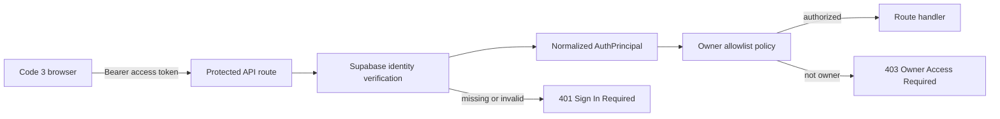

# Code 3 Owner Authentication Decision

Status: Phase 1A local implementation, not committed or deployed.

Published baseline: `264d5a5dbc58568295ba514b9c474f588f42282e`.

## Decision

Code 3 uses the repository's existing Supabase Auth integration as its production-capable identity provider. Authentication establishes who made a request; a separate server-owned policy decides whether that authenticated principal is the owner.

The decision deliberately does not use browser role state, email text, hidden navigation, Vercel Preview Authentication, or local storage as authorization. Vercel Preview Authentication remains a useful outer preview barrier, but it is not the Code 3 owner boundary.

## Normalized principal

The server normalizes a verified identity to `AuthPrincipal` in `backend/src/auth/authPrincipal.ts`:

| Field | Meaning |
|---|---|
| `subject` | Immutable identity-provider user ID |
| `provider` | `supabase`, `local-development`, or `automated-test` |
| `email` | Optional provider-supplied display data; never the authorization key |
| `emailVerified` | Optional provider verification fact |
| `issuedAt` | Token issue time, in epoch seconds |
| `expiresAt` | Token expiration time, in epoch seconds |

For Supabase, the server rejects an absent, malformed, invalid, or expired bearer token. It calls Supabase Auth to verify the access token and requires the returned immutable user ID to match the token subject. The server does not accept a principal supplied by the browser.

## Browser session flow

1. The existing Supabase client owns browser sign-in and session refresh.
2. `src/services/ownerSession.js` obtains the current Supabase access token from the SDK.
3. Sensitive API requests send it in an `Authorization: Bearer …` header. Tokens are never placed in URLs.
4. `GET /api/auth/session` verifies the token and returns only safe session state.
5. The UI renders one of: checking access, Sign In Required, Owner Access Required, authenticated Owner Center, or an unavailable state.
6. Signing out ends the application identity session; it does not erase business records.

The client rechecks owner authorization after every Supabase auth event, even when a refreshed token belongs to the same user ID. It also rechecks at least every five minutes and no later than the verified session expiration, so token expiry or an owner-allowlist change cannot leave the Owner Center indefinitely authorized in browser state. Every protected API call is independently authorized by the server.

The session response may contain only `authenticated`, `ownerAuthorized`, provider name, a masked display identity, expiration, and a coarse configuration state. It uses `Cache-Control: no-store` and never returns a raw token, refresh token, full claims, provider secret, or owner allowlist.

## Server verification flow



`backend/src/auth/ownerAuthorization.ts` exposes reusable `inspectSession` and `requireOwner` policies. Protected responses are not cached.

## Owner identifier strategy

Owner authorization uses exact, provider-qualified immutable subjects configured server-side:

```text
supabase:<immutable-provider-user-id>
```

Multiple values may be supplied as a comma-separated allowlist for controlled recovery or rotation. Documentation and examples contain no real subject, email, or token.

The policy never authorizes solely from an email address. Emails can change, can be unverified, and are returned only as masked display context when the provider supplies one.

## Response semantics

For routes protected by `requireOwner`:

| Condition | Result |
|---|---|
| No bearer token | `401` |
| Malformed, invalid, or expired token | `401` |
| Authentication provider unavailable | `503` |
| Valid authenticated principal not in the owner allowlist | `403` |
| Valid authenticated owner | Route-specific success response |
| Missing production auth configuration | Denied |
| Missing owner allowlist | Denied |

Errors do not reveal the configured owner subject or allowlist.

## Protected routes in Phase 1A

- `GET /api/ebay/health`
- `POST /api/ebay/search`

`GET /api/auth/session` is an identity-inspection endpoint, not a sourcing endpoint. It returns only safe session facts and uses exact-origin CORS plus `no-store` caching.

The generic `GET /api/health` endpoint remains public and contains only a liveness result. Other legacy backend routes have not yet been migrated behind the owner policy and remain a production blocker.

## CORS policy

`backend/src/security/corsPolicy.ts` applies to `/api/auth/*` and `/api/ebay/*` before the legacy permissive CORS middleware. It:

- accepts only exact configured HTTPS origins, plus loopback HTTP origins for local development/testing;
- ignores wildcard entries rather than treating them as permission;
- never reflects an arbitrary origin;
- adds `Vary: Origin`;
- permits only `GET`, `POST`, and `OPTIONS` with `Authorization` and `Content-Type` headers in hosted environments;
- permits the local-development header only in local-development or automated-test runtimes;
- rejects an unapproved browser origin with `403`.

Requests with no `Origin` header still require authentication and owner authorization. This supports same-origin and non-browser clients without treating CORS as authentication.

## Local development

The local adapter is intentionally narrow. It requires all of the following:

- runtime detected as local development;
- the server-only local-development setting explicitly enabled;
- a loopback hostname and loopback remote address;
- the explicit `X-Code3-Local-Dev: 1` request header.

The adapter cannot activate in Preview, Production, a hosted-unknown runtime, or an ordinary unknown runtime. The client also requires a development build on a loopback host before it sends the local header. The UI identifies the resulting session as local development.

The legacy browser beta-mode setting may help request local development in a local build, but it is not accepted as server authorization by itself.

## Automated tests

Tests inject a principal resolver into `createOwnerSecurity`. That resolver is consulted only when the runtime is `automated-test`. It cannot authorize Preview or Production and does not require real Supabase or owner credentials.

Test coverage must include missing, malformed, invalid, expired, non-owner, and owner identities; missing configuration; local adapter rejection in hosted environments; safe session output; protected eBay routes; CORS; and redaction.

## Environment-variable names

Values belong in environment-specific secret/configuration storage, not Git.

Server:

- `SUPABASE_URL`
- `SUPABASE_ANON_KEY`
- `CODE3_OWNER_SUBJECTS`
- `CODE3_CORS_ALLOWED_ORIGINS`
- `CODE3_CORS_PREVIEW_ORIGINS`
- `CODE3_CORS_LOCAL_ORIGINS`
- `CODE3_ENABLE_LOCAL_DEV_AUTH`
- `NODE_ENV`
- `VERCEL`
- `VERCEL_ENV`

Browser-safe configuration:

- `VITE_SUPABASE_URL`
- `VITE_SUPABASE_ANON_KEY`
- `VITE_API_BASE_URL`
- `VITE_CODE3_LOCAL_AUTH_ENABLED` for explicit local development only
- legacy `VITE_BETA_LOCAL_MODE` during compatibility migration only

The Supabase anonymous key is designed for browser identification and is not an owner credential. Database policies and server authorization remain mandatory.

## Redaction and logging

`backend/src/security/redaction.ts` redacts authorization, token, secret, API-key, session, owner-allowlist, database-URL, and signed-URL fields and bearer values. Route errors remain generic. Raw tokens, claims, allowlists, imported records, and provider credentials must not enter client errors or normal logs.

## Failure behavior

Preview and Production fail closed. A missing provider, missing allowlist, missing token, invalid token, expired token, or non-owner principal cannot fall back to the local or test identity. Authentication service outages return an unavailable response rather than anonymous privileged access.

## Known limitations

- Phase 1A owner-security source is published. Phase 2B2-A adds exact Preview functions for `/api/auth/session` and the provider-status route, but hosted acceptance still requires an exact candidate Preview with real application authentication configuration; Production remains unverified and prohibited in that phase.
- Supabase Auth establishes identity, but Code 3 does not yet provide connected-device management, server session revocation UI, sign-out-other-devices, or recovery administration.
- Only the auth and eBay route families use the new exact-origin policy and owner middleware. Legacy Express routes still need route-by-route classification and protection or retirement.
- Canonical business records remain browser-local; server authorization does not make those records durable or protect them from same-origin script execution.
- No durable security/audit event writer exists yet.
- Production CSP, rate limits, dependency review, and centralized observability remain future security gates.

## Rollback and recovery

Phase 1A adds no database migration. If the boundary fails in an isolated preview, revert the middleware/client integration together and keep production disabled. Never weaken the allowlist or enable the development adapter in a hosted runtime to recover access. Recovery should instead use a separately configured immutable owner subject, verified identity-provider administration, and the tested backup contract.
