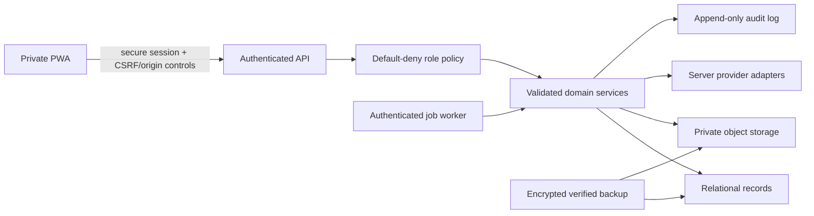

# Code 3 Security and Privacy

Phase 1B starting baseline: `26d30b9a0b1379d53778c0bc5c92887cc0ae744f`.

Phase 1A and the validated Phase 1B checkpoint source are published on the feature branch; hosted owner access still depends on correct environment configuration and has not been accepted for Production. Phase 1B owner-scoped repository/API and migration-preview foundations are schema/dry-run contracts, not an active remote datastore.

Phase 1C is published through commit `af21199f610cc91e31d9dee59af6f0a2f748ab79`. Its intelligence code remains local-only and adds no database migration, hosted persistence, sync, provider credential, model provider, file upload, or external account action.

Phase 2A Account Ops is published at `c76e3e4bc668c08d9a0908c9bb2cd96444610297`. It stores operational profiles, alias metadata, retailer-account metadata, credential references, and tasks in browser storage. It performs no email provisioning, mailbox/order access, retailer signup submission, verification bypass, secret storage, schema application, remote activation, or sync.

Phase 2A.5 is published at `4c6c7891a123777acec8f326793f30aee61f3de6`. Product workspace, route, availability, and entitlement metadata are not authorization. Bot and Owner Center remain OWNER-only, and Account Ops remains `VERIFIED_OWNER` even though it is associated with Business.

Phase 2B1 is published at `2f49a5ed97cec827184c6080e4ada0f4c8194451`. Its client domain rejects authority and secret injection, minimizes protected messages before hashing or persistence, and never creates a Purchase. Phase 2B2-B is published at `b4848cb851b2be83093fbdc4ed4b976857f9d3ff`. Its operational Phase 2B2-B.1 verification is paused: a Free Upstash resource and three branch-scoped Preview secrets exist, but the remaining owner/CORS/activation configuration is absent, no follow-up Preview was deployed, and `hostedRuntimeVerified=false`.

Published Phase 2D-A adds an OWNER-gated, provider-neutral `LOCAL_ONLY` Bot Operations domain and UI. Published Phase 2D-B1 adds static official-source discovery evidence and a fail-closed pilot decision without provider traffic or credentials. Phase 2D-B2 adds an offline owner-selected Stellar JSON preview that exists only in memory and fails closed before normalization. Browser authority, Bot/retailer/payment/proxy credentials, raw provider payloads/logs, and credential-bearing URLs remain rejected before hashing/persistence/backup. Hayha and Stellar remain `NOT_CONFIGURED`, all live capabilities are false, and no real provider/network/credential/export is used.

Phase 2C-A adds a separate OWNER-gated Purchase/Receiving domain. Published Phase 2C-B adds one explicit local Inventory creation boundary while retaining `Receiving != Inventory` and `Inventory Creation Candidate != Inventory`. Phase 2C-C adds a separate preview-first correction/disposition boundary with `Inventory Correction Candidate != Inventory Mutation` and `Refund != Physical Return`. Both require verified OWNER, re-derive current state inside the same-origin exclusive lock, verify read-back, and fail closed on stale/conflicting state. Neither connects upstream evidence or mutates Inventory automatically.

## Security posture summary

The published source keeps eBay credentials server-side and includes Supabase token verification, an immutable-subject OWNER policy, protected eBay routes, safe session inspection, exact-origin CORS for protected route families, redaction helpers, and deterministic backup/restore inspection. Hosted configuration still requires verification. Phase 1B extends that boundary to canonical owner API contracts and zero-write migration planning. Phase 1C adds recursive rejection of owner/role/session/token/security authority in local analysis payloads, provenance-separated evidence, and append-only local card-analysis revisions. Published Phase 2A reuses the verified client session gate before Account Ops storage is read, rejects nested authority/secret fields, stores only credential references, and keeps generated passwords ephemeral. Published Phase 2A.5 adds defense-in-depth around workspace visibility: direct route and verified session state take precedence over a bounded preference whose public fallback cannot grant authority. Published Phase 2B1 adds a default-unavailable owner-protected mailbox-provider runtime plus minimized local message/order evidence, without enabling OAuth, mailbox access, or Purchase import. Phase 2D-A applies the same default-deny pattern to Bot records: verified OWNER before storage, test-only mock isolation, recursive authority/credential/raw-payload rejection, scoped append-only attempt history, explicit capability falsehood, and no Purchase/Inventory writer. These controls are not replacements for application-wide backend authorization, durable provider security storage, or protected canonical persistence. The application is still not ready for production private-business data because remote persistence is deliberately inactive, canonical records remain browser-local, legacy API families remain broadly exposed, Account Ops/Inbox/Order/Bot metadata are same-origin-readable, downloaded backup JSON is unencrypted, and backup coverage can be partial.

Code 3 is the application identity, not a declaration of the legal/public business name. Authentication, records, exports, and provider connections must reference the configured business identity separately where legally or operationally relevant.

The next activation phase MUST verify schema/RLS, repository owner scope, rollback, backup coverage, and deployment configuration before remote canonical persistence or file uploads expand the attack surface. Scheduled scanning remains later work.

## Current protections

| Control | Current state | Evidence |
|---|---|---|
| eBay secret isolation | Implemented | `backend/src/services/ebayBrowse.service.ts`; browser receives normalized results only |
| Example environment files | Names/placeholders only | `.env.production.example`, `backend/.env.example` |
| Owner Center UI guard | Implemented client-side | `src/features/ownerCenter/ownerAuthorization.js`, `src/App.jsx` |
| Guest denial in UI | Implemented | same guard |
| Import Review | Implemented | `src/features/flipScout/ebayDiscovery.js`, `src/features/flipScout/screens/EbayDiscoveryScreen.jsx` |
| Confirmed deal deletion | Implemented | Deal Inbox browser regression coverage |
| Local parsing/validation | Implemented for feature repositories | `src/features/flipScout/storageRepository.js`, `src/features/ownerCenter/ownerCenterRepository.js` |
| Supabase policies | Present for legacy schemas | `supabase/migrations` and RLS-focused scripts |
| Provider timeout/error mapping | Implemented for eBay | backend HTTP client and eBay service tests |
| Automatic external actions | Absent | provider contract and implementation |
| Supabase identity verification | Implemented in published source; hosted configuration pending verification | `backend/src/auth/supabaseIdentityProvider.ts` |
| Immutable-subject OWNER policy | Implemented for protected routes | `backend/src/auth/ownerAuthorization.ts` |
| Exact-origin protected-route CORS | Implemented for auth/eBay/canonical/provider route families; Phase 2B2-B hardens canonical origin parsing and runtime-specific headers | `backend/src/security/corsPolicy.ts`, `backend/src/server.ts` |
| Safe identity endpoint | Implemented | `GET /api/auth/session`; `Cache-Control: no-store` |
| Security/error redaction helper | Implemented | `backend/src/security/redaction.ts` |
| Versioned verified browser export | Implemented with explicit coverage | `src/features/backup` |
| No-write JSON restore preview | Implemented; no apply path | `src/features/backup`, Owner Center Data & Backup |
| Canonical repository/API owner scope | Phase 1B source published; not active remotely | owner context is server-derived and required by repository methods |
| Migration Preview | Phase 1B `DRY_RUN_ONLY` | no-write mapping/plan and readiness UI |
| Intelligence authority-field rejection | Phase 1C local implementation | `src/features/intelligence/analysisHistory.js`; recursive owner/role/session/token/authorization/credential/security rejection |
| Intelligence provenance/history | Phase 1C local implementation | immutable card-analysis system result, separate version-checked owner correction, linked card revisions in existing `appraisals`; no generic auction/restock revision series |
| AI/CV and autonomous action boundary | Enforced by absence and explicit capability flags | no configured model provider, no image analysis claim, no purchase/offer/bid action |
| Account Ops session gate | Published Phase 2A implementation | repository/service construction and private reads occur only after verified OWNER session state |
| Account Ops authority/secret rejection | Published Phase 2A implementation | recursive owner/session/token/authorization/prototype/secret-field validation before persistence |
| Account credential boundary | Published Phase 2A implementation | nonsecret `CredentialReference` metadata only; generated passwords remain ephemeral and are excluded from backup/logs |
| Retailer verification/anti-abuse boundary | Published Phase 2A implementation | human-controlled signup/checklist; no CAPTCHA/OTP/verification bypass, bulk signup, limit evasion, or checkout action |
| Product workspace preference boundary | Published Phase 2A.5 implementation | `code3.workspace-preference.v1` retains a public fallback plus optional inert last selection; direct route/session wins, Bot requires a fresh OWNER decision, and Owner Center/authority fields are excluded |
| Bot and workspace authorization | Published Phase 2A.5 implementation | Bot/Owner remain verified OWNER surfaces; Account Ops remains `VERIFIED_OWNER`; registry/entitlement metadata cannot authorize |
| Bot Operations authority/credential rejection | Phase 2D-A local implementation | `src/features/botOps/security.js` recursively rejects owner/session/role/entitlement authority, Bot/retailer/payment/proxy credentials, raw provider payloads/logs, credential-bearing URLs, dangerous keys and unsafe values before persistence/backup |
| Bot provider/test-adapter isolation | Phase 2D-A local implementation | Hayha/Stellar remain `NOT_CONFIGURED` with all live capabilities false; `MOCK` is explicit automated-test injection only and cannot establish normal-runtime health |
| Bot event/Purchase boundary | Phase 2D-A local implementation | scoped append-only attempts/activity, idempotency and contradiction preservation; Checkout Evidence is review-only and all Purchase/receiving/Inventory flags remain false |
| Bot discovery evidence isolation | Phase 2D-B1 local implementation | short public official-source references and assessment metadata are immutable bundled source, not provider health, owner data, local persistence, Backup input, or permission to connect |
| Read-versus-control separation | Phase 2D-B1 local implementation | observation/read/control/sensitive capability assessments are independent; every operational provider capability remains false and no documented human UI action implies an adapter command |
| Stellar task-export preview isolation | Phase 2D-B2 local implementation | explicit JSON selection only; 1 MiB/500-record bounds; recursive pre-normalization secret/payment/session/proxy/dangerous-key rejection; strict safe-field allowlist; ephemeral component memory; no raw retention/hash/log/persistence/backup/network/import |
| Mailbox provider runtime boundary | Phase 2B1, 2B2-A and 2B2-B published; Phase 2B2-B.1 operational proof paused | exact Vercel entries reuse `backend/src/server.ts`; protected provider-connections router has no connect/callback/live adapter |
| Trusted Preview execution proof | Exact Express route partially verified; `hostedRuntimeVerified=false` | Ready Preview returns safe Express session JSON and protected `401`; missing server auth/owner configuration prevents the required owner `200`; Production/incomplete/local/test markers cannot satisfy proof and no request-derived authority is accepted |
| Server-only provider secret/state contracts | Phase 2B2-B published; Free Upstash resource and three branch-scoped Preview secrets exist, but activation/deployed proof are paused | Redis adapters require exact Preview/project/branch, separate metadata/secrets, encrypt with AES-256-GCM, atomically consume hashed state, perform bounded readiness operations, and never use hosted memory fallback |
| Protected Inbox/order evidence | Phase 2B1 published implementation | recursive authority/secret rejection; minimization before hashing/persistence; exact-money/idempotent Order Candidates require owner review and cannot create Purchases |
| Purchase/Receiving authority boundary | Phase 2C-A local implementation | verified OWNER gate precedes storage; Purchase Draft confirmation uses expected version/idempotency; client role/session fields are rejected; Receiving and Inventory are separate |
| Purchase/Receiving credential and evidence rejection | Phase 2C-A local implementation | recursive rejection of payment/retailer/provider/proxy credentials, raw messages/payloads/logs, unsafe URLs and authority fields before persistence/backup |
| Inventory handoff/candidate isolation | Phase 2C-B published / Phase 2C-C local candidate | handoff, creation, and correction previews/candidates are derived in memory and excluded from backup/migration/persistence; none can mutate Inventory without separate confirmation |
| Inventory OWNER confirmation | Phase 2C-B published / Phase 2C-C local candidate | OWNER check before Inventory access; strict allowlists; authoritative re-derivation inside Web Lock; expected versions, stable identity, journal/write/read-back and conflict failure |
| Inventory acquisition provenance | Phase 2C-C local candidate | schema-4 item/lot/application/event/typed-adjustment chains strictly reconcile immutable creation facts, current state, quantity and exact cost; generic edit/delete/import blocked |
| Inventory correction/disposition safety | Phase 2C-C local candidate | whole-lot identity/condition and cost changes block after sales/transfers; schema-4 has no managed-transfer writer and any future transfer authority fails closed; full/partial physical-return categories have distinct bounded semantics; quantity reason is typed; refund alone never removes Inventory; replacement Receiving requires an effective unreversed return, is resumable after a noted-only interruption, persists its dependency, blocks consumed-return reversal, and still requires separate Inventory confirmation; extras remain blocked; Raw/Graded deferred |

## Current limitations and production blockers

### Critical: server authorization remains narrow in the published deployment

The published source verifies Supabase access tokens server-side and enforces an exact provider-qualified immutable subject on `GET /api/ebay/health` and `POST /api/ebay/search`. Protected-route outcomes are `401` for no/invalid/expired identity, `403` for an authenticated non-owner, `503` for provider outage, and route success for the configured owner. Missing auth or owner configuration fails closed. Hosted owner configuration still requires explicit verification.

This is not yet an application-wide security boundary. The Phase 1B canonical API/export family reuses the owner boundary, but legacy APIs, noncanonical server-data APIs, financial/file operations, controls, and jobs still require route classification and OWNER enforcement before production. The client continues to contain legacy role/development settings for presentation/compatibility; none can authorize the protected server routes.

The full decision and limitations are in [OWNER_AUTH_DECISION.md](./OWNER_AUTH_DECISION.md). Phase 2B2-A maps exact Preview functions for `/api/auth/session` and `/api/account-ops/provider-connections`; both execute the same canonical Express middleware and expose no alternate owner policy.

### Critical: trusted Preview execution is not provider authorization

Phase 2B2-A establishes server-owned Vercel Preview execution markers. Phase 2B2-B permits the protected response to report `hostedRuntimeVerified=true` only when those markers, legitimate OWNER authorization, and all three managed-store health checks succeed together. Even that infrastructure proof would not prove Gmail or Outlook authorization, mailbox health, or Production readiness. Provider configuration remains `NOT_CONFIGURED`, provider network access remains disabled, and all live capabilities remain false.

The 2026-08-27 exact candidate Preview returned `AUTH_NOT_CONFIGURED` from the safe session endpoint and `401 authentication_required` from the protected provider route, with no-store JSON and Express response headers. A synthetic client role query remained unauthorized. This is strong evidence that the trusted server route is hosted and fail closed, but it is intentionally insufficient for `hostedRuntimeVerified=true` because no valid owner request could be verified.

The exact Vercel entry points contain no secrets or copied business logic. Missing auth/owner configuration still fails closed. Query, header, body, local-storage, role, and entitlement values cannot alter the runtime proof or owner scope. Phase 2B2-B further requires healthy managed connection, secret, and OAuth-state stores before the protected status response can report hosted verification. The complete boundary is [PREVIEW_TRUSTED_RUNTIME_CONTRACT.md](./PREVIEW_TRUSTED_RUNTIME_CONTRACT.md).

### Critical: canonical records are browser-local

Deal, legacy purchase, Phase 2C-A Purchase/Receiving, inventory, sales, expense, mileage, Owner Center, Account Ops, minimized Inbox/Order Candidate, Bot Operations metadata/evidence, restock observation, and Phase 1C card-analysis history records are stored in localStorage. Auction workflows may save current result snapshots locally, while restock intelligence recomputes from observations. These records are available to scripts executing in that origin, depend on one browser profile/device, and lack server audit, centralized backup, or revocation. This is acceptable only for the current private preview with explicit limitations.

Phase 1B schema, repository, API, migration mapping, and remote-adapter contracts do not change that fact. `LOCAL_ONLY` remains active and `REMOTE_ACTIVE` remains disabled. A dry-run result, migration file, or successful test repository must never be presented as durable owner storage.

### Critical: Account Ops operational identity data is browser-local

Phase 2A profiles can contain names, phone numbers, shipping/billing addresses, email preferences, aliases, retailer usernames, and operational notes. They live in `code3.account-ops.v1`, are readable by scripts executing in the same origin, and may appear in an unencrypted downloaded JSON backup. A profile is never a Code 3 authentication identity, and no profile/record field may supply owner scope, role, subject, token, or session authority.

The owner must protect the browser profile/device and downloaded backup. Production use requires a separately reviewed server-authorized repository, protected persistence, CSP/dependency controls, retention/deletion rules, audit coverage, and a migration rehearsal. Phase 2A does not satisfy those gates.

### High: alias, credential, and retailer-account capability truth

A generated alias is local metadata only. It is not described as provider-provisioned or receiving mail unless explicit provider/owner evidence exists. Phase 2A has no email provider credential or network adapter. Catch-all and provider-managed modes are contracts, not active integrations.

Store-account records may hold a nonsecret credential reference, but no plaintext password, OTP, session, token, payment-card/CVV value, or provider secret. The password generator uses secure randomness for immediate copy and keeps the result only in ephemeral UI memory; an unsaved value cannot be recovered. No current adapter proves an external password-manager/OS-secure-store item exists.

Account setup is owner-assisted. Code 3 may prepare/copy ordinary metadata and open a configured legitimate signup URL, but it does not submit bulk registrations, solve/bypass CAPTCHA or OTP, manufacture email/phone verification, rotate identities, evade bot detection, or circumvent retailer household/account/purchase limits. Every `READY` transition depends on real checklist state and explicit owner confirmation.

### High: backend surface and residual CORS

The protected exact-origin policy runs before `/api/auth/*`, `/api/ebay/*`, `/api/code3/*`, and `/api/account-ops/provider-connections`. It canonicalizes an origin to exactly its scheme/host/port, accepts configured HTTPS origins and loopback HTTP only in local/test lists, rejects wildcards, `null`, trailing paths/slashes, credentials, query/fragment data, malformed values, and arbitrary reflection, and always adds `Vary: Origin`. Preview reads only `CODE3_CORS_PREVIEW_ORIGINS` and does not inherit general Production origins; Production reads only `CODE3_CORS_ALLOWED_ORIGINS`. Hosted allowed headers are `Authorization` and `Content-Type`; the local-development header is excluded outside local/test runtime.

The legacy Express routes still use the existing permissive `cors()` middleware. Before production, inventory every route, protect or retire it, validate content types/request sizes, and rate-limit sensitive or upstream-backed operations.

### High: file evidence

Screenshots, receipts, and images are currently URLs/references or browser-held data rather than a protected file service. Target storage needs MIME and size validation, content hash, malware scanning where appropriate, private object keys, short-lived signed access, authorization on metadata and bytes, retention policy, and backup.

### High: backup and recovery coverage remains partial

The published Phase 1A format inventories current browser sources, excludes security/session data, hashes deterministic sections and manifest with SHA-256, reparses/reverifies the result, and provides a zero-write JSON Restore Preview. It explicitly labels coverage `COMPLETE`, `PARTIAL`, or `FAILED`.

It is not a full disaster-recovery system. Phase 1B adds an owner-protected canonical PostgreSQL export, but that source is included only when the canonical gate/database are configured and the bounded response validates. Legacy Supabase data, other PostgreSQL/Express process-memory records, and file bytes remain outside that route. Any unavailable/configured remote source or referenced unembedded file keeps coverage partial. There is no apply-restore operation, protected file-byte export, cloud retention, encryption wrapper, or durable backup audit history. See [BACKUP_FORMAT_V1.md](./BACKUP_FORMAT_V1.md) and [RESTORE_PREVIEW_CONTRACT.md](./RESTORE_PREVIEW_CONTRACT.md).

### Medium/high: legacy authorization and privacy model

The repository retains public-beta roles, profiles, community, marketplace, moderation, and workspace schemas. The private product must isolate or retire these surfaces. Existing Supabase RLS is useful evidence, not proof that the new private model is protected.

### Medium: dependencies and observability

Dependency vulnerability reports require separate review. Logs and errors need structured redaction so credentials, seller/buyer data, imported payloads, signed URLs, and financial details are not emitted. Production monitoring must expose status without exposing raw provider payloads or tokens.

### Medium: deterministic intelligence can be over-trusted

Phase 1C condition, valuation, deal, lot, auction, and restock results are deterministic proposals from supplied observations and assumptions. Determinism makes a result reproducible; it does not make sparse, stale, duplicated, owner-entered, or incorrectly identified evidence true. Current controls retain provenance, source independence, warnings, confidence bands, methodology/input hashes, immutable card-analysis system revisions, explicit owner corrections, and explicit deal-risk severity. Valuation v2 uses matched-condition verified sales directly, permits a single adjustment only from an explicit `NM` baseline, and excludes unknown or incompatible condition bases. Restock freshness uses the most recent positive observation, and duplicated underlying sources cannot bypass the independence cap. These controls do not supply licensed completed-sale coverage, authenticate card identity, guarantee condition/grade, inspect unseen lot contents, or guarantee restocks/profit.

Official eBay evidence remains separately attributable as external identity, provider observations, image references, and active-listing valuation evidence. A provider amount with missing or invalid currency does not become a money object. This prevents an integration omission from being silently converted into a false default-currency value.

No image/OCR/AI provider is configured. The scanner boundary explicitly reports image analysis false and must not receive a machine-observed defect label unless a future approved adapter actually produced it. Future model work requires protected file handling, privacy/retention approval, prompt/input isolation, evaluation, cost controls, and a human-review gate before it can affect a confirmed record.

### Medium: workspace and entitlement metadata can be mistaken for authority

Phase 2A.5 route ownership, navigation visibility, remembered product workspace, and future `FREE`/`PLUS`/`PRO`/`BUSINESS`/`OWNER` hints are client presentation metadata. They cannot grant an OWNER session, authorize a backend request, expose Bot or Owner Center, or load Account Ops before its existing gate. `OWNER` is an authority role rather than a purchasable tier. No billing or subscription state is active.

The saved preference always retains a public Collect, Find, Sell, or Business fallback. It may also remember Bot as inert presentation history only after an authorized selection; that marker is ignored unless the current session independently verifies OWNER authorization. Direct routes and verified session state take precedence, and session downgrade/logout must remove private visibility before private storage initializes. The product-workspace term is distinct from historical persisted collaboration/data `Workspace` records and `activeWorkspaceId`; Phase 2A.5 does not reinterpret or migrate them.

### Critical: Bot metadata and synthetic evidence can be mistaken for live automation

Phase 2D-A stores validated Bot installation, Account Ops reference, proxy metadata, product target, task, attempt, Checkout Evidence, and activity records in browser-local `code3.bot-ops.v1`. They are same-origin-readable, device-local, and eligible for an unencrypted JSON backup after sanitization. A normalized status such as `RUNNING`, `CARTED`, `CHECKOUT_ATTEMPT`, or `SUCCESS` is a domain observation/synthetic test state; it does not prove Code 3 controlled a Bot, reached a retailer, carted an item, completed checkout, or created a Purchase.

Normal runtime starts empty. Hayha and Stellar stay `NOT_CONFIGURED`, supported retailer coverage is empty/unverified, all live capabilities are false, and `MOCK` is allowed only through explicit automated-test injection. Real Bot/provider health, commands, credentials, account actions, proxies, and checkout require a separately approved server/local-companion and anti-abuse contract.

Bot/provider passwords/tokens/API keys/cookies/sessions, retailer passwords/cookies/OTPs/security answers, payment-card/PAN/CVV values, proxy endpoints/IPs/hosts/authentication URLs/usernames/passwords, raw provider payloads/request-response bodies/logs/headers, and credential-bearing URLs are prohibited before hashing, persistence, logs, fixtures, browser state, or backup. Phase 2D-A does not authorize a Bot secret store or use the Phase 2B2-B.1 managed mailbox-provider resource.

Phase 2D-B1 adds no import endpoint, filesystem watcher, Discord client, webhook receiver, local companion, subprocess, process inspection, or provider network. Official-source URLs and short summaries are static review evidence only. Restricted Discord content, private dashboard responses, bot files, local process output, and undocumented endpoints are not collected. Provider documentation describing secrets or sensitive exports is represented only by a warning; the export itself is never ingested.

Phase 2D-B2 adds no import endpoint or durable file ingestion. It uses the browser's explicit file picker and accepts JSON only up to 1 MiB and 500 candidate records. It never scans directories, reads Stellar application/config/session folders, watches files, inspects a process, or contacts Stellar. The selected basename may be displayed while the preview is open; full paths are removed and neither name nor path is persisted or logged.

Security screening traverses every nested object and array before any provider field is normalized. Password/credential/token/session/cookie/authorization/license/OTP/recovery/security-answer/payment-card/CVV/bank/proxy-authentication/credential-bearing URL/raw-provider data and dangerous prototype keys block the entire file. Findings expose bounded categories only, never the rejected value. Harmless unknown fields are ignored with warnings and their values are not retained. The strict allowlist then bounds types, lengths, counts, integer quantities, exact money/currency, statuses, identifiers, labels and timestamps.

Official documentation establishes only JSON task-group transfer and a same-version requirement; no stable schema root/fields/version marker is published. The preview therefore never emits `SUPPORTED`, never treats a retailer label as verified coverage, and never promotes parsed data to capability authority. `Stellar Export Preview != Bot Task Import`; `Previewed Task != Task`.

Raw JSON, normalized preview rows, source hashes, filenames, warning summaries and counts are component-memory only. No localStorage, IndexedDB, persistence gateway, Backup/Migration/Restore source, Upstash, Supabase, network, analytics or ordinary log receives them. Discard, replacement, route exit or refresh destroys the state. The UI has no Import, Save, Apply, Create Tasks, Sync, Connect, Task control, Attempt, Activity, Checkout Evidence, Order Candidate, Purchase, Receiving or Inventory action.

Hayha private/internal APIs, CLI/UI automation, filesystem parsing without an official contract, traffic inspection, and reverse engineering are `DO_NOT_USE`, consistent with its published terms and the Code 3 anti-bypass boundary. Stellar's documented WebSocket is an input path capable of feeding product pings into running tasks, not read-only status output; it is also `DO_NOT_USE` for the proposed read/status pilot. Discord webhook URLs are bearer-like write credentials, and Discord-channel reading would require a separately approved bot/app, provider permission, minimum channel scopes, retention policy, and stable event/redaction contract. None is authorized here.

`Bot Success != Purchase` and `Bot Checkout Evidence != Purchase` are mandatory. Checkout Evidence cannot reach Purchase, receiving, or Inventory repositories. A future handoff requires order reconciliation, stable import identity, explicit OWNER confirmation, transactions/idempotency, and rollback tests in a separately approved phase.

See [BOT_INTEGRATION_CONTRACT.md](./BOT_INTEGRATION_CONTRACT.md) for the complete record, adapter, security, backup, and handoff contract.

## Target security architecture

## Authentication and session requirements

- OWNER is the only enabled role initially.
- The current Supabase bearer flow uses the provider SDK session; a future server-cookie design, if selected, must use secure, HttpOnly, and appropriate SameSite settings.
- Session rotation, expiration, revocation, and sign-out-other-devices are supported.
- Password reset and invitation flows do not reveal account existence unnecessarily.
- Administrative and Owner Center requests are authorized on the server for every operation.
- Future roles are policy capabilities, not scattered UI booleans.
- Local development authorization requires server-detected development, explicit enablement, loopback host/socket, and an explicit header; it is rejected in hosted runtimes.
- Authentication failure never falls back to anonymous privileged data.

## Secret handling

- Server secrets are supplied by deployment-secret storage, never `VITE_*` variables.
- Browser-safe configuration is explicitly allowlisted.
- Secrets are not returned by health/configuration endpoints.
- Logs redact authorization headers, tokens, credentials, connection strings, signed URLs, and raw provider errors that may contain request details.
- Example files document names only.
- Secret rotation and provider disconnect invalidate cached credentials/tokens.
- CI and staged-content scans block known secret patterns.

Known server-only eBay names are `EBAY_CLIENT_ID`, `EBAY_CLIENT_SECRET`, `EBAY_ENVIRONMENT`, `EBAY_MARKETPLACE_ID`, and `EBAY_REQUEST_TIMEOUT_MS`. `VITE_API_BASE_URL` is a browser-safe route base, not a credential.

Owner-boundary server names are `SUPABASE_URL`, `SUPABASE_ANON_KEY`, `CODE3_OWNER_SUBJECTS`, `CODE3_CORS_ALLOWED_ORIGINS`, `CODE3_CORS_PREVIEW_ORIGINS`, `CODE3_CORS_LOCAL_ORIGINS`, and `CODE3_ENABLE_LOCAL_DEV_AUTH`. Browser session configuration uses `VITE_SUPABASE_URL`, `VITE_SUPABASE_ANON_KEY`, and `VITE_API_BASE_URL`; explicit local development may additionally use `VITE_CODE3_LOCAL_AUTH_ENABLED`. Example files contain names/placeholders only.

Phase 1B canonical persistence additionally uses the server-only gate `CODE3_CANONICAL_PERSISTENCE_ENABLED` and existing `DATABASE_URL`. Missing either leaves hosted canonical routes unavailable with a safe response. The gate does not bypass authentication or owner authorization and has no `VITE_` equivalent.

Phase 2B2-B managed provider adapters use server-only `CODE3_PROVIDER_MANAGED_STORE_ENABLED`, `CODE3_PROVIDER_PREVIEW_PROJECT_ID`, `CODE3_PROVIDER_PREVIEW_GIT_BRANCH`, `CODE3_PROVIDER_KV_REST_API_URL`, `CODE3_PROVIDER_KV_REST_API_TOKEN`, `CODE3_PROVIDER_SECRET_ENCRYPTION_KEY`, `CODE3_PROVIDER_SECRET_KEY_VERSION`, `CODE3_PROVIDER_OAUTH_REDIRECT_URIS`, and `CODE3_PROVIDER_STORE_NAMESPACE`, matched against server-owned `VERCEL_PROJECT_ID` and `VERCEL_GIT_COMMIT_REF`. The encryption key is an exact 32-byte base64url value and never has a `VITE_` equivalent. Values are absent from source/examples. Missing, malformed, disabled, wrong-project/branch, or non-Preview configuration selects unavailable stores; it does not fall back to memory.

Phase 2D-A defines no Bot credential environment variable and authorizes no Bot secret store. Any future Bot credential name and storage architecture require a separate review. The existing mailbox-provider Upstash values must not be reused, aliased, copied, or interpreted as Bot credentials.

## Authorization matrix target

| Domain | OWNER | Collaborator | Inventory helper | Bookkeeper | Read only |
|---|---:|---:|---:|---:|---:|
| Connections, schedules, security, backup | Full | None | None | None | None |
| Account Ops profiles, aliases, store accounts, and provider controls | Full | None by default | None | None | Explicit view only if a future policy permits |
| Bot workspace and future provider controls | Full | None | None | None | None |
| Search/import raw provider data | Full | Configurable review | None | None | Configurable view |
| Purchases/receiving/listings/sales/shipping | Full | Configurable edit | Processing subset | Financial review only | Explicit view |
| Owned-item identification/storage | Full | Edit | Edit | View only if granted | Explicit view |
| Sensitive totals/reports | Full | Explicit grant | Denied by default | Review/export | Explicit view |
| Expense/mileage/receipt/reconciliation | Full | Explicit grant | Receipt capture only | Review/edit/export | Explicit view |

Only OWNER is enabled now. Future columns are design reservations, not current permissions.

## Input and URL safety

- Validate every request with a versioned schema and reject unknown privileged fields.
- Normalize currency, rates, quantities, dates, enums, provider IDs, and pagination bounds.
- Prevent server-side request forgery: user URLs are stored/opened safely and never fetched by a generic backend proxy.
- Allow only documented upstream hosts in provider adapters.
- Use bounded timeouts, response-size limits, and redirect policies.
- Sanitize filenames and never derive object paths directly from user input.
- Render owner notes as text unless a separately reviewed rich-text sanitizer exists.
- Use idempotency keys for imports, mutations, webhooks, jobs, and retried submissions.

## Files and images

Every uploaded file requires authenticated ownership, size/MIME/magic-byte validation, hash, protected storage key, source record, scan state, and audit entry. Image processing occurs in a sandboxed/bounded service. Original evidence is immutable; derivatives reference it. Signed URLs are short-lived and never treated as authorization themselves.

## Provider and job security

- Provider scopes are minimized and recorded.
- Capability checks prevent calling unsupported operations.
- Rate limits and retry-after are respected.
- Scheduled work uses a server identity with explicit domain permission, not an owner browser token.
- Jobs are leased/idempotent and cannot run twice unnoticed.
- Raw results enter Import Review; they never become purchases or inventory automatically.
- Webhook signatures and replay windows are validated if webhooks are introduced.
- Disconnect removes/revokes provider credentials and marks dependent schedules unavailable.

## Data minimization and privacy

- Store only seller/buyer details needed for sourcing, fulfillment, returns, trust history, or reconciliation.
- Store only the Account Ops profile/address/alias/account metadata needed for legitimate owner operations; avoid unnecessary identity duplication and sensitive notes.
- Never store full payment-card credentials.
- Never persist Account Ops plaintext passwords, OTPs, retailer sessions/tokens, provider secrets, payment-card data, or Code 3 owner authority fields.
- Never persist Bot/provider credentials, retailer authentication values, payment credentials, proxy endpoints/authentication values, raw provider logs/payloads, raw mailbox evidence, or client authority inside Purchase/Receiving. Stable nonsecret source references are distinct from copied source evidence.
- Minimize children's personal information; impact tracking should prefer aggregate counts.
- Separate private owner records from any public product dataset and credentials.
- Store AI/provider retention and use terms with the connection configuration.
- Preserve whether intelligence evidence was machine-observed, provider-supplied, owner-entered, or inferred; never upgrade a deterministic inference or repeated provider copy into an independent observation.
- Exports contain the owner's data but warn when files include personal or financial information.
- Data deletion uses archive/correction rules where audit or financial history must remain; privacy deletion is policy-driven and logged.

## Audit requirements

Audit records are append-only and include actor/session, action, entity and version, time, reason, and before/after references or a safe diff. At minimum, audit:

- authentication/session/security changes;
- provider connect/disconnect and schedule/scoring changes;
- import confirmation and mapping;
- owner-entered financial changes and recalculation;
- purpose, quantity, allocation, storage, sale, return, refund, void, and write-off actions;
- backup/export/restore and migration operations;
- administrative feature-control changes.

Raw secrets and protected file contents never enter audit events.

## Backup, export, and deletion

A complete future recovery point includes schema/version manifest, canonical records, provenance, audit references, protected file manifest/content, counts, hashes, and validation results. Phase 1A covers registered browser sources; Phase 1B can additionally include the bounded canonical export only when it is owner-authorized and valid. Phase 2A raised the registry to 22 sources (18 locally included and four excluded/conditional), Phase 2B1 to 23/19, Phase 2D-A to 24/20, and Phase 2C-A to 25/21. Phase 2C-C keeps those totals and extends the existing Deal Finder source to schema 4 with validated nonsecret Inventory item/lot/application/event/typed-adjustment metadata. Backup validation requires complete, strictly reconciled creation and adjustment chains. Plaintext passwords, OTPs, tokens, sessions, OAuth state/codes/verifiers, provider/Bot/retailer/payment/proxy secrets, raw/protected/provider content, credential-bearing URLs, security links, owner-authority fields, Inventory handoff/creation/correction previews or candidates, and the private Inventory journal remain prohibited. Coverage must say `PARTIAL` whenever a relevant server source or file byte is absent. Restore Preview remains bounded and zero-write; the mixed `deal-finder.inventory`, Inventory provenance paths, and all Purchase/Receiving paths are `REQUIRES_MAPPING`, and applying restore is not implemented. Any expanded server export, future restore, or deletion operation requires fresh owner authorization and rate limiting.

Phase 1B registers the remote-export adapter and owner-authorized read-only export route. Data & Backup calls it through `src/services/code3OwnerApi.js`, which obtains the current supported owner-session headers and always requests with `no-store`. PostgreSQL export uses one repeatable-read, read-only transaction for all canonical domains; tests use an isolated memory snapshot. An unavailable, unauthorized, forbidden, invalid, hash-mismatched, partial, inconsistent, or not-configured remote source remains excluded or `PARTIAL`; it cannot be represented by an empty successful section. This read bridge does not enable canonical writes or `REMOTE_ACTIVE`. Migration Preview writes no durable audit event because zero-write is part of its security contract.

The local `/api/code3/*` route family reuses exact-origin CORS, `requireOwner`, `no-store`, strict validation, server-derived owner context, and a bounded owner rate limit. Its protected CORS methods are `GET`, `POST`, `PATCH`, `PUT`, and `OPTIONS`; `DELETE` is not exposed. The repository never accepts client owner authority. Missing `CODE3_CANONICAL_PERSISTENCE_ENABLED` or `DATABASE_URL` produces a safe unavailable response before any canonical operation. These controls remain unaccepted for Production until the schema, policies, configuration, and deployment are tested in a disposable environment.

## Phase 2B1 mailbox-provider security contract

The Phase 2B1 runtime is owner-protected and default-deny. Production/Preview code has no enabled provider adapter, durable connection store, secret store, or OAuth-state store. Automated-test memory adapters check the runtime kind and cannot be selected by browser input or hosted configuration. A future connection must derive owner scope from the verified `AuthPrincipal`, never from a profile, alias, role, email, owner ID, query parameter, entitlement flag, or callback payload.

OAuth initiation/callback remains unavailable until server state can be bound to the immutable owner principal, provider, exact allowlisted redirect, expiration, and atomic single-use consumption. An origin header is not a callback authenticity mechanism. Authorization codes, state, PKCE verifier, provider tokens, and managed secret references never appear in a client response.

Protected-message minimization occurs before hashing, persistence, audit, notification, or backup. OTPs, one-time codes, reset/login links, recovery values, and protected body content are neither stored nor hashed directly. Unrelated personal messages cannot create an Order Candidate. Sender display names are treated as spoofable; high retailer confidence requires stronger independent evidence.

The backend redactor covers bearer/basic credentials, token/secret fields, OAuth authorization/state/verifier fields, and secret-bearing URL parameters. Provider errors use bounded codes and generic client messages. Safe audit summaries contain action, outcome, time, provider/opaque connection identity when appropriate, and warning/error counts only; durable audit storage remains future work.

The browser client provider API accepts only the fixed owner-protected status route and `GET`, obtains credentials through the existing owner-session mechanism, rejects caller-supplied headers/bodies, bounds JSON responses, rejects an SPA fallback, and does not persist its result. The backend additionally exposes a bounded owner-only disconnect contract; it is unavailable under production defaults and is not wired to a client action in Phase 2B1. Account Ops initializes the lazy provider surface only after the existing verified-owner return boundary.

Published Phase 2B2-B closes the code-adapter portions of the managed secret and atomic replay-store blockers. The official Upstash REST client is telemetry-disabled. Connection metadata and encrypted secret material use separate owner-scoped key families under a project/branch-derived namespace. Code 3 encrypts secrets before storage using AES-256-GCM with fresh IVs and associated owner/provider/connection/reference data. OAuth state is random, persisted only by digest, redirect/provider/owner bound, expiring, bounded, and atomically consumed by Redis Lua; a short-lived used marker rejects replay. Redis transport failures become a generic `503`.

Hosted verification requires exact durable store kinds and bounded owner-scoped connection write/read/delete, encrypted secret write/decrypt/delete, and atomic OAuth write/read/delete readiness. `PING`, configured names, or test memory cannot satisfy it. Project-wide Preview resource secrets are unacceptable because unrelated branches could inherit them; operational proof requires a dedicated Preview project/resource or branch-scoped values.

These controls are not deployed proof. A Free Upstash resource and three branch-scoped Preview secrets exist, but Supabase owner/auth values and the remaining Preview CORS/activation/runtime values are absent; no follow-up Preview, secret envelope, OAuth state, provider connection, or authenticated-owner health proof exists. Phase 2B2-B.1 is paused pending explicit owner confirmation after Supabase sign-in. Code 3 makes no claim about platform encryption at rest. Remaining blockers include the paused Preview configuration/proof, provider registration/scope approval, provider-specific revocation proof, and protected observability/retention acceptance. Live authorization must not be enabled until those blockers close, and the resource must not store Bot credentials or canonical business data.

See [INBOX_ORDER_PROVIDER_CONTRACT.md](./INBOX_ORDER_PROVIDER_CONTRACT.md).

## Threat register

| Threat | Current exposure | Required mitigation |
|---|---|---|
| Direct use of eBay endpoint by non-owner | Locally mitigated; deployment unverified | configure/test Supabase owner boundary per environment, rate limit, audit |
| XSS reads local financial records | Browser-local data | strict CSP, dependency hygiene, safe rendering, migrate to API/cache minimization |
| Device/profile loss | local-only records | verified complete backup and durable canonical storage |
| Malicious/oversized file | no canonical upload boundary yet | protected upload validation/scanning/quota |
| Provider payload overwrites owner facts | partly prevented by discovery model | immutable snapshots and explicit reviewed merge |
| Analysis payload forges owner/session authority | Phase 1C local validator rejects authority fields recursively; browser storage is still untrusted | retain server-derived owner scope for every future intelligence API and repeat validation server-side |
| Deterministic recommendation is mistaken for fact or professional grade | local explainable proposal with confidence/warnings and explicit risk severity; no model provider | owner review, evidence links, methodology version, valuation condition-basis disclosure, evaluation fixtures, prohibited-guarantee copy |
| Image reference is mistaken for analyzed/protected file | Phase 1C retains metadata only and reports image analysis false | protected file service and approved analysis adapter before any machine-observed visual claim |
| Duplicate retry creates financial/inventory records | local validations only | server idempotency and database constraints |
| Cross-device edit conflict | unsupported | record versions, optimistic concurrency, conflict UI |
| Legacy route exposes private operation | broad compatibility surface | route inventory, default-deny middleware, focused retirement |
| Secret leakage through configuration/logs | eBay currently isolated | allowlist config, log redaction, CI scans, rotation |
| Preview configuration used as production assurance | current preview only | explicit environment gates and production review |
| Account Ops profile field is treated as owner authority | local browser records are untrusted | verified application session before reads; recursive authority rejection; future server-derived owner scope only |
| Generated alias is mistaken for receiving/provisioned mail | Phase 2A local metadata can resemble an address | separate lifecycle/provisioning evidence; no `CONNECTED` or receiving claim without verified provider result |
| Generated or entered credential leaks through persistence/export/logs | no secure vault adapter; password is ephemeral | prohibit secret fields recursively; reference-only model; no log/backup; security/credential scans and tests |
| Account Ops is misused for account farming or retailer-limit evasion | assisted setup and reusable profiles could be abused if expanded | human-only verification, no bulk signup/automation/bypass, no identity rotation, explicit product non-goals and future provider review |
| Remembered workspace or entitlement metadata grants private access | local route/navigation metadata is browser-controlled | verified session before private render/storage, public fallback plus inert private marker, direct-route precedence, server authorization, session-downgrade tests |
| Product workspace routing exposes or duplicates records | custom route/history plus legacy `Workspace` terminology | central validated route ownership, compatibility tests, shared record IDs/projections, explicit distinction from historical persisted Workspace records |
| Bot shell is mistaken for a connected automation provider | Phase 2A.5 provides a visible OWNER-only foundation | honest empty/capability state; no provider/token/task-control/checkout path; separate future authorization and anti-abuse review |
| Synthetic Bot status or test adapter is mistaken for live control | Phase 2D-A provides normalized statuses, fixtures and an injected mock | keep normal store empty; mock test-runtime-only; Hayha/Stellar `NOT_CONFIGURED`; all live capabilities false; no command/network path |
| Bot/retailer/payment/proxy credential enters client records, logs or backup | recursive guard and backup validator reject fields/text/URLs; browser storage remains untrusted | retain negative fixtures, response/log/backup scans, server-only future design, no managed Bot secret store in Phase 2D-A |
| Replayed/reordered/contradictory Bot events overwrite history or duplicate evidence | scoped local identity, source hash, append-only attempts/activity and reconciliation warnings | future durable uniqueness/transaction contract; preserve event/ingestion time and changed-hash revisions; never last-write-wins contradictions |
| Bot success or Checkout Evidence creates a Purchase/Inventory mutation | repository/service expose no business writer and force mutation flags false | explicit owner-reviewed future handoff, stable import identity, transaction/idempotency/rollback tests before any Purchase mapping |
| Upstream evidence or client role silently creates a Purchase | Phase 2C-A accepts source references only and gates service construction plus confirmation behind verified OWNER state | keep server-derived authority, expected versions and stable confirmation identity; never treat evidence review state or browser fields as Purchase permission |
| Replayed/interrupted confirmation or receiving duplicates financial facts | local atomic full-state update and stable confirmation/receiving identities mitigate one-device retries | retain repair-safe tests; require server transactions/unique constraints before multi-device or remote activation |
| Delivery, refund, Receiving, preview, or candidate silently mutates Inventory | Phase 2C-B/2C-C expose only explicit OWNER-confirmed gateways with fresh authoritative derivation | retain no automatic writer/import; test caller authority rejection, eligibility/product/cost recomputation, `Refund != Physical Return`, and explicit action copy |
| Replayed/interrupted/two-tab Inventory confirmation duplicates quantity | deterministic source IDs, same-origin Web Lock, whole-document write, application-first dedupe, and read-back repair | retain collision/stale/partial-write tests; require database transactions and uniqueness before remote/multi-device activation |
| Inventory cost loses pennies across units or partial receipts | integer-minor-unit slices and deterministic remainder assignment reconcile each event and Purchase line, then feed existing sales/valuation compatibility UI | preserve exact-unit arrays/original values; block overflow/currency mismatch; never make legacy decimal display the authority |
| Generic edit/delete/import or later correction erases acquisition provenance | managed items/lots are protected; creation/application/events remain and every correction/disposition/reversal appends a typed adjustment | retain protected-record UI/repository guards, sale/transfer/availability checks, chain validation and no physical deletion; require future server transaction before remote activation |
| Replacement/extra or Raw/Graded correction bypasses its required model | replacement and extra categories do not mutate an existing lot; Raw/Graded remain blocked | require new Receiving/acquisition review for replacements/extras and a separate card/slab condition contract before Raw/Graded activation |
| Purchase/Receiving record becomes a payment or raw-evidence channel | recursive guards and backup sanitizer reject credentials, PAN/CVV, cookies/tokens, raw message/provider payloads and unsafe URLs | keep bounded allowlists, negative fixtures, credential scans, safe summaries, and no copied upstream source object |
| Bot account/profile assignment duplicates Account Ops identity or grants authority | Bot link records reference stable Account Ops IDs and client authority fields are rejected | no credential/profile copy, server-derived future owner scope, missing/archive reference diagnostics and shared-ID tests |
| Proxy metadata becomes a covert credential channel | host/IP/endpoint/authentication URL/username/password and credential-bearing text are rejected | reserved test labels only, bounded metadata allowlist, UI/log/backup checks, separate future server credential review |
| Mailbox OAuth state is replayed or owner scope is supplied by the callback/browser | no connect/callback route; Phase 2B2-B Redis/Lua adapter is tested, but operational owner/runtime proof is paused and no OAuth state exists | after the paused gate resumes, prove immutable verified-principal binding, exact redirect, expiry, atomic single use/replay across deployed instances; retain adversarial callback tests before enabling |
| Provider secret reaches browser persistence, backup, response, URL, or log | Phase 2B2-B AES-256-GCM server adapter is tested; three managed-store variables are branch-scoped Preview secrets, but no provider secret exists and client route remains fixed/read-only | after the paused gate resumes, prove response allowlist/redaction/scans/deletion, establish rotation procedure, and retain no client/in-memory fallback |
| Protected or personal message content is retained | synthetic normalizer minimizes before hash/storage and raw content is prohibited | bounded retention, no short-secret hashes, adversarial provider fixtures, sanitized observability and deletion review |
| Synthetic candidate is treated as connected Inbox or Purchase | local review source exists without a provider/Purchase writer | honest unavailable UI, `ownerReviewRequired`, import disabled, capability truth and no Purchase route/repository dependency |
| Disconnect fails to stop reads or revoke secrets | contract is tested with injected fakes; no live provider | stop reads first, remove managed secret, attempt provider revocation, surface partial failure, test against approved test account before live use |

## Production security blockers

The product MUST NOT be promoted to production private-business use until, at minimum:

1. server-authenticated OWNER authorization protects all sensitive APIs;
2. permissive legacy routes and CORS are reviewed or isolated;
3. complete export/restore is verified;
4. canonical data and files have durable protected storage or the local-only limitation is explicitly accepted for a non-production pilot;
5. secrets/logging/configuration scans pass;
6. dependency vulnerabilities are triaged;
7. authorization, import idempotency, backup/restore, and file tests pass;
8. production and preview environment/domain separation is verified;
9. an owner-access recovery procedure exists.
