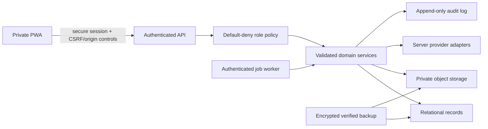

# Code 3 Security and Privacy

Phase 1B starting baseline: `26d30b9a0b1379d53778c0bc5c92887cc0ae744f`.

Phase 1A and the validated Phase 1B checkpoint source are published on the feature branch; hosted owner access still depends on correct environment configuration and has not been accepted for Production. Phase 1B owner-scoped repository/API and migration-preview foundations are schema/dry-run contracts, not an active remote datastore.

Phase 1C is published through commit `af21199f610cc91e31d9dee59af6f0a2f748ab79`. Its intelligence code remains local-only and adds no database migration, hosted persistence, sync, provider credential, model provider, file upload, or external account action.

Phase 2A Account Ops is published at `c76e3e4bc668c08d9a0908c9bb2cd96444610297`. It stores operational profiles, alias metadata, retailer-account metadata, credential references, and tasks in browser storage. It performs no email provisioning, mailbox/order access, retailer signup submission, verification bypass, secret storage, schema application, remote activation, or sync.

Phase 2A.5 is a local, unpublished navigation architecture. Product workspace, route, availability, and entitlement metadata are not authorization. Bot and Owner Center remain OWNER-only, and Account Ops remains `VERIFIED_OWNER` even though it is associated with Business.

## Security posture summary

The published source keeps eBay credentials server-side and includes Supabase token verification, an immutable-subject OWNER policy, protected eBay routes, safe session inspection, exact-origin CORS for protected route families, redaction helpers, and deterministic backup/restore inspection. Hosted configuration still requires verification. Phase 1B extends that boundary to canonical owner API contracts and zero-write migration planning. Phase 1C adds recursive rejection of owner/role/session/token/security authority in local analysis payloads, provenance-separated evidence, and append-only local card-analysis revisions. Published Phase 2A reuses the verified client session gate before Account Ops storage is read, rejects nested authority/secret fields, stores only credential references, and keeps generated passwords ephemeral. Local Phase 2A.5 adds defense-in-depth around workspace visibility: direct route and verified session state take precedence over a bounded preference whose public fallback cannot grant authority. An optional remembered Bot marker remains inert unless the current session independently verifies OWNER authorization; Owner Center and authority fields are prohibited. These controls are not replacements for backend authorization or a secure secret vault. Auction results do not gain a generic revision series, and restock intelligence recomputes from observations. The application is still not ready for production private-business data because remote persistence is deliberately inactive, canonical records remain browser-local, legacy API families remain broadly exposed, Account Ops personal/operational metadata is same-origin-readable, downloaded backup JSON is unencrypted, and backup coverage can be partial.

Code 3 is the application identity, not a declaration of the legal/public business name. Authentication, records, exports, and provider connections must reference the configured business identity separately where legally or operationally relevant.

The next activation phase MUST verify schema/RLS, repository owner scope, rollback, backup coverage, and deployment configuration before remote canonical persistence or file uploads expand the attack surface. Scheduled scanning remains later work.

## Current protections

| Control | Current state | Evidence |
|---|---|---|
| eBay secret isolation | Implemented | `backend/src/services/ebayBrowse.service.ts`; browser receives normalized results only |
| Example environment files | Names/placeholders only | `.env.production.example`, `backend/.env.example` |
| Owner Center UI guard | Implemented client-side | `src/features/ownerCenter/ownerAuthorization.js`, `src/App.jsx` |
| Guest denial in UI | Implemented | same guard |
| Import Review | Implemented | `src/features/flipScout/ebayDiscovery.js`, `src/features/flipScout/screens/EbayDiscoveryScreen.jsx` |
| Confirmed deal deletion | Implemented | Deal Inbox browser regression coverage |
| Local parsing/validation | Implemented for feature repositories | `src/features/flipScout/storageRepository.js`, `src/features/ownerCenter/ownerCenterRepository.js` |
| Supabase policies | Present for legacy schemas | `supabase/migrations` and RLS-focused scripts |
| Provider timeout/error mapping | Implemented for eBay | backend HTTP client and eBay service tests |
| Automatic external actions | Absent | provider contract and implementation |
| Supabase identity verification | Implemented in published source; hosted configuration pending verification | `backend/src/auth/supabaseIdentityProvider.ts` |
| Immutable-subject OWNER policy | Implemented for protected routes | `backend/src/auth/ownerAuthorization.ts` |
| Exact-origin protected-route CORS | Implemented for auth/eBay; Phase 1B canonical routes reuse it locally | `backend/src/security/corsPolicy.ts`, `backend/src/server.ts` |
| Safe identity endpoint | Implemented | `GET /api/auth/session`; `Cache-Control: no-store` |
| Security/error redaction helper | Implemented | `backend/src/security/redaction.ts` |
| Versioned verified browser export | Implemented with explicit coverage | `src/features/backup` |
| No-write JSON restore preview | Implemented; no apply path | `src/features/backup`, Owner Center Data & Backup |
| Canonical repository/API owner scope | Phase 1B source published; not active remotely | owner context is server-derived and required by repository methods |
| Migration Preview | Phase 1B `DRY_RUN_ONLY` | no-write mapping/plan and readiness UI |
| Intelligence authority-field rejection | Phase 1C local implementation | `src/features/intelligence/analysisHistory.js`; recursive owner/role/session/token/authorization/credential/security rejection |
| Intelligence provenance/history | Phase 1C local implementation | immutable card-analysis system result, separate version-checked owner correction, linked card revisions in existing `appraisals`; no generic auction/restock revision series |
| AI/CV and autonomous action boundary | Enforced by absence and explicit capability flags | no configured model provider, no image analysis claim, no purchase/offer/bid action |
| Account Ops session gate | Published Phase 2A implementation | repository/service construction and private reads occur only after verified OWNER session state |
| Account Ops authority/secret rejection | Published Phase 2A implementation | recursive owner/session/token/authorization/prototype/secret-field validation before persistence |
| Account credential boundary | Published Phase 2A implementation | nonsecret `CredentialReference` metadata only; generated passwords remain ephemeral and are excluded from backup/logs |
| Retailer verification/anti-abuse boundary | Published Phase 2A implementation | human-controlled signup/checklist; no CAPTCHA/OTP/verification bypass, bulk signup, limit evasion, or checkout action |
| Product workspace preference boundary | Phase 2A.5 local implementation | `code3.workspace-preference.v1` retains a public fallback plus optional inert last selection; direct route/session wins, Bot requires a fresh OWNER decision, and Owner Center/authority fields are excluded |
| Bot and workspace authorization | Phase 2A.5 local implementation | Bot/Owner remain verified OWNER surfaces; Account Ops remains `VERIFIED_OWNER`; registry/entitlement metadata cannot authorize |

## Current limitations and production blockers

### Critical: server authorization remains narrow in the published deployment

The published source verifies Supabase access tokens server-side and enforces an exact provider-qualified immutable subject on `GET /api/ebay/health` and `POST /api/ebay/search`. Protected-route outcomes are `401` for no/invalid/expired identity, `403` for an authenticated non-owner, `503` for provider outage, and route success for the configured owner. Missing auth or owner configuration fails closed. Hosted owner configuration still requires explicit verification.

This is not yet an application-wide security boundary. The Phase 1B canonical API/export family reuses the owner boundary, but legacy APIs, noncanonical server-data APIs, financial/file operations, controls, and jobs still require route classification and OWNER enforcement before production. The client continues to contain legacy role/development settings for presentation/compatibility; none can authorize the protected server routes.

The full decision and limitations are in [OWNER_AUTH_DECISION.md](./OWNER_AUTH_DECISION.md).

### Critical: canonical records are browser-local

Deal, purchase, inventory, sales, expense, mileage, Owner Center, restock observations, and Phase 1C card-analysis history records are stored in localStorage. Auction workflows may save current result snapshots locally, while restock intelligence recomputes from observations. These records are available to scripts executing in that origin, depend on one browser profile/device, and lack server audit, centralized backup, or revocation. This is acceptable only for the current private preview with explicit limitations.

Phase 1B schema, repository, API, migration mapping, and remote-adapter contracts do not change that fact. `LOCAL_ONLY` remains active and `REMOTE_ACTIVE` remains disabled. A dry-run result, migration file, or successful test repository must never be presented as durable owner storage.

### Critical: Account Ops operational identity data is browser-local

Phase 2A profiles can contain names, phone numbers, shipping/billing addresses, email preferences, aliases, retailer usernames, and operational notes. They live in `code3.account-ops.v1`, are readable by scripts executing in the same origin, and may appear in an unencrypted downloaded JSON backup. A profile is never a Code 3 authentication identity, and no profile/record field may supply owner scope, role, subject, token, or session authority.

The owner must protect the browser profile/device and downloaded backup. Production use requires a separately reviewed server-authorized repository, protected persistence, CSP/dependency controls, retention/deletion rules, audit coverage, and a migration rehearsal. Phase 2A does not satisfy those gates.

### High: alias, credential, and retailer-account capability truth

A generated alias is local metadata only. It is not described as provider-provisioned or receiving mail unless explicit provider/owner evidence exists. Phase 2A has no email provider credential or network adapter. Catch-all and provider-managed modes are contracts, not active integrations.

Store-account records may hold a nonsecret credential reference, but no plaintext password, OTP, session, token, payment-card/CVV value, or provider secret. The password generator uses secure randomness for immediate copy and keeps the result only in ephemeral UI memory; an unsaved value cannot be recovered. No current adapter proves an external password-manager/OS-secure-store item exists.

Account setup is owner-assisted. Code 3 may prepare/copy ordinary metadata and open a configured legitimate signup URL, but it does not submit bulk registrations, solve/bypass CAPTCHA or OTP, manufacture email/phone verification, rotate identities, evade bot detection, or circumvent retailer household/account/purchase limits. Every `READY` transition depends on real checklist state and explicit owner confirmation.

### High: backend surface and residual CORS

The local exact-origin policy runs before `/api/auth/*` and `/api/ebay/*`. It accepts configured HTTPS origins and loopback HTTP origins only, rejects wildcards/arbitrary reflection, adds `Vary: Origin`, and restricts methods/headers. Preview and local origin lists are included only in their matching runtimes.

The legacy Express routes still use the existing permissive `cors()` middleware. Before production, inventory every route, protect or retire it, validate content types/request sizes, and rate-limit sensitive or upstream-backed operations.

### High: file evidence

Screenshots, receipts, and images are currently URLs/references or browser-held data rather than a protected file service. Target storage needs MIME and size validation, content hash, malware scanning where appropriate, private object keys, short-lived signed access, authorization on metadata and bytes, retention policy, and backup.

### High: backup and recovery coverage remains partial

The published Phase 1A format inventories current browser sources, excludes security/session data, hashes deterministic sections and manifest with SHA-256, reparses/reverifies the result, and provides a zero-write JSON Restore Preview. It explicitly labels coverage `COMPLETE`, `PARTIAL`, or `FAILED`.

It is not a full disaster-recovery system. Phase 1B adds an owner-protected canonical PostgreSQL export, but that source is included only when the canonical gate/database are configured and the bounded response validates. Legacy Supabase data, other PostgreSQL/Express process-memory records, and file bytes remain outside that route. Any unavailable/configured remote source or referenced unembedded file keeps coverage partial. There is no apply-restore operation, protected file-byte export, cloud retention, encryption wrapper, or durable backup audit history. See [BACKUP_FORMAT_V1.md](./BACKUP_FORMAT_V1.md) and [RESTORE_PREVIEW_CONTRACT.md](./RESTORE_PREVIEW_CONTRACT.md).

### Medium/high: legacy authorization and privacy model

The repository retains public-beta roles, profiles, community, marketplace, moderation, and workspace schemas. The private product must isolate or retire these surfaces. Existing Supabase RLS is useful evidence, not proof that the new private model is protected.

### Medium: dependencies and observability

Dependency vulnerability reports require separate review. Logs and errors need structured redaction so credentials, seller/buyer data, imported payloads, signed URLs, and financial details are not emitted. Production monitoring must expose status without exposing raw provider payloads or tokens.

### Medium: deterministic intelligence can be over-trusted

Phase 1C condition, valuation, deal, lot, auction, and restock results are deterministic proposals from supplied observations and assumptions. Determinism makes a result reproducible; it does not make sparse, stale, duplicated, owner-entered, or incorrectly identified evidence true. Current controls retain provenance, source independence, warnings, confidence bands, methodology/input hashes, immutable card-analysis system revisions, explicit owner corrections, and explicit deal-risk severity. Valuation v2 uses matched-condition verified sales directly, permits a single adjustment only from an explicit `NM` baseline, and excludes unknown or incompatible condition bases. Restock freshness uses the most recent positive observation, and duplicated underlying sources cannot bypass the independence cap. These controls do not supply licensed completed-sale coverage, authenticate card identity, guarantee condition/grade, inspect unseen lot contents, or guarantee restocks/profit.

Official eBay evidence remains separately attributable as external identity, provider observations, image references, and active-listing valuation evidence. A provider amount with missing or invalid currency does not become a money object. This prevents an integration omission from being silently converted into a false default-currency value.

No image/OCR/AI provider is configured. The scanner boundary explicitly reports image analysis false and must not receive a machine-observed defect label unless a future approved adapter actually produced it. Future model work requires protected file handling, privacy/retention approval, prompt/input isolation, evaluation, cost controls, and a human-review gate before it can affect a confirmed record.

### Medium: workspace and entitlement metadata can be mistaken for authority

Phase 2A.5 route ownership, navigation visibility, remembered product workspace, and future `FREE`/`PLUS`/`PRO`/`BUSINESS`/`OWNER` hints are client presentation metadata. They cannot grant an OWNER session, authorize a backend request, expose Bot or Owner Center, or load Account Ops before its existing gate. `OWNER` is an authority role rather than a purchasable tier. No billing or subscription state is active.

The saved preference always retains a public Collect, Find, Sell, or Business fallback. It may also remember Bot as inert presentation history only after an authorized selection; that marker is ignored unless the current session independently verifies OWNER authorization. Direct routes and verified session state take precedence, and session downgrade/logout must remove private visibility before private storage initializes. The product-workspace term is distinct from historical persisted collaboration/data `Workspace` records and `activeWorkspaceId`; Phase 2A.5 does not reinterpret or migrate them.

## Target security architecture

## Authentication and session requirements

- OWNER is the only enabled role initially.
- The current Supabase bearer flow uses the provider SDK session; a future server-cookie design, if selected, must use secure, HttpOnly, and appropriate SameSite settings.
- Session rotation, expiration, revocation, and sign-out-other-devices are supported.
- Password reset and invitation flows do not reveal account existence unnecessarily.
- Administrative and Owner Center requests are authorized on the server for every operation.
- Future roles are policy capabilities, not scattered UI booleans.
- Local development authorization requires server-detected development, explicit enablement, loopback host/socket, and an explicit header; it is rejected in hosted runtimes.
- Authentication failure never falls back to anonymous privileged data.

## Secret handling

- Server secrets are supplied by deployment-secret storage, never `VITE_*` variables.
- Browser-safe configuration is explicitly allowlisted.
- Secrets are not returned by health/configuration endpoints.
- Logs redact authorization headers, tokens, credentials, connection strings, signed URLs, and raw provider errors that may contain request details.
- Example files document names only.
- Secret rotation and provider disconnect invalidate cached credentials/tokens.
- CI and staged-content scans block known secret patterns.

Known server-only eBay names are `EBAY_CLIENT_ID`, `EBAY_CLIENT_SECRET`, `EBAY_ENVIRONMENT`, `EBAY_MARKETPLACE_ID`, and `EBAY_REQUEST_TIMEOUT_MS`. `VITE_API_BASE_URL` is a browser-safe route base, not a credential.

Owner-boundary server names are `SUPABASE_URL`, `SUPABASE_ANON_KEY`, `CODE3_OWNER_SUBJECTS`, `CODE3_CORS_ALLOWED_ORIGINS`, `CODE3_CORS_PREVIEW_ORIGINS`, `CODE3_CORS_LOCAL_ORIGINS`, and `CODE3_ENABLE_LOCAL_DEV_AUTH`. Browser session configuration uses `VITE_SUPABASE_URL`, `VITE_SUPABASE_ANON_KEY`, and `VITE_API_BASE_URL`; explicit local development may additionally use `VITE_CODE3_LOCAL_AUTH_ENABLED`. Example files contain names/placeholders only.

Phase 1B canonical persistence additionally uses the server-only gate `CODE3_CANONICAL_PERSISTENCE_ENABLED` and existing `DATABASE_URL`. Missing either leaves hosted canonical routes unavailable with a safe response. The gate does not bypass authentication or owner authorization and has no `VITE_` equivalent.

## Authorization matrix target

| Domain | OWNER | Collaborator | Inventory helper | Bookkeeper | Read only |
|---|---:|---:|---:|---:|---:|
| Connections, schedules, security, backup | Full | None | None | None | None |
| Account Ops profiles, aliases, store accounts, and provider controls | Full | None by default | None | None | Explicit view only if a future policy permits |
| Bot workspace and future provider controls | Full | None | None | None | None |
| Search/import raw provider data | Full | Configurable review | None | None | Configurable view |
| Purchases/receiving/listings/sales/shipping | Full | Configurable edit | Processing subset | Financial review only | Explicit view |
| Owned-item identification/storage | Full | Edit | Edit | View only if granted | Explicit view |
| Sensitive totals/reports | Full | Explicit grant | Denied by default | Review/export | Explicit view |
| Expense/mileage/receipt/reconciliation | Full | Explicit grant | Receipt capture only | Review/edit/export | Explicit view |

Only OWNER is enabled now. Future columns are design reservations, not current permissions.

## Input and URL safety

- Validate every request with a versioned schema and reject unknown privileged fields.
- Normalize currency, rates, quantities, dates, enums, provider IDs, and pagination bounds.
- Prevent server-side request forgery: user URLs are stored/opened safely and never fetched by a generic backend proxy.
- Allow only documented upstream hosts in provider adapters.
- Use bounded timeouts, response-size limits, and redirect policies.
- Sanitize filenames and never derive object paths directly from user input.
- Render owner notes as text unless a separately reviewed rich-text sanitizer exists.
- Use idempotency keys for imports, mutations, webhooks, jobs, and retried submissions.

## Files and images

Every uploaded file requires authenticated ownership, size/MIME/magic-byte validation, hash, protected storage key, source record, scan state, and audit entry. Image processing occurs in a sandboxed/bounded service. Original evidence is immutable; derivatives reference it. Signed URLs are short-lived and never treated as authorization themselves.

## Provider and job security

- Provider scopes are minimized and recorded.
- Capability checks prevent calling unsupported operations.
- Rate limits and retry-after are respected.
- Scheduled work uses a server identity with explicit domain permission, not an owner browser token.
- Jobs are leased/idempotent and cannot run twice unnoticed.
- Raw results enter Import Review; they never become purchases or inventory automatically.
- Webhook signatures and replay windows are validated if webhooks are introduced.
- Disconnect removes/revokes provider credentials and marks dependent schedules unavailable.

## Data minimization and privacy

- Store only seller/buyer details needed for sourcing, fulfillment, returns, trust history, or reconciliation.
- Store only the Account Ops profile/address/alias/account metadata needed for legitimate owner operations; avoid unnecessary identity duplication and sensitive notes.
- Never store full payment-card credentials.
- Never persist Account Ops plaintext passwords, OTPs, retailer sessions/tokens, provider secrets, payment-card data, or Code 3 owner authority fields.
- Minimize children's personal information; impact tracking should prefer aggregate counts.
- Separate private owner records from any public product dataset and credentials.
- Store AI/provider retention and use terms with the connection configuration.
- Preserve whether intelligence evidence was machine-observed, provider-supplied, owner-entered, or inferred; never upgrade a deterministic inference or repeated provider copy into an independent observation.
- Exports contain the owner's data but warn when files include personal or financial information.
- Data deletion uses archive/correction rules where audit or financial history must remain; privacy deletion is policy-driven and logged.

## Audit requirements

Audit records are append-only and include actor/session, action, entity and version, time, reason, and before/after references or a safe diff. At minimum, audit:

- authentication/session/security changes;
- provider connect/disconnect and schedule/scoring changes;
- import confirmation and mapping;
- owner-entered financial changes and recalculation;
- purpose, quantity, allocation, storage, sale, return, refund, void, and write-off actions;
- backup/export/restore and migration operations;
- administrative feature-control changes.

Raw secrets and protected file contents never enter audit events.

## Backup, export, and deletion

A complete future recovery point includes schema/version manifest, canonical records, provenance, audit references, protected file manifest/content, counts, hashes, and validation results. Phase 1A covers registered browser sources; Phase 1B can additionally include the bounded canonical export only when it is owner-authorized and valid. Phase 2A raises the registry to 22 sources (18 locally included and four excluded/conditional) by adding sanitized Account Ops metadata. Plaintext passwords, OTPs, tokens, sessions, provider secrets, and owner-authority fields remain prohibited. Coverage must say `PARTIAL` whenever a relevant server source or file byte is absent. Restore Preview remains bounded and zero-write, including Account Ops schema/count/ID/alias/reference checks; applying restore is not implemented. Any expanded server export, future restore, or deletion operation requires fresh owner authorization and rate limiting.

Phase 1B registers the remote-export adapter and owner-authorized read-only export route. Data & Backup calls it through `src/services/code3OwnerApi.js`, which obtains the current supported owner-session headers and always requests with `no-store`. PostgreSQL export uses one repeatable-read, read-only transaction for all canonical domains; tests use an isolated memory snapshot. An unavailable, unauthorized, forbidden, invalid, hash-mismatched, partial, inconsistent, or not-configured remote source remains excluded or `PARTIAL`; it cannot be represented by an empty successful section. This read bridge does not enable canonical writes or `REMOTE_ACTIVE`. Migration Preview writes no durable audit event because zero-write is part of its security contract.

The local `/api/code3/*` route family reuses exact-origin CORS, `requireOwner`, `no-store`, strict validation, server-derived owner context, and a bounded owner rate limit. Its protected CORS methods are `GET`, `POST`, `PATCH`, `PUT`, and `OPTIONS`; `DELETE` is not exposed. The repository never accepts client owner authority. Missing `CODE3_CANONICAL_PERSISTENCE_ENABLED` or `DATABASE_URL` produces a safe unavailable response before any canonical operation. These controls remain unaccepted for Production until the schema, policies, configuration, and deployment are tested in a disposable environment.

## Threat register

| Threat | Current exposure | Required mitigation |
|---|---|---|
| Direct use of eBay endpoint by non-owner | Locally mitigated; deployment unverified | configure/test Supabase owner boundary per environment, rate limit, audit |
| XSS reads local financial records | Browser-local data | strict CSP, dependency hygiene, safe rendering, migrate to API/cache minimization |
| Device/profile loss | local-only records | verified complete backup and durable canonical storage |
| Malicious/oversized file | no canonical upload boundary yet | protected upload validation/scanning/quota |
| Provider payload overwrites owner facts | partly prevented by discovery model | immutable snapshots and explicit reviewed merge |
| Analysis payload forges owner/session authority | Phase 1C local validator rejects authority fields recursively; browser storage is still untrusted | retain server-derived owner scope for every future intelligence API and repeat validation server-side |
| Deterministic recommendation is mistaken for fact or professional grade | local explainable proposal with confidence/warnings and explicit risk severity; no model provider | owner review, evidence links, methodology version, valuation condition-basis disclosure, evaluation fixtures, prohibited-guarantee copy |
| Image reference is mistaken for analyzed/protected file | Phase 1C retains metadata only and reports image analysis false | protected file service and approved analysis adapter before any machine-observed visual claim |
| Duplicate retry creates financial/inventory records | local validations only | server idempotency and database constraints |
| Cross-device edit conflict | unsupported | record versions, optimistic concurrency, conflict UI |
| Legacy route exposes private operation | broad compatibility surface | route inventory, default-deny middleware, focused retirement |
| Secret leakage through configuration/logs | eBay currently isolated | allowlist config, log redaction, CI scans, rotation |
| Preview configuration used as production assurance | current preview only | explicit environment gates and production review |
| Account Ops profile field is treated as owner authority | local browser records are untrusted | verified application session before reads; recursive authority rejection; future server-derived owner scope only |
| Generated alias is mistaken for receiving/provisioned mail | Phase 2A local metadata can resemble an address | separate lifecycle/provisioning evidence; no `CONNECTED` or receiving claim without verified provider result |
| Generated or entered credential leaks through persistence/export/logs | no secure vault adapter; password is ephemeral | prohibit secret fields recursively; reference-only model; no log/backup; security/credential scans and tests |
| Account Ops is misused for account farming or retailer-limit evasion | assisted setup and reusable profiles could be abused if expanded | human-only verification, no bulk signup/automation/bypass, no identity rotation, explicit product non-goals and future provider review |
| Remembered workspace or entitlement metadata grants private access | local route/navigation metadata is browser-controlled | verified session before private render/storage, public fallback plus inert private marker, direct-route precedence, server authorization, session-downgrade tests |
| Product workspace routing exposes or duplicates records | custom route/history plus legacy `Workspace` terminology | central validated route ownership, compatibility tests, shared record IDs/projections, explicit distinction from historical persisted Workspace records |
| Bot shell is mistaken for a connected automation provider | Phase 2A.5 provides a visible OWNER-only foundation | honest empty/capability state; no provider/token/task-control/checkout path; separate future authorization and anti-abuse review |

## Production security blockers

The product MUST NOT be promoted to production private-business use until, at minimum:

1. server-authenticated OWNER authorization protects all sensitive APIs;
2. permissive legacy routes and CORS are reviewed or isolated;
3. complete export/restore is verified;
4. canonical data and files have durable protected storage or the local-only limitation is explicitly accepted for a non-production pilot;
5. secrets/logging/configuration scans pass;
6. dependency vulnerabilities are triaged;
7. authorization, import idempotency, backup/restore, and file tests pass;
8. production and preview environment/domain separation is verified;
9. an owner-access recovery procedure exists.
