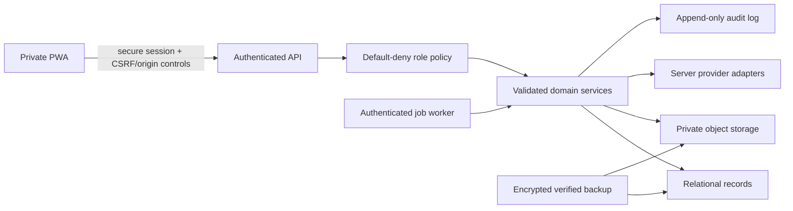

# Code 3 Security and Privacy

Verified against commit `fa087331f3e81b5cf06a57ca7a89e8b37edba0fc`.

## Security posture summary

The current preview correctly keeps eBay credentials on the server and has a narrow UI owner guard, input validation in important feature utilities, confirm-before-delete behavior, and some Supabase row-level policies for legacy tables. It is not ready for production private-business data because canonical records are browser-local and sensitive server routes do not enforce an authenticated OWNER session.

Code 3 is the application identity, not a declaration of the legal/public business name. Authentication, records, exports, and provider connections must reference the configured business identity separately where legally or operationally relevant.

The next implementation phase MUST establish a backend ownership boundary and verified recovery path before scheduled scans, remote canonical persistence, or file uploads expand the attack surface.

## Current protections

| Control | Current state | Evidence |
|---|---|---|
| eBay secret isolation | Implemented | `backend/src/services/ebayBrowse.service.ts`; browser receives normalized results only |
| Example environment files | Names/placeholders only | `.env.production.example`, `backend/.env.example` |
| Owner Center UI guard | Implemented client-side | `src/features/ownerCenter/ownerAuthorization.js`, `src/App.jsx` |
| Guest denial in UI | Implemented | same guard |
| Import Review | Implemented | `src/features/flipScout/ebayDiscovery.js`, `src/features/flipScout/screens/EbayDiscoveryScreen.jsx` |
| Confirmed deal deletion | Implemented | Deal Inbox browser regression coverage |
| Local parsing/validation | Implemented for feature repositories | `src/features/flipScout/storageRepository.js`, `src/features/ownerCenter/ownerCenterRepository.js` |
| Supabase policies | Present for legacy schemas | `supabase/migrations` and RLS-focused scripts |
| Provider timeout/error mapping | Implemented for eBay | backend HTTP client and eBay service tests |
| Automatic external actions | Absent | provider contract and implementation |

## Current limitations and production blockers

### Critical: server authorization

The browser owner check is not authorization. The Express application does not establish a general authenticated session or enforce OWNER policy on `/api/ebay/*` or canonical private endpoints. Any caller that can reach a route may be able to consume configured upstream quota or access route data.

Required before production:

1. verified server-side session identity;
2. default-deny authorization middleware;
3. explicit OWNER policy for eBay, imports, financial data, files, backup, controls, and jobs;
4. CSRF/origin strategy appropriate to the chosen session mechanism;
5. route-level authorization tests for unauthenticated, wrong-role, expired, and valid owner sessions.

The legacy role utility also consumes browser-visible role/development inputs such as `VITE_ADMIN_EMAILS`, `VITE_DEV_ADMIN_EMAIL`, and profile metadata/flags. These can support presentation or local testing, but MUST NOT grant private API access. Production authorization must derive the role from a server-verified session and server-owned policy.

### Critical: canonical records are browser-local

Deal, purchase, inventory, sales, expense, mileage, Owner Center, and restock records are stored in localStorage. They are available to scripts executing in that origin, depend on one browser profile/device, and lack server audit, centralized backup, or revocation. This is acceptable only for the current private preview with explicit limitations.

### High: backend surface and CORS

The Express application uses permissive `cors()` and contains legacy routes with mixed authentication assumptions. Before production, inventory every route, restrict allowed origins/methods/headers, validate content types and request sizes per route, enforce authentication centrally, and rate-limit sensitive/upstream-backed operations.

### High: file evidence

Screenshots, receipts, and images are currently URLs/references or browser-held data rather than a protected file service. Target storage needs MIME and size validation, content hash, malware scanning where appropriate, private object keys, short-lived signed access, authorization on metadata and bytes, retention policy, and backup.

### High: backup and recovery

Feature JSON/CSV export exists, but there is no unified verified backup containing all local, legacy, database, and file records. The app MUST NOT claim a successful backup until a versioned export is created, hashed, parsed, validated, and restorable in preview.

### Medium/high: legacy authorization and privacy model

The repository retains public-beta roles, profiles, community, marketplace, moderation, and workspace schemas. The private product must isolate or retire these surfaces. Existing Supabase RLS is useful evidence, not proof that the new private model is protected.

### Medium: dependencies and observability

Dependency vulnerability reports require separate review. Logs and errors need structured redaction so credentials, seller/buyer data, imported payloads, signed URLs, and financial details are not emitted. Production monitoring must expose status without exposing raw provider payloads or tokens.

## Target security architecture

## Authentication and session requirements

- OWNER is the only enabled role initially.
- Session tokens/cookies use secure, HttpOnly, SameSite settings appropriate to the deployment.
- Session rotation, expiration, revocation, and sign-out-other-devices are supported.
- Password reset and invitation flows do not reveal account existence unnecessarily.
- Administrative and Owner Center requests are authorized on the server for every operation.
- Future roles are policy capabilities, not scattered UI booleans.
- Local development bypass is impossible in production builds/configuration.
- Authentication failure never falls back to anonymous privileged data.

## Secret handling

- Server secrets are supplied by deployment-secret storage, never `VITE_*` variables.
- Browser-safe configuration is explicitly allowlisted.
- Secrets are not returned by health/configuration endpoints.
- Logs redact authorization headers, tokens, credentials, connection strings, signed URLs, and raw provider errors that may contain request details.
- Example files document names only.
- Secret rotation and provider disconnect invalidate cached credentials/tokens.
- CI and staged-content scans block known secret patterns.

Known server-only eBay names are `EBAY_CLIENT_ID`, `EBAY_CLIENT_SECRET`, `EBAY_ENVIRONMENT`, `EBAY_MARKETPLACE_ID`, and `EBAY_REQUEST_TIMEOUT_MS`. `VITE_API_BASE_URL` is a browser-safe route base, not a credential.

## Authorization matrix target

| Domain | OWNER | Collaborator | Inventory helper | Bookkeeper | Read only |
|---|---:|---:|---:|---:|---:|
| Connections, schedules, security, backup | Full | None | None | None | None |
| Search/import raw provider data | Full | Configurable review | None | None | Configurable view |
| Purchases/receiving/listings/sales/shipping | Full | Configurable edit | Processing subset | Financial review only | Explicit view |
| Owned-item identification/storage | Full | Edit | Edit | View only if granted | Explicit view |
| Sensitive totals/reports | Full | Explicit grant | Denied by default | Review/export | Explicit view |
| Expense/mileage/receipt/reconciliation | Full | Explicit grant | Receipt capture only | Review/edit/export | Explicit view |

Only OWNER is enabled now. Future columns are design reservations, not current permissions.

## Input and URL safety

- Validate every request with a versioned schema and reject unknown privileged fields.
- Normalize currency, rates, quantities, dates, enums, provider IDs, and pagination bounds.
- Prevent server-side request forgery: user URLs are stored/opened safely and never fetched by a generic backend proxy.
- Allow only documented upstream hosts in provider adapters.
- Use bounded timeouts, response-size limits, and redirect policies.
- Sanitize filenames and never derive object paths directly from user input.
- Render owner notes as text unless a separately reviewed rich-text sanitizer exists.
- Use idempotency keys for imports, mutations, webhooks, jobs, and retried submissions.

## Files and images

Every uploaded file requires authenticated ownership, size/MIME/magic-byte validation, hash, protected storage key, source record, scan state, and audit entry. Image processing occurs in a sandboxed/bounded service. Original evidence is immutable; derivatives reference it. Signed URLs are short-lived and never treated as authorization themselves.

## Provider and job security

- Provider scopes are minimized and recorded.
- Capability checks prevent calling unsupported operations.
- Rate limits and retry-after are respected.
- Scheduled work uses a server identity with explicit domain permission, not an owner browser token.
- Jobs are leased/idempotent and cannot run twice unnoticed.
- Raw results enter Import Review; they never become purchases or inventory automatically.
- Webhook signatures and replay windows are validated if webhooks are introduced.
- Disconnect removes/revokes provider credentials and marks dependent schedules unavailable.

## Data minimization and privacy

- Store only seller/buyer details needed for sourcing, fulfillment, returns, trust history, or reconciliation.
- Never store full payment-card credentials.
- Minimize children's personal information; impact tracking should prefer aggregate counts.
- Separate private owner records from any public product dataset and credentials.
- Store AI/provider retention and use terms with the connection configuration.
- Exports contain the owner's data but warn when files include personal or financial information.
- Data deletion uses archive/correction rules where audit or financial history must remain; privacy deletion is policy-driven and logged.

## Audit requirements

Audit records are append-only and include actor/session, action, entity and version, time, reason, and before/after references or a safe diff. At minimum, audit:

- authentication/session/security changes;
- provider connect/disconnect and schedule/scoring changes;
- import confirmation and mapping;
- owner-entered financial changes and recalculation;
- purpose, quantity, allocation, storage, sale, return, refund, void, and write-off actions;
- backup/export/restore and migration operations;
- administrative feature-control changes.

Raw secrets and protected file contents never enter audit events.

## Backup, export, and deletion

A complete backup includes schema/version manifest, canonical records, provenance, audit references, protected file manifest/content, counts, hashes, and validation results. Restore is previewed, duplicate-checked, version-compatible, confirmed, logged, and reversible until accepted. Export and delete operations require fresh owner authorization and are rate-limited.

## Threat register

| Threat | Current exposure | Required mitigation |
|---|---|---|
| Direct use of eBay endpoint by non-owner | High in production | server session, OWNER middleware, rate limit, audit |
| XSS reads local financial records | Browser-local data | strict CSP, dependency hygiene, safe rendering, migrate to API/cache minimization |
| Device/profile loss | local-only records | verified complete backup and durable canonical storage |
| Malicious/oversized file | no canonical upload boundary yet | protected upload validation/scanning/quota |
| Provider payload overwrites owner facts | partly prevented by discovery model | immutable snapshots and explicit reviewed merge |
| Duplicate retry creates financial/inventory records | local validations only | server idempotency and database constraints |
| Cross-device edit conflict | unsupported | record versions, optimistic concurrency, conflict UI |
| Legacy route exposes private operation | broad compatibility surface | route inventory, default-deny middleware, focused retirement |
| Secret leakage through configuration/logs | eBay currently isolated | allowlist config, log redaction, CI scans, rotation |
| Preview configuration used as production assurance | current preview only | explicit environment gates and production review |

## Production security blockers

The product MUST NOT be promoted to production private-business use until, at minimum:

1. server-authenticated OWNER authorization protects all sensitive APIs;
2. permissive legacy routes and CORS are reviewed or isolated;
3. complete export/restore is verified;
4. canonical data and files have durable protected storage or the local-only limitation is explicitly accepted for a non-production pilot;
5. secrets/logging/configuration scans pass;
6. dependency vulnerabilities are triaged;
7. authorization, import idempotency, backup/restore, and file tests pass;
8. production and preview environment/domain separation is verified;
9. an owner-access recovery procedure exists.
